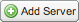

.. _geoexplorer.introduction:

.. warning:: Document status: **Draft** 

Introduction
============

This section provides a brief introduction to GeoExplorer. 

#. To launch GeoExplorer, locate the GeoExplorer component on the OpenGeo Suite Dashboard, and click the :guilabel:`Launch` link. 

   .. figure:: images/launch_geoexplorer.png
   
      *Launching GeoExplorer*

   The GeoExplorer web application is typically available at ``http://localhost:8080/geoexplorer/composer``, although your setup may differ.

   .. figure:: images/geoexplorer.png
   
      *GeoExplorer*

.. |addlayer| image:: images/Button_Addlayer.png

#. To add a new layer to the :guilabel:`Map Window`, click :guilabel:`Add Layers` |addlayer| on the :ref:`geoexplorer.workspace.layerspanel` toolbar and click :guilabel:`Add layers` to open the :guilabel:`Available Layers` dialog box.
    
   .. figure:: using/images/add_button.png
       
      *Add layers option*
    
#. In the :guilabel:`Available Layers` dialog box, click the layer you want to add to your map and click the :guilabel:`Add layers` button at the bottom of the :guilabel:`Available Layers` dialog box. 

   .. note:: To add multiple layers, hold down Ctrl while you click all the layers you want to add.

   .. figure:: using/images/add_dialog.png
       
      *Adding layers to GeoExplorer*

#. To add a new :term:`WMS` server, in the :guilabel:`View available data from` list, click :guilabel:`Add A New Server`.

   .. note:: An example of a WMS URL is: ``http://terraservice.net/ogccapabilities.ashx?version=1.1.1&request=GetCapabilities``
    
   .. figure:: using/images/add_newserver.png
   
      *Adding a new WMS server*
   
   .. figure:: using/images/add_newserver_addr.png
   
      *Adding the URL for a new WMS server*

#. Once you've added the URL for the new WMS server, click the :guilabel:`Add Server` |addserver| button.

#. Click the :guilabel:`Done` button to return to the :ref:`geoexplorer.workspace.layerspanel`.
       
#. To rearrange the layers in your map, drag a layer up or down the list of layers in the :ref:`geoexplorer.workspace.layerspanel`.
    
   .. figure:: images/workspace_draglayers.png
   
      *Ordering layers*
       
#. You can also generate a map application, and the HTML code to embed into a web page, based on the layers in your :guilabel:`Map Window`. On the :guilabel:`GeoExplorer` toolbar, click :guilabel:`Map` and then click :guilabel:`Publish map` to open the :ref:`geoexplorer.using.publish` dialog box.

   .. figure:: using/images/map_publish.png
      
      *Publishing a map*

#. In the the :guilabel:`Publish map` dialog box, select the map tools you'd like to include in your map application, and click :guilabel:`Next` to generate the HTML code.

   .. figure:: using/images/publish_tools.png

      *Selecting the map tools*

   .. figure:: using/images/publish_html.png

      *Generating HTML code*

#. Click :guilabel:`Preview` to create a preview of your map application.

   .. figure:: using/images/map_preview.png

      *Publishing a map*

#. Copy and paste the HTML code into your own web page to view your map application.

For more information on working with GeoExplorer, please refer to :ref:`geoexplorer.using`.
