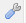
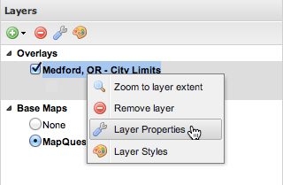
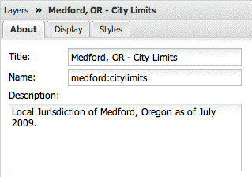
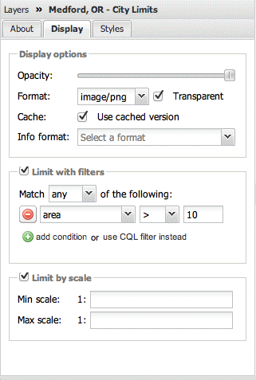
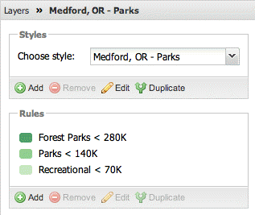

.. _geoexplorer.using.layerproperties:

Layer Properties
================

.. warning:: Document status: **Draft** 

You can view and edit layer properties in GeoExplorer.

.. note:: The properties of layers based on third party data, such as Google, cannot be viewed or edited.

To access the Layer Properties panel, click a layer in the :ref:`geoexplorer.workspace.layerspanel`, then click :guilabel:`Layer Properties` |lyrprops| on the Layer panel toolbar. Alternatively, right-click the layer and click :guilabel:`Layer Properties` in the shortcut menu.

   *Layer Properties tool*

There are three tabs in the Layer Properties panel:

.. list-table::
       :header-rows: 1
       :widths: 30 70

       * - Name
         - Description
       * - :guilabel:`About`
         - Displays layer metadata
       * - :guilabel:`Display`
         - Options for customizing layer display
       * - :guilabel:`Styles`
         - Options for customizing layer style and style rules 

.. _geoexplorer.using.layerproperties.about:

About tab
---------

The :guilabel:`About` tab displays layer metadata and includes:

.. list-table::
   :header-rows: 1
   :widths: 20 60 20

   * - Field
     - Description
     - Editable?
   * - **Title**
     - Human-readable title of the layer
     - Yes
   * - **Name**
     - Internal name for the layer
     - No
   * - **Description**
     - Descriptive summary of the layer. Also known as the Abstract.
     - Yes

   *Layer metadata properties*

.. _geoexplorer.using.layerproperties.display:

Display tab
-----------

The :guilabel:`Display` tab provides options for customizing the display of layers in GeoExplorer.

.. list-table::
   :header-rows: 1
   :widths: 40 70

   * - Field
     - Description
   * - **Opacity**
     - Determines the level of transparency for the layer. Default is 100% opaque. You can adjust opacity by dragging the slider bar.
   * - **Format**
     - Determines the format of the displayed images. The following formats are available: 
         * :guilabel:`image/png` (24-bit PNG) (*Default*)
         * :guilabel:`image/gif` (GIF)
         * :guilabel:`image/gif;subtype=animated` (animated GIF - this option is only suitable if your layer's data has a temporal dimension)
         * :guilabel:`image/jpeg` (JPEG)
         * :guilabel:`image/png8` (8-bit PNG)
         * :guilabel:`image/png; mode=8bit` (8-bit PNG)
   * - **Transparent**
     - Sets transparency for a given layer (boolean value). Default is selected. If this check box is cleared, the layer displays like a Base Map, obscuring any layers drawn beneath it. See the :ref:`geoexplorer.workspace.layerspanel.layerorder` section for more information on how layers are drawn.
   * - **Cache**
     - Use cached version of layer (via the integrated GeoWebCache in GeoServer). Default is selected. Clear check box if you don't want to use the cached version.
   * - **Info format**
     - Determines the format for reporting feature information with the :guilabel:`Identify` tool. The following options are available:
         * :guilabel:`text/plain` (text)
         * :guilabel:`application/vnd.ogc.gml` (GML v. 2.1.2)
         * :guilabel:`application/vnd.ogc.gml/3.1.1` (GML v. 3.1.1)
         * :guilabel:`text/html` (HTML)
   * - **Limit with filters (optional)**
     - Selective display of layer features based on two filter options: 
         * By condition (*Default*)—Filter based on layer attributes
         * By CQL filter—Filter based on simple :term:`CQL` queries 
   * - **Limit by scale (optional)**
     - Apply scale dependency to the selected layer. The two scale settings are:
         * Min scale—Layer will not be displayed if the Map Window scale is less than this value
         * Max scale—Layer will not be displayed if the Map Window scale exceeds this value  

   *Layer display properties*

.. _geoexplorer.using.layerproperties.styles:

Styles tab
----------

The :guilabel:`Styles` tab provides access to the :guilabel:`Styles` editor. This editor allows you to view, add, edit, and delete styles and individual style rules for layers published by a :term:`WMS` server adopting the :term:`SLD` standard. Editing styles is only available for layers in the :guilabel:`Overlays` folder.

   *Layer style properties*

Please refer to :ref:`geoexplorer.using.style` for more information on styling.

.. note:: Since editing and deleting styles requires authentication, you must be logged into GeoServer. If you are not connected to GeoServer, the **Styles** editor will be read-only.

