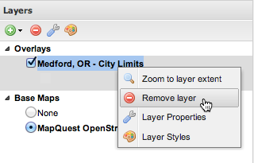

.. _geoexplorer.using.remove:

Remove layers
=============

.. warning:: Document status: **Draft** 

To remove layers from the GeoExplorer, click the layer in the :ref:`geoexplorer.workspace.layerspanel`, then click :guilabel:`Remove layer` |rmlayer| on the Layers panel toolbar. Alternatively, right-click the layer and click :guilabel:`Remove Layer` on the shortcut menu. Base Maps and Overlays may be removed in the same way.
.. To remove layers from GeoExplorer (not the GeoExplorer)

   *Remove layer tool*

.. note:: You can only remove one layer at a time.