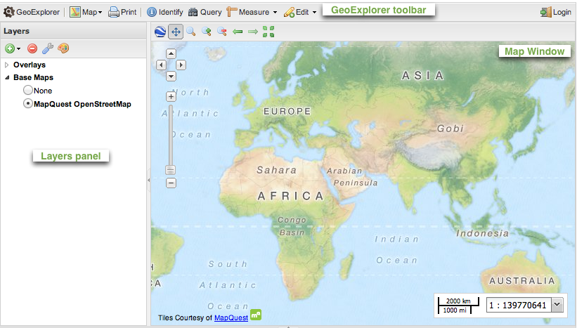
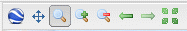
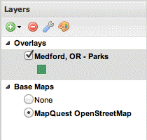
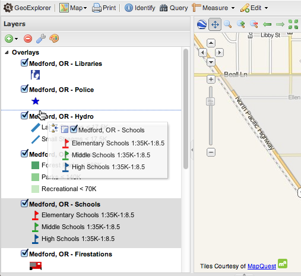
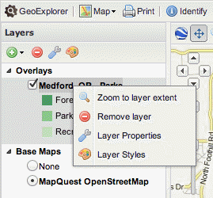
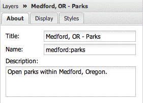
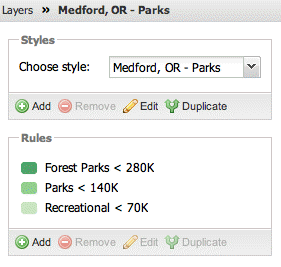

.. _geoexplorer.workspace:

.. warning:: Document status: **Draft** 

GeoExplorer workspace
=====================

The GeoExplorer workspace is divided into three main areas:

#. :ref:`geoexplorer.workspace.mapwindow`—Map display window
#. :ref:`geoexplorer.workspace.toolbar`—Main application toolbar 
#. :ref:`geoexplorer.workspace.layerspanel`–Displays a list of map layers and provides access to the :ref:`geoexplorer.workspace.propertiespanel` and :ref:`geoexplorer.workspace.stylespanel` 

   *GeoExplorer workspace*

.. _geoexplorer.workspace.mapwindow:

Map Window
----------

The Map Window provides the main display area for any layers that have been added to GeoExplorer. The contents of the Map Window are configured via the :ref:`geoexplorer.workspace.layerspanel` and the Map Window toolbar provides display and navigation tools for zooming, panning, and switching to the 3D viewer.

Map Window toolbar
~~~~~~~~~~~~~~~~~~

The :guilabel:`Map Window` toolbar provides access to the following tools:

   *Map Window toolbar*

.. list-table::
     :header-rows: 1
     :widths: 18 30 85 

     * - Button
       - Name
       - Description
     * - .. image:: images/button_3dviewer.png
       - Switch to 3D Viewer
       - Changes map view to 3D. Requires the `Google Earth browser plugin <http://earth.google.com/plugin/>`_.
     * - .. image:: images/button_panmap.png
       - Pan Map
       - Pan the Map Window by click and drag (enabled by default). Shift+click+drag 
         together zooms in to a user-defined extent.
     * - .. image:: images/button_zoombox.png
       - Zoom by dragging a box
       - Zoom to user-defined extent   
     * - .. image:: images/button_zoomin.png
       - Zoom in
       - Increases the zoom level by one
     * - .. image:: images/button_zoomout.png
       - Zoom out
       - Decreases the zoom level by one  
     * - .. image:: images/button_zoomprevious.png
       - Zoom to previous extent
       - Returns to the previous map extent
     * - .. image:: images/button_zoomnext.png
       - Zoom to next extent
       - Returns to the next map extent (activated only after using :guilabel:`Zoom to previous extent`)
     * - .. image:: images/button_zoomvisible.png
       - Zoom to max extent
       - Zooms to the maximum extent of all active layers

.. _geoexplorer.workspace.toolbar:

GeoExplorer toolbar
-------------------

.. figure:: images/workspace_toolbar.png

   *GeoExplorer toolbar*

The :guilabel:`GeoExplorer` toolbar provides access to the following tools:

.. list-table::
     :header-rows: 1
     :widths: 18 30 85 

     * - Button
       - Name
       - Description
     * - .. image:: images/button_geoexplorer.png
       - GeoExplorer
       - Displays information about the GeoExplorer application
     * - .. image:: images/button_publishmap.png
       - :ref:`geoexplorer.using.publish`
       - Composes a map application based on the current Map Window and generates HTML code to embed the application into a web page.
     * - .. image:: images/button_savemap.png
       - :ref:`geoexplorer.using.save`
       - Saves the current state of the Map Window and generates a URL to revisit the current configuration.
     * - .. image:: images/button_print.png
       - :ref:`geoexplorer.using.print`
       - Opens the :guilabel:`Print Preview` dialog box for creating a PDF of the current Map Window display.
     * - .. image:: images/button_getfeatureinfo.png
       - :ref:`geoexplorer.using.getfeatureinfo`
       - Displays feature information (attributes) for the feature at a user-defined location in the Map Window. Dragging has no effect when this tool is activated.
     * - .. image:: images/button_measure.png
       - :ref:`geoexplorer.using.measure`
       - Measure distance or area in the Map Window. Double-click to end measurement.
     * - .. image:: images/button_query.png
       - :ref:`geoexplorer.using.query`
       - Query the selected layer. Options are :guilabel:`Query by current map extent` and :guilabel:`Query by attrbutes`.
     * - .. image:: images/button_createfeature.png
       - :ref:`geoexplorer.using.createfeature`
       - Creates a new feature in the selected layer that can then be edited. Works with overlays only. Requires :ref:`geoexplorer.using.login` to local GeoServer.
     * - .. image:: images/button_editfeature.png
       - :ref:`geoexplorer.using.editfeature`
       - Edits an existing feature in the selected layer. Works with overlays only and requires authentication by the server. Requires :ref:`geoexplorer.using.login` to local GeoServer.
     * - .. image:: images/button_login.png
       -  :ref:`geoexplorer.using.login`
       - Login to local GeoServer (if available) for editing of map features and style settings.

.. _geoexplorer.workspace.layerspanel:

Layers panel
------------

   *Layers panel*

The Layers panel displays a list of all active layers active in the Map Window. Individual layer visibility settings may be configured as required by clicking the check box next to each layer in the list. The Layers panel provides two folders for managing GeoExplorer layers, :guilabel:`Overlays` and :guilabel:`Base Layers`, and a :guilabel:`Layers panel` toolbar.

Overlays
~~~~~~~~

.. |addlayer| image:: images/button_addlayer.png 
              :align: bottom

The :guilabel:`Overlays` folder contains any layers that you add to GeoExplorer, so when GeoExplorer is first started, the :guilabel:`Overlays` list is initially empty. You can :ref:`geoexplorer.using.add` to the list by clicking :guilabel:`Add layers` |addlayer| on the :ref:`geoexplorer.workspace.layerstoolbar`.

Overlay layers are set to be transparent, so multiple layers may be viewed in the Map Window at the same time. The legend for each layer is generated directly from the WMS :term:`GetLegendGraphic` request.

Base Maps
~~~~~~~~~

.. |addlayer2| image:: images/button_addlayer.png 
              :align: bottom

The :guilabel:`Base Maps` folder contains a list of layers that can be used as a base map. A base map will always be drawn beneath all other active :guilabel:`Overlay` layers. Although only one base map can be active at any time, it is possible to have multiple base maps in the list. It is also possible to drag layers between the :guilabel:`Base Maps` folder and the :guilabel:`Overlays` folder.

The default base layer is Mapquest OpenStreetMap. Having no base layer displayed in the :guilabel:`Map Window` (:guilabel:`None`) is also an option. As with the :guilabel:`Overlays` list, you can :ref:`geoexplorer.using.add` to the :guilabel:`Base Maps` list by clicking :guilabel:`Add layers` |addlayer2| on the :ref:`geoexplorer.workspace.layerstoolbar`.

.. _geoexplorer.workspace.layerspanel.layerorder:

Layer order
~~~~~~~~~~~

Layers in the Layers panel may be reordered to affect the rendering, or draw, order. To change the layer order, click and drag the layers in the :guilabel:`Overlays` list in the :ref:`geoexplorer.workspace.layerspanel`. The layers will be rendered in the order in which they are listed—the layer at the top of the list will display on the top of all of the other layers, the next layer will be drawn below that, and so on. The selected base layer will **always** be drawn beneath all :guilabel:`Overlays` layers.

   *Reordering Layers*

.. _geoexplorer.workspace.layerstoolbar:

Layers panel toolbar
~~~~~~~~~~~~~~~~~~~~

The Layers panel toolbar provides access to the following tools:

.. list-table::
     :header-rows: 1
     :widths: 15 30 85 

     * - Button
       - Name
       - Description
     * - .. image:: /images/button_addlayers.png
       - :ref:`geoexplorer.using.add`
       - Displays the Available Layers panel for adding new layers to GeoExplorer
     * - .. image:: /images/button_removelayer.png
       - :ref:`geoexplorer.using.remove`
       - Removes the currently selected layer from the list
     * - .. image:: /images/button_layerproperties.png
       - :ref:`geoexplorer.using.layerproperties`
       - Displays the :ref:`geoexplorer.workspace.propertiespanel` for viewing and editing the properties of the selected layer (layer name and description, display settings, and layer styles). For attribute information, use the :ref:`geoexplorer.using.getfeatureinfo` tool.
     * - .. image:: /images/button_style.png
       - :ref:`geoexplorer.using.style`
       - Displays the :ref:`geoexplorer.workspace.stylespanel` for editing layer styling rules. Requires :ref:`geoexplorer.using.login` to local GeoServer.

.. _geoexplorer.workspace.layercontextmenu:

Layers panel shortcut menu
~~~~~~~~~~~~~~~~~~~~~~~~~~

You can also right-click an entry in the layer list to display a shortcut menu. 

   *Layer context menu*

This shortcut menu provides access to four tools:

.. list-table::
     :header-rows: 1
     :widths: 15 30 85 

     * - Icon
       - Name
       - Description
     * - .. image:: /images/button_zoomlayer.png
       - Zoom to Layer Extent
       - Zooms to the extent of the selected layer
     * - .. image:: /images/button_removelayer.png
       - :ref:`geoexplorer.using.remove`
       - Removes the currently selected layer from the list
     * - .. image:: /images/button_layerproperties.png
       - :ref:`geoexplorer.using.layerproperties`
       - Displays the :ref:`geoexplorer.workspace.propertiespanel` for viewing and editing the properties of the selected layer (layer name and description, display settings, and layer styles). For attribute information, use the :ref:`geoexplorer.using.getfeatureinfo` tool.
     * - .. image:: /images/button_style.png
       - :ref:`geoexplorer.using.style`
       - Displays the :ref:`geoexplorer.workspace.stylespanel` for editing layer styling rules. Requires :ref:`geoexplorer.using.login` to local GeoServer.

.. _geoexplorer.workspace.propertiespanel:

Layer Properties panel
~~~~~~~~~~~~~~~~~~~~~~

   *Layer Properties panel*

The Layer Properties panel displays the properties of the currently selected layer, including layer name and description, and the display and style settings. You can also edit the :ref:`geoexplorer.using.layerproperties` for each layer as required.

.. _geoexplorer.workspace.stylespanel:

Layer Styles panel
~~~~~~~~~~~~~~~~~~

   *:Layer Style panel*

The Layer Styles panel displays style information for the currently selected layer. The style rules are read directly from the layer :term:`SLD`. You can also edit the :ref:`geoexplorer.using.style.styles` for WMS layers as required.

