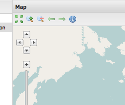
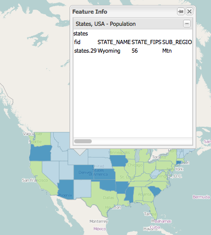

.. _apps.sdk.client.dev.viewer.featureinfo:

Adding a WMS GetFeatureInfo tool
================================

On the file system navigate to :file:`src/app/app.js` in the :file:`myviewer` directory. Open up this file in a text editor. Open up the `API documentation <http://suite.opengeo.org/opengeo-docs/sdk-api/>`_, and find a tool provides the WMS GetFeatureInfo functionality (look in the section titled ``gxp.plugins``):

http://suite.opengeo.org/opengeo-docs/sdk-api/lib/plugins/WMSGetFeatureInfo.html

Its ``ptype`` is ``gxp_wmsgetfeatureinfo``, so we will add an entry in the ``tools`` configuration of :file:`app.js`:

.. code-block:: javascript

    {
        ptype: "gxp_wmsgetfeatureinfo"
    }

As the next step we need to add the new tool to our build profile, so we add a line for :file:`plugins/WMSGetFeatureInfo.js` to the list of dependencies at the top of our :file:`app.js` file. 

.. code-block:: javascript

    * @require plugins/WMSGetFeatureInfo.js

Now restart the application, and reload the application in your browser. You should now see an extra tool button in the map's toolbar:

Click on this button to activate the tool, and click on a state. You should then get a popup displaying the information about that state using WMS GetFeatureInfo:

Let's say you want to influence the way that the popup looks like, e.g. increase its width. Open up the :file:`app.js` again, and add a section called ``outputConfig`` to your tool configuration:

.. code-block:: javascript

    {
        ptype: "gxp_wmsgetfeatureinfo",
        outputConfig: {
            width: 400
        }
    }

Reload the application in the browser, and check that the popup now has a width of 400 pixels:

.. figure:: ../img/viewer_gfi_popupwidth.png
   :align: center

If we want to influence the sequence of tools in the toolbar, e.g. having the WMS GetFeatureInfo tool as the second button, open up :file:`app.js`, and configure an ``actionTarget`` with an ``index``:

.. code-block:: javascript

    {
        ptype: "gxp_wmsgetfeatureinfo",
        outputConfig: {
            width: 400
        },
        actionTarget: {
            target: "map.tbar",
            index: 1
        }
     }

The button is now the second button in the toolbar:

.. figure:: ../img/viewer_gfi_index.png
   :align: center

