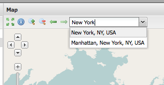

.. _apps.sdk.client.dev.viewer.geocoder:

Adding a Google Geocoder search field
=====================================

.. warning::  Before adding Google components to your applications, make sure that Google's Terms of Use allow you to do so.

Open up the `API documentation <http://suite.opengeo.org/opengeo-docs/sdk-api/>`_ again, and search for a plugin that could provide the geocoder functionality.

http://suite.opengeo.org/opengeo-docs/sdk-api/lib/plugins/GoogleGeocoder.html

This requires the Google Maps v3 API to be present in the application. Add the following script tag to :file:`index.html` in your app directory:

.. code-block:: html

    

Now open up :file:`app.js` again, and add the tool configuration for this plugin. We want the geocoder field to show up in the map's top toolbar:

.. code-block:: javascript

    {
        ptype: "gxp_googlegeocoder",
        outputTarget: "map.tbar",
        outputConfig: {
            emptyText: "Search for a location ..."
        }
    }

Add the plugin to the list of dependencies in :file:`app.js`. The file name is :file:`plugins/GoogleGeocoder.js`.

.. code-block:: javascript

  * @require plugins/GoogleGeocoder.js

 Restart the application and reload the browser.  The Google geocoder will now be in our viewer:

