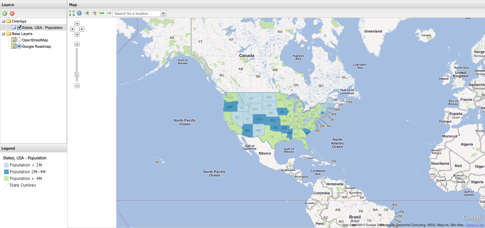

.. _apps.sdk.client.dev.viewer.googlelayer:

Adding a Google base layer
==========================

.. warning::  Before adding Google components to your applications, make sure that Google's Terms of Use allow you to do so.

Open up :file:`app.js`, search for the ``sources`` section, and add a Google source:

.. code-block:: javascript

    google: {
        ptype: "gxp_googlesource"
    }

Next search for the ``layers`` section, and add a Google base layer:

.. code-block:: javascript

    {
        source: "google",
        name: "ROADMAP",
        group: "background"
    }

In the build config at the top of :file:`app.js`, add a dependency line for :file:`plugins/GoogleSource.js`.

.. code-block:: javascript

  * @require plugins/GoogleSource.js

Finally, restart your application.  There will now be a new base layer called "Google RoadMap" in our viewer:

