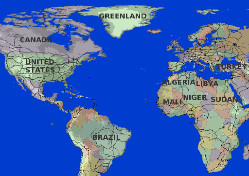
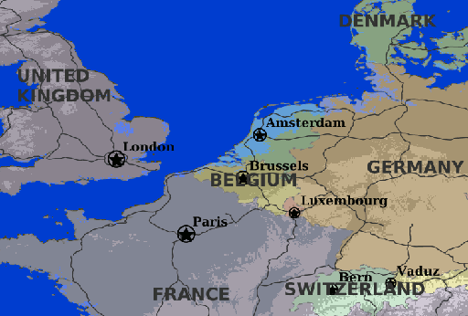
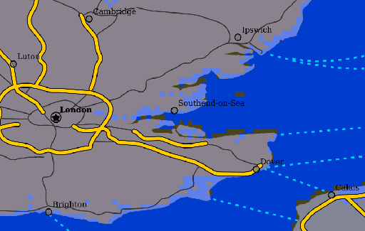

.. _cartography.mbstyle.tutorial.map:

Composing a map
===============

Now that we have a set of styled layers, we can bring them together as a map.

In Composer, create a new map with the four layers styled in the following order (top is drawn last)

* ``places`` (point layer)
* ``roads`` (line layer)
* ``countries`` (polygon layer)
* ``dem`` (raster layer)

.. note:: See the section on :ref:`webmaps.composer.tutorial.map` for details.

This will produce a map that looks like the following at various zoom levels:

   Map at world scale

   Map at region scale

   Map at city scale
