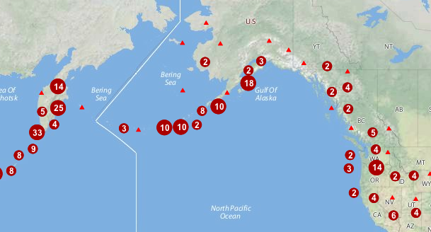

.. _cartography.rt.pointstacker:

Point Stacker
=============

The Point Stacker rendering transformation is a **Vector-to-Vector** transformation which displays a dataset of points with those points that occur close together aggregated into a single point. This produces a more readable map in situations when there are many close points to display. As the stacking is performed dynamically, it can be used to visualize changing data, and does not incur a performance overhead even when applied to very large datasets.

The stacked view is created by configuring a layer with an SLD style which invokes the PointStacker rendering transformation. 

   *Point Stacker rendering transformation*

Usage
-----

As with all rendering transformations, the transformation is invoked by adding a ``<Transformation>`` element to a ``<FeatureTypeStyle>`` in an SLD style. The SLD can then be applied to any layer which is backed by a suitable dataset (featuretype).

The transformation is specified with a ``<ogc:Function name="gs:PointStacker">`` element, with arguments which supply the transformation parameters. The arguments are specified using the special function ``<ogc:Function name='parameter'>``. Each function accepts the following arguments:

* an ``<ogc:Literal>`` giving the name of the parameter
* one or more literals containing the value(s) of the parameter

The transformation parameters are as follows. The order of parameters is not significant.

.. list-table::
   :widths: 25 10 65 
   :header-rows: 1   

   * - Name
     - Required?
     - Description
   * - ``data``
     - Yes
     - Input FeatureCollection containing the features to map  
   * - ``cellSize``     
     - No   
     - Size of the cells in which to aggregate points (in pixels)   Default = 1
   * - ``outputBBOX``     
     - Yes    
     - Georeferenced bounding box of the output
   * - ``outputWidth``     
     - Yes   
     - Output image width
   * - ``outputHeight``     
     - Yes   
     - Output image height

The transformation has required parameters which specify the input data extent and the output image dimensions. The values of these parameters are obtained from environment variables accessed via the function ``<ogc:Function name="env">``. The environment variable values are determined from the WMS request which initiated the rendering process. The parameters and corresponding environment variables are:

* ``outputBBOX``—Uses variable ``wms_bbox`` to obtain the surface extent
* ``outputWidth``—Uses variable ``wms_width`` to obtain the output raster width
* ``outputHeight``—Uses variable ``wms_height`` to obtain the output raster height

Input
-----

The PointStacker rendering transformation can be applied to datasets containing features with **vector** geometry. The geometry may be of any type. Point geometries are used directly, while non-point geometry types are converted to points using the centroid of the geometry. The dataset is supplied in the ``data`` parameter.

Output 
------

The output of the transformation is a **vector** featuretype containing point features. Each feature has the following attributes:

.. list-table::
   :widths: 20 15 65 
   :header-rows: 1   

   * - Name
     - Type
     - Description
   * - ``geom``
     - Point
     - Point geometry representing the group of input features  
   * - ``count``
     - Integer
     - Count of all input features represented by this point  
   * - ``countUnique``
     - Integer
     - Count of all different input points represented by this point  

The output can be styled as required using a ``<PointSymbolizer>``. 

Example
-------

The map image above shows point stacking applied to a dataset of world volcanoes, displayed with a base map layer of continental topography. The stacked points are symbolized using appropriate icons and labels, configured with the following SLD. You can modify the parameters in this SLD to adapt it for your data.

.. code-block:: xml
   :linenos:
   
     <?xml version="1.0" encoding="ISO-8859-1"?>
     <StyledLayerDescriptor version="1.0.0" 
      xsi:schemaLocation="http://www.opengis.net/sld StyledLayerDescriptor.xsd" 
      xmlns="http://www.opengis.net/sld" 
      xmlns:ogc="http://www.opengis.net/ogc" 
      xmlns:xlink="http://www.w3.org/1999/xlink" 
      xmlns:xsi="http://www.w3.org/2001/XMLSchema-instance">
       <NamedLayer>
         <Name>vol_stacked_point</Name>
         <UserStyle>
         <!-- Styles can have names, titles and abstracts -->
           <Title>Stacked Point</Title>
           <Abstract>Styles volcanoes using stacked points</Abstract>
           <FeatureTypeStyle>
             <Transformation>
               <ogc:Function name="gs:PointStacker">
                 <ogc:Function name="parameter">
                   <ogc:Literal>data</ogc:Literal>
                 </ogc:Function>
                 <ogc:Function name="parameter">
                   <ogc:Literal>cellSize</ogc:Literal>
                   <ogc:Literal>30</ogc:Literal>
                 </ogc:Function>
                 <ogc:Function name="parameter">
                   <ogc:Literal>outputBBOX</ogc:Literal>
                   <ogc:Function name="env">
                  <ogc:Literal>wms_bbox</ogc:Literal>
                   </ogc:Function>
                 </ogc:Function>
                 <ogc:Function name="parameter">
                   <ogc:Literal>outputWidth</ogc:Literal>
                   <ogc:Function name="env">
                  <ogc:Literal>wms_width</ogc:Literal>
                   </ogc:Function>
                 </ogc:Function>
                 <ogc:Function name="parameter">
                   <ogc:Literal>outputHeight</ogc:Literal>
                   <ogc:Function name="env">
                     <ogc:Literal>wms_height</ogc:Literal>
                   </ogc:Function>
                 </ogc:Function>
               </ogc:Function>
             </Transformation>
             <Rule>
               <Name>rule1</Name>
               <Title>Volcano</Title>
               <ogc:Filter>
                 <ogc:PropertyIsLessThanOrEqualTo>
                   <ogc:PropertyName>count</ogc:PropertyName>
                  <ogc:Literal>1</ogc:Literal>
                 </ogc:PropertyIsLessThanOrEqualTo>
               </ogc:Filter>
               <PointSymbolizer>
                 <Graphic>
                   <Mark>
                     <WellKnownName>triangle</WellKnownName>
                     <Fill>
                       <CssParameter name="fill">#FF0000</CssParameter>
                     </Fill>
                   </Mark>
                   <Size>8</Size>
                 </Graphic>
               </PointSymbolizer>
             </Rule>
             <Rule>
               <Name>rule29</Name>
               <Title>2-9 Volcanoes</Title>
               <ogc:Filter>
                 <ogc:PropertyIsBetween>
                   <ogc:PropertyName>count</ogc:PropertyName>
                   <ogc:LowerBoundary>
                     <ogc:Literal>2</ogc:Literal>
                   </ogc:LowerBoundary>
                   <ogc:UpperBoundary>
                     <ogc:Literal>9</ogc:Literal>
                   </ogc:UpperBoundary>
                 </ogc:PropertyIsBetween>
               </ogc:Filter>
               <PointSymbolizer>
                 <Graphic>
                   <Mark>
                     <WellKnownName>circle</WellKnownName>
                     <Fill>
                       <CssParameter name="fill">#AA0000</CssParameter>
                     </Fill>
                   </Mark>
                   <Size>14</Size>
                 </Graphic>
               </PointSymbolizer>
               <TextSymbolizer>
                 <Label>
                   <ogc:PropertyName>count</ogc:PropertyName>
                 </Label>
                 
                   <CssParameter name="font-family">Arial</CssParameter>
                   <CssParameter name="font-size">12</CssParameter>
                   <CssParameter name="font-weight">bold</CssParameter>
                  
                 <LabelPlacement>
                   <PointPlacement>
                   <AnchorPoint>
                     <AnchorPointX>0.5</AnchorPointX>
                     <AnchorPointY>0.8</AnchorPointY>
                   </AnchorPoint>
                   </PointPlacement>
                 </LabelPlacement>
                 <Halo>
                   <Radius>2</Radius>
                   <Fill> 
                     <CssParameter name="fill">#AA0000</CssParameter> 
                     <CssParameter name="fill-opacity">0.9</CssParameter> 
                   </Fill> 
                 </Halo>
                 <Fill>
                   <CssParameter name="fill">#FFFFFF</CssParameter>
                   <CssParameter name="fill-opacity">1.0</CssParameter>
                 </Fill>
               </TextSymbolizer>
             </Rule>
             <Rule>
               <Name>rule10</Name>
               <Title>> 10 Volcanoes</Title>
               <ogc:Filter>
                 <ogc:PropertyIsGreaterThan>
                   <ogc:PropertyName>count</ogc:PropertyName>
                   <ogc:Literal>9</ogc:Literal>
                 </ogc:PropertyIsGreaterThan>
               </ogc:Filter>
               <PointSymbolizer>
                 <Graphic>
                   <Mark>
                     <WellKnownName>circle</WellKnownName>
                     <Fill>
                       <CssParameter name="fill">#AA0000</CssParameter>
                     </Fill>
                   </Mark>
                   <Size>22</Size>
                 </Graphic>
               </PointSymbolizer>
               <TextSymbolizer>
                 <Label>
                   <ogc:PropertyName>count</ogc:PropertyName>
                 </Label>
                 
                   <CssParameter name="font-family">Arial</CssParameter>
                   <CssParameter name="font-size">12</CssParameter>
                   <CssParameter name="font-weight">bold</CssParameter>
                  
                 <LabelPlacement>
                   <PointPlacement>
                     <AnchorPoint>
                       <AnchorPointX>0.5</AnchorPointX>
                       <AnchorPointY>0.8</AnchorPointY>
                     </AnchorPoint>
                   </PointPlacement>
                 </LabelPlacement>
                 <Halo>
                    <Radius>2</Radius>
                    <Fill> 
                      <CssParameter name="fill">#AA0000</CssParameter> 
                      <CssParameter name="fill-opacity">0.9</CssParameter> 
                    </Fill> 
                 </Halo>
                 <Fill>
                   <CssParameter name="fill">#FFFFFF</CssParameter>
                   <CssParameter name="fill-opacity">1.0</CssParameter>
                 </Fill>
               </TextSymbolizer>
             </Rule>
           </FeatureTypeStyle>
         </UserStyle>
       </NamedLayer>
     </StyledLayerDescriptor>
     
In this SLD **lines 15-43** define the Point Stacker rendering transformation,
providing values for the transformation parameters which are appropriate for the input dataset. **Line 18** specifies the input dataset parameter name. **Line 22** specifies a cell size of 30 to aggregate the points by. **Lines 24-42** define the output parameters, which are obtained from internal environment variables set during rendering, as described above.

**Lines 44-169** define styling rules which are applied to the transformation 
output to produce the rendered layer. **Lines 44-64** define a rule for depicting a single (unstacked) point using a red triangle symbol. **Lines 65-119** define a rule for depicting a stacked point which has a count in the range 2 to 9. The points are styled as dark red circles of size 14 pixels, with a label showing the count inside them. **Lines 120-169**  define a rule for depicting a stacked point which has a count of 10 or greater. The points are styled as dark red circles of size 22 pixels, with a label that includes the point count.

