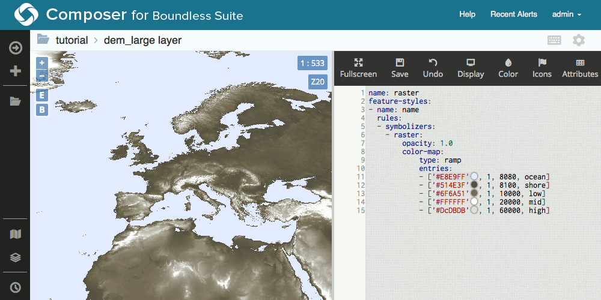

.. _cartography.ysld.composer:

Viewing styles in Composer
==========================

Styles can be viewed and edited in :ref:`GeoServer Composer <webmaps.composer>`. Styles viewed in Composer will always display in YSLD. This means that if a style was originally created in SLD, it will be converted to YSLD.

To view a layer's style in Composer:

#. Log in to Composer.

   .. note:: Read more about the :ref:`configuration pages in Composer <webmaps.composer.configuration>`.

#. In the navigation panel, click the name of the project workspace of the layer to expand its tree. If the project workspace isn't shown, click :guilabel:`More` to bring up a list of all project workspaces.

   .. figure:: ../../webmaps/composer/img/tabsinpanel.png

      Expanded tree for a project workspace

#. Click the Layers link in the tree, or click the Layers tab in the main window. This will bring up the list of layers.

   .. figure:: img/layerstab.png

      All layers in the project workspace

#. Find the layer in the list and click the :guilabel:`Style` button associated with the layer.

   .. note:: If the list of layers is large, it can be sorted by name or by last modification, and can also filtered via string.

   .. figure:: img/layerstylelink.png

      Link to open the Style Editor

#. This will bring up the Style Editor page for this layer. The left panel will show the current view of the layer, while the right panel will show the current style. The style can be edited and the view refreshed all from this interface.

   A layer viewed in Composer

.. note:: Read more about :ref:`webmaps.composer.styleview`.
