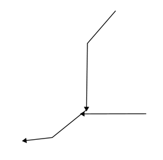

.. _cartography.ysld.reference.functions:

Functions
=========

Functions are additional operations that can be employed when calculating values for YSLD parameters. In most cases, a value for a parameter can be the output (result) of a function.

Functions can be used in most places in a style document.

Syntax
------

Functions aren't a parameter to itself, but instead are used as a part of the values of a parameter, or indeed in any expression. So the syntax is very general, for example::

  <parameter>: <function>

Functions are evaluated at rendering time, so the output is passed as the parameter value and then rendered accordingly.

List of functions
-----------------

A reference list of functions can be found in the `GeoServer User Manual </../geoserver/filter/function_reference.html>`_ and is also available in raw form in the `GeoTools User Manual <http://docs.geotools.org/latest/userguide/library/main/function_list.html>`_.

The functions can be broken up loosely into categories such as geometric, math, and string functions.

Theming functions
~~~~~~~~~~~~~~~~~

There are three important functions that are often easier to use for theming than using rules, and can vastly simplify your style documents:

**Recode**: Attribute values are directly mapped to styling properties::

  recode(attribute,value1,result1,value2,result2,value3,result3,...)

This is equivalent to creating multiple rules with similar filters::

  rules:
  - ...
    filter: [attribute] = value1
    - ...
      <property>: result1
  - ...
    filter: [attribute] = value2
    - ...
      <property>: result2
  - ...
    filter: [attribute] = value3
    - ...
      <property>: result3

**Categorize**: Categories are defined using minimum and maximum ranges, and attribute values are sorted into the appropriate category::

  categorize(attribute,value1,category1,value2,category2,value3,category3,...)

.. todo:: ARE THESE VALUES MIN OR MAX? INCLUSIVE OR EXCLUSIVE? ORDERED? TEST THESE.

This would create a situation where the ``attribute`` value, if less than ``value1`` will be given the result of ``category1``; if between ``value1`` and ``value2``, will be given the result of ``category2``;  if between ``value2`` and ``value3``, will be given the result of ``category3``, etc.

This is equivalent to creating the following multiple rules::

  rules:
  - ...
    filter: [attribute] < value1
    - ...
      <property>: category1
  - ...
    filter: [attribute] >= value1 AND [attribute] < value2
    - ...
      <property>: category2
  - ...
    filter: [attribute] >= value2 AND [attribute] < value3
    - ...
      <property>: category3

**Interpolate**: Used to smoothly theme quantitative data by calculating a styling property based on an attribute value. This is similar to Categorize, except that the values are continuous and not discrete::

  interpolate(attribute,value1,entry1,value2,entry2,...)

.. todo:: ARE THESE VALUES MIN OR MAX? INCLUSIVE OR EXCLUSIVE? ORDERED? TEST THESE.

This would create a situation where the ``attribute`` value, if equal to ``value1`` will be given the result of ``entry1``; if halfway between ``value1`` and ``value2`` will be given a result of halfway in between ``entry1`` and ``entry2``; if three-quarts between ``value1`` and ``value2`` will be given a result of three-quarters in between ``entry1`` and ``entry2``, etc.

There is no equivalent to this function in vector styling. The closest to this in raster styling is the color ramp.

Examples
--------

**Display rotated arrows at the endpoint of a line geometry**

The ``startPoint(geom)`` and ``endPoint(geom)`` functions take a geometry as an argument and returns the start and end points of the geometry respectively. The ``startAngle(geom)`` and ``endAngle(geom)`` functions take a geometry as an argument and return the angle of the line terminating at the start and end points of the geometry respectively.  These functions can be used to display an arrow at the end of a line geometry, and rotate it to match the direction of the line::

  point:
    geometry: ${endPoint(geom)}
    rotation: ${endAngle(geom)+90}
    size: 10
    symbols:
    - mark:
        shape: triangle

   Endpoint arrows

**Add a drop shadow**

The ``offset(geom, x, y)`` function takes a geometry and two values, and displaces the geometry by those values in the ``x`` and ``y`` directions. This can be used to create a drop-shadow effect::

  feature-styles:
  - name: shadow
    rules:
    - symbolizers:  
      - polygon:
          stroke-width: 0.0
          fill-color: 000000
          fill-opacity: 0.75
          geometry: ${offset(geom, 0.0001, -0.0001)}
  - name: fill
    rules:
    - symbolizers:  
      - polygon:
        stroke-width: 0.0
        fill-color: 00ffff 

.. figure:: img/functions_dropshadow.png

   Drop shadow

**Add a different-colored outline**

The ``buffer(geom, buffer)`` function takes a geometry and a value as arguments, and returns a polygon geometry with a boundary equal to the original geometry plus the value. This can be used to generate an extended outline filled with a different color, for example to style a shoreline::

  feature-styles:
  - name: shoreline
    rules:
    - polygon:
        fill-color: 00bbff
        geometry: ${buffer(geom, 0.00025)}
  - name: land
    rules:
    - polygon:
        fill-color: 00dd00

.. figure:: img/functions_buffer.png

   Buffered outline

See also:

* `convexHull(geom) </../geoserver/filter/function_reference.html#geometric-functions>`_
* `octagonalEnvelope(geom) </../geoserver/filter/function_reference.html#geometric-functions>`_
* `mincircle(geom) </../geoserver/filter/function_reference.html#geometric-functions>`_
* `minrectangle(geom) </../geoserver/filter/function_reference.html#geometric-functions>`_
* `minimumdiameter(geom) </../geoserver/filter/function_reference.html#geometric-functions>`_

**Display vertices of a line**

The ``vertices(geom)`` function takes a geometry and returns a collection of points representing the vertices of the geometry. This can be used to convert a polygon or line geometry into a point geometry::

  point:
    geometry: vertices(geom)

.. figure:: img/functions_vertices.png

   Endpoint arrows

See also:

* `boundary(geom) </../geoserver/filter/function_reference.html#geometric-functions>`_
* `centroid(geom) </../geoserver/filter/function_reference.html#geometric-functions>`_

**Angle between two points**

The ``atan2(x, y)`` function calculates the arctangent of (y/x) and so is able to determine the angle (in radians) between two points. This function uses the signs of the x and y values to determine the computed angle, so it is preferable over ``atan()``. The ``getX(point_geom)`` and ``getY(point_geom)`` extracts the ``x`` and ``y`` ordinates from a geometry respectively, while ``toDegrees(value)`` converts from radians to degrees::

  point:
    symbols:
    - mark:
        shape: triangle     
    rotation: ${toDegrees(atan2(getX(startPoint(the_geom))-getX(endPoint(the_geom)),getY(startPoint(the_geom))-getY(endPoint(the_geom))))}

See also:

* `sin(value) </../geoserver/filter/function_reference.html#math-functions>`_
* `cos(value) </../geoserver/filter/function_reference.html#math-functions>`_
* `tan(value) </../geoserver/filter/function_reference.html#math-functions>`_
* `asin(value) </../geoserver/filter/function_reference.html#math-functions>`_
* `acos(value) </../geoserver/filter/function_reference.html#math-functions>`_
* `atan(value) </../geoserver/filter/function_reference.html#math-functions>`_
* `toRadians(value) </../geoserver/filter/function_reference.html#math-functions>`_
* `pi() </../geoserver/filter/function_reference.html#math-functions>`_

**Scale objects based on a large range of values**

The ``log(value)`` function returns the natural logarithm of the provided value. Use ``log(value)/log(base)`` to specify a different base.

For example, specifying ``log(population)/log(2)`` will make the output increase by 1 when the value of population doubles. This allows one to display relative sizes on a consistent scale while still being able to represent very small and very large populations::

  point:
    symbols:
    - mark:
        shape: circle
    size: ${log(population)/log(2)}

See also:

* `exp(val) </../geoserver/filter/function_reference.html#math-functions>`_
* `pow(base,exponent) </../geoserver/filter/function_reference.html#math-functions>`_
* `sqrt(val) </../geoserver/filter/function_reference.html#math-functions>`_

**Combine several strings into one**

The ``Concatenate(string1, string2, ...)`` function takes any number of strings and combines them to form a single string. This can be used to display more than one attribute within a single label::

  text:
    label: ${Concatenate(name, ', ', population)}

**Capitalize words**

The ``strCapitalize(string)`` function takes a single string and capitalizes the first letter of each word in the string. This could be used to capitalize labels created from lower case text::

  text:
    label: ${strCapitalize(name)}

See also:

* `strToLowerCase(string) </../geoserver/filter/function_reference.html#string-functions>`_
* `strToUpperCase(string) </../geoserver/filter/function_reference.html#string-functions>`_

A list of fill values based on discrete attribute values (using Recode)::

  fill: recode(color,1,ff0000,2,00ff00,3,0000ff,4,000000)
  stroke: 808080

The above symbolizer contents will color features differently, dependent on the value of the attribute ``color``. If the value is ``1``, the ``fill`` will be ``ff0000``; if the value is ``2``, the ``fill`` will be ``00ff00``, and so forth. In all cases, though, the stroke will be ``808080``.

A list of fills based on attribute values (using Categorize)::

  fill: categorize(option,0,ff0000,10,00ff00,20,0000ff,100,000000)
  stroke: 808080

The abolve symbolizer content will color features differently, dependent on the value of the attribute ``option``. If the value is SOMETHING...

A gradient of fills based on attribute values (using Interpolate)::

  fill: interpolate(color,0,ff0000,30,00ff00,60,0000ff,255,000000)
  stroke: 808080

The abolve symbolizer content will color features differently, dependent on the value of the attribute ``option``. If the value is SOMETHING...

