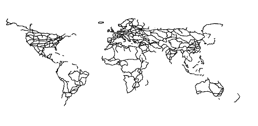
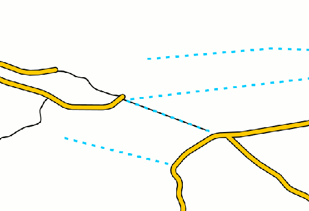

.. _cartography.ysld.tutorial.line:

Line Style
==========

In the layers tab of the Composer, click on the style option for the “ne_10m_admin_0_roads” layer to go to the styling page. A simple default style is already associated with this layer.
The boundary lines layer is a line layer, so we use a :ref:`line symbolizer <cartography.ysld.reference.symbolizers.line>`.

.. figure:: img/line_default.png

   Default line style

We can immediately see that there are far more roads than we need on this layer. Fortunately, the road data contains a ``scalerank`` attribute to help determine the importance of different roads. Add a filter to only show roads with a ``scalerank < 4``. Then our YSLD looks like::

  name: roads
  title: Simple road styler
  feature-styles:
  - name: name
    rules:
    - filter: scalerank < 4
      symbolizers:
      - line:
          stroke-color: 000000
          stroke-width: 1

The layer now appears much less cluttered:

Scale
-----

If we zoom in, we want to see all the roads, not just those included in our filter. The scale property can be used with rules to show or hide symbolizers depending on the :ref:`zoom level <cartography.ysld.reference.scalezoom>`. In order to determine what roads to show, we will again use the ``scalerank`` attribute of the data. After adding a few scale rules the YSLD looks like::

  name: roads
  title: Simple road styler
  feature-styles:
  - name: name
    rules:
    - scale: (8000000,)
      filter: scalerank < 4
      symbolizers:
      - line:
          stroke-color: 000000
          stroke-width: 1
    - scale: (2000000,8000000)
      filter: scalerank < 8
      symbolizers:
      - line:
          stroke-color: 000000
          stroke-width: 1
    - scale: (,2000000)
      symbolizers:
      - line:
          stroke-color: 000000
          stroke-width: 1

This YSLD means that at scales greater than ``8000000``, draw roads with ``scalerank < 4``. Between scale ``2000000`` and ``8000000``, draw roads with ``scalerank < 8``. Below scale ``2000000``, draw all roads.

Line Styling
------------

On the smaller scales, we want some differentiation between roads:
Add a new rule for roads that have attribute ``featurecla = 'Ferry'``, and draw these roads with a blue line::

    - name: ferry
      scale: (,8000000)
      filter: featurecla = 'Ferry'
      symbolizers:
      - line:
          stroke-color: 00ccff

Further modify this rule to use a dashed line::

          stroke-width: 2
          stroke-dasharray: '4 6'

Road Casing
-----------

Line symbolizers only have a stroke, so you cannot normally draw an outline around a line. This effect can be accomplished by drawing two line symbolizes of different widths, one on top of the other.
Add a new rule to draw expressways using 6-wide black lines with round ends. This will be our outline::

    - name: expressway
      scale: (,8000000)
      filter: expressway = 1
      symbolizers:
      - line:
          stroke-color: 000000
          stroke-width: 6
          stroke-linecap: round

In order to ensure the inner line is drawn last, it must be in a separate :ref:`feature style <cartography.ysld.reference.featurestyles>`. At the bottom of our YSLD, we add a new ``feature-style`` named inner, which contains a rule to draw expressways using 4-wide orange lines with round ends::

  - name: inner
    rules:
    - name: expressway
      scale: (,8000000)
      filter: expressway = 1
      symbolizers:
      - line:
          stroke-color: ffcc00
          stroke-width: 4
          stroke-linecap: round

These two rules will draw expressways as orange lines with a black casing.

After adding the ferries and expressways rules, if we zoom into the layer we see:

Now that we have these rules for special types of roads, we want to make sure our basic rule does not also draw lines for these special roads. We can add a filter to the rule to exclude these from the rule (``<>`` means NOT or NOT EQUAL TO)::

   - name: roads
      scale: ( ,8000000)
      filter: scalerank < 8 AND expressway <> 1 and featurecla <> 'Ferry'
      symbolizers:
      - line:
          stroke-color: 333333
          stroke-width: 1

Else
----

When we added the above rules, we made them apply for all zoom levels below ``8000000``. However, we still have a rule that draws ALL the roads if the zoom level is below ``2000000``. We still want to use this rule, but we do not want it to apply if we are already drawing a styled road. To accomplish this, we can make it an ``else`` rule. This means that it will only apply if no other filter is true. This way when we zoom past ``100000``, we see all the roads, without drawing over our special styles for ferries and expressways::

    - name: else
      scale: (,2000000)
      else: true
      symbolizers:
      - line:
          stroke-color: 777777
          stroke-width: 0.5

After all these changes, the final YSLD is::

  name: roads
  title: Simple road styler
  feature-styles:
  - name: roads
    rules:
    - scale: (8000000,)
      filter: scalerank < 4
      symbolizers:
      - line:
          stroke-color: 333333
          stroke-width: 0.5
    - name: expressway
      scale: (,8000000)
      filter: expressway = 1
      symbolizers:
      - line:
          stroke-color: 000000
          stroke-width: 6
          stroke-linecap: round
    - name: ferry
      scale: (,8000000)
      filter: featurecla = 'Ferry'
      symbolizers:
      - line:
          stroke-color: 00ccff
          stroke-width: 2
          stroke-dasharray: '4 6'
    - name: roads
      scale: ( ,8000000)
      filter: scalerank < 8 AND expressway <> 1 and featurecla <> 'Ferry'
      symbolizers:
      - line:
          stroke-color: 333333
          stroke-width: 1
    - name: else
      scale: (,2000000)
      else: true
      symbolizers:
      - line:
          stroke-color: 777777
          stroke-width: 0.5
  - name: inner
    rules:
    - name: expressway
      scale: (,8000000)
      filter: expressway = 1
      symbolizers:
      - line:
          stroke-color: ffcc00
          stroke-width: 4
          stroke-linecap: round

The resulting map shows different levels of road detail at different zoom levels:

.. figure:: img/line_all_zoom_1.png

.. figure:: img/line_all_zoom_2.png

.. figure:: img/line_all_zoom_3.png
