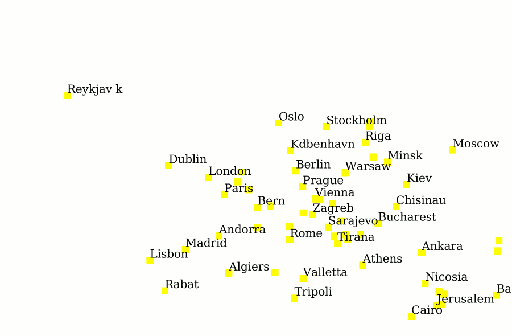

.. _cartography.ysld.tutorial.point:

Point Style
===========

In the layers tab of the Composer, click on the style option for the “ne_10m_admin_0_populated_places” layer to go to the styling page. A simple default style is already associated with this layer.
The populated places layer is a point layer, so we use a :ref:`point symbolizer <cartography.ysld.reference.symbolizers.point>`.

.. figure:: img/point_default.png

   Default point style

Looking at the styling page, we can see there are a lot of points in this data set, and we probably do not want to draw all of them. We can use the ``ADM0CAP`` attribute to filter points that correspond to capital cities::

  name: places
  title: Populated places styler
  feature-styles:
  - name: name
    rules:
    - filter: ADM0CAP = 1.0
      symbolizers:
      - point:
          size: 6
          symbols:
          - mark:
              shape: square
              fill-color: ffff00

Add a text symbolizer referencing the ``NAME`` attribute to display the names of the cities::

  name: places
  title: Populated places styler
  feature-styles:
  - name: name
    rules:
    - filter: ADM0CAP = 1.0
      symbolizers:
      - point:
          size: 6
          symbols:
          - mark:
              shape: square
              fill-color: ffff00
      - text:
          label: ${NAME}

This is much better. We now have a reasonably sized set of labeled points.

Point Styling
-------------

Now, lets do some styling. Point symbolizes are described by symbols, which can either be one of a predefined set of :ref:`marks <cartography.ysld.reference.symbolizers.point>`, or an external image. Marks can be styled just like polygons, with both stroke and fill.
Under the point symbolizer, set::

        size: 7
          symbols:
          - mark:
              shape: star
              fill-color: 000000

This draws a black star 7 pixels wide.
Create a second point symbolizer, and set::

        size: 8
          symbols:
          - mark:
              shape: circle
              stroke-color: 000000

This draws the outline of a black circle, 8 pixels wide.

Modify the text symbolizer so that it displays labels better:

.. list-table::
   :class: non-responsive
   :widths: 40 60 

   * - ``font-weight: bold``
     - Make the font bold
   * - ``displacement: (3, 2)``
     - Adjusts the label so it does not overlap the point symbolizer
   * - ``x-labelPriority: ${10-LABELRANK}``
     - Select labels based on priority (This uses the LABELRANK attribute of the places data).

The full YSLD is now::

  name: places
  title: Populated places styler
  feature-styles:
  - name: name
    rules:
    - filter: ADM0CAP = 1.0
      symbolizers:
      - point:
          size: 7
          symbols:
          - mark:
              shape: star
              fill-color: 000000
      - point:
          size: 8
          symbols:
          - mark:
              shape: circle
              stroke-color: 000000
      - text:
          label: ${NAME}
          font-weight: bold
          displacement: (3, 2)
          x-labelPriority: ${10-LABELRANK}

The layer looks like:

.. figure:: img/point_style_label.png

Since this data set contains population attributes, lets scale the size of the points based on population. Use ``log(POP2015)/log(2)`` to get a nice relative scale without to much variation in point size. Replacing our two scale values here, we get::

  name: places
  title: Populated places styler
  feature-styles:
  - name: name
    rules:
    - filter: ADM0CAP = 1.0
      symbolizers:
      - point:
          size: ${log(POP2015)/log(2) - 1}
          symbols:
          - mark:
              shape: star
              fill-color: 000000
      - point:
          size: ${log(POP2015)/log(2)}
          symbols:
          - mark:
              shape: circle
              stroke-color: 000000
      - text:
          label: ${NAME}
          font-weight: bold
          displacement: (5, 4)
          x-labelPriority: ${10-LABELRANK}

On the map, we see that different cities now have different sizes:

.. figure:: img/point_size_label.png

So that points show up a bit nicer, let's add some scale filters. So the points are not so crowded when zoomed out, we will only show labels past scale ``50000000``::

  name: places
  title: Populated places styler
  feature-styles:
  - name: name
    rules:
    - scale: (100000000, )
      filter: ADM0CAP = 1.0
      symbolizers:
      - point:
          size: 2
          symbols:
          - mark:
              shape: circle
              fill-color: 000000
    - scale: (, 100000000)
      filter: ADM0CAP = 1.0
      symbolizers:
      - point:
          size: ${log(POP2015)/log(2) - 1}
          symbols:
          - mark:
              shape: star
              fill-color: 000000
      - point:
          size: ${log(POP2015)/log(2)}
          symbols:
          - mark:
              shape: circle
              stroke-color: 000000
    - scale: (, 50000000)
      filter: ADM0CAP = 1.0  
      symbolizers:
      - text:
          label: ${NAME}
          font-weight: bold
          displacement: (5, 4)
          x-labelPriority: ${10-LABELRANK}

To show all cities when we are fully zoomed in, we can add some else rules for small scales. Again, we will display the points at higher zoom levels than the labels::

    - scale: (5000000, 10000000)
      else: true
      symbolizers:
        - point:
            size: ${log(POP2015)/log(2)-1}
            symbols:
            - mark:
                shape: circle
                stroke-color: 000000
                fill-color: 777777
                fill-opacity: 0.5
    - scale: (, 5000000)
      else: true
      symbolizers:
        - point:
            size: ${log(POP2015)/log(2)-1}
            symbols:
            - mark:
                shape: circle
                stroke-color: 000000
                fill-color: 777777
                fill-opacity: 0.5
        - text:
            label: ${NAME}
            displacement: (5, 4)
            x-labelPriority: ${10-LABELRANK}

The full YSLD is now::

  name: places
  title: Populated places styler
  feature-styles:
  - name: name
    rules:
    - scale: (100000000, )
      filter: ADM0CAP = 1.0
      symbolizers:
      - point:
          size: 2
          symbols:
          - mark:
              shape: circle
              fill-color: 000000
    - scale: (, 100000000)
      filter: ADM0CAP = 1.0
      symbolizers:
      - point:
          size: ${log(POP2015)/log(2) - 1}
          symbols:
          - mark:
              shape: star
              fill-color: 000000
      - point:
          size: ${log(POP2015)/log(2)}
          symbols:
          - mark:
              shape: circle
              stroke-color: 000000
    - scale: (, 50000000)
      filter: ADM0CAP = 1.0  
      symbolizers:
      - text:
          label: ${NAME}
          font-weight: bold
          displacement: (5, 4)
          x-labelPriority: ${10-LABELRANK}
    - scale: (5000000, 10000000)
      else: true
      symbolizers:
        - point:
            size: ${log(POP2015)/log(2)-1}
            symbols:
            - mark:
                shape: circle
                stroke-color: 000000
                fill-color: 777777
                fill-opacity: 0.5
    - scale: (, 5000000)
      else: true
      symbolizers:
        - point:
            size: ${log(POP2015)/log(2)-1}
            symbols:
            - mark:
                shape: circle
                stroke-color: 000000
                fill-color: 777777
                fill-opacity: 0.5
        - text:
            label: ${NAME}
            displacement: (5, 4)
            x-labelPriority: ${10-LABELRANK}

After these modifications, we have a much nicer display at different zoom levels:

.. figure:: img/point_zoom_2.png

.. figure:: img/point_zoom_3.png

.. figure:: img/point_zoom_5.png
