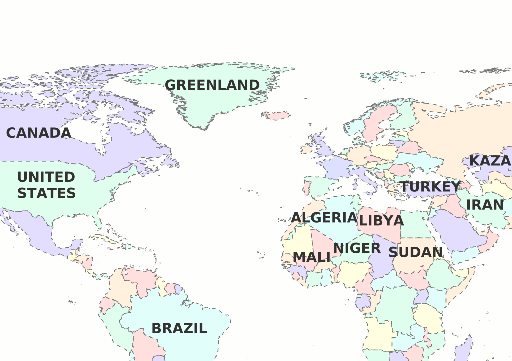

.. _cartography.ysld.tutorial.polygon:

Styling a polygon layer
=======================

The Countries layer is a polygon layer, and therefore we use a :ref:`polygon symbolizer <cartography.ysld.reference.symbolizers.polygon>` to display it. 

Viewing the existing style
--------------------------

#. In the layers tab of the Composer, click on the style option for the ``ne_10m_admin_0_countries`` layer to go to the style edit page. A simple default style is already associated with this layer.

   .. figure:: img/poly_default.png

      Default polygon style

   .. note:: Your default color may vary.

   Observe that the default style draws a colored polygon with a black border for every country.

#. The default style will look something like this::

    name: Default Styler
    title: A yellow polygon style
    feature-styles:
    - name: name
      rules:
      - title: yellow polygon
        symbolizers:
        - polygon:
            stroke-color: 000000
            stroke-width: 0.5
            fill-color: ffff00

Setting basic styling
---------------------

Polygon symbolizers provide options for styling both fill (inside) and stroke (outline) of features.

#. Modify the default style to create a nicer display using the following additional parameters:

   .. list-table::
      :class: non-responsive
      :widths: 40 60 
      :header-rows: 1

      * - Parameter
        - Description
      * - ``fill-color: efefc3``
        - Change the fill color to a pale brown
      * - ``fill-opacity: 0.5``
        - Make the fill 50% transparent
      * - ``stroke-color: 777777``
        - Change the stroke color
      * - ``stroke-dasharray: '4 4'``
        - Use dashed lines of 4px with 4px gaps
      * - ``stroke-width: 0.5``
        - Use a line width of 0.5 px

#. The complete style after these changes will be::

      name: countries
      title: Simple countries style
      feature-styles:
      - name: name
        rules:
        - symbolizers:
          - polygon:
              stroke-color: 777777
              stroke-dasharray: '4 4'
              stroke-width: 0.5
              fill-color: efefc3
              fill-opacity: 0.5

   And the layer now will look like this:

   .. figure:: img/poly_basic.png

      Basic styled polygons

Adding filters
--------------

Suppose we wish to display different colors for each country. The countries layer contains an attribute called ``MAPCOLOR7``, which assigns each country a number from 1 to 7, such that no adjacent countries have the same number. We can use this attribute to control what color a country is using :ref:`filters <cartography.ysld.reference.filters>`. Filters apply a condition to a rule, so that the symbolizers in that rule are only drawn if the filter evaluates to true.

#. Add seven rules, corresponding to the seven possibilities for ``MAPCOLOR7``. For each value, set the ``fill-color`` to the following values:

   .. list-table::
      :class: non-responsive
      :widths: 40 60 
      :header-rows: 1

      * - Filter
        - Parameter
      * - ``MAPCOLOR7 = 1``
        - ``fill-color: ffc3c3``
      * - ``MAPCOLOR7 = 2``
        - ``fill-color: ffe3c3``
      * - ``MAPCOLOR7 = 3``
        - ``fill-color: ffffc3``
      * - ``MAPCOLOR7 = 4``
        - ``fill-color: c3ffe3``
      * - ``MAPCOLOR7 = 5``
        - ``fill-color: c3ffff``
      * - ``MAPCOLOR7 = 6``
        - ``fill-color: c3c3ff``
      * - ``MAPCOLOR7 = 7``
        - ``fill-color: bfc3ff``

#. After adding the filters, the style will look like::

    name: countries
    title: Simple countries style
    feature-styles:
    - name: name
      rules:
      - filter: ${MAPCOLOR7 = 1}
        symbolizers:
        - polygon:
            stroke-color: 777777
            stroke-dasharray: '4 4'
            stroke-width: 0.5
            fill-color: ffc3c3
            fill-opacity: 0.5
      - filter: ${MAPCOLOR7 = 2}
        symbolizers:
        - polygon:
            stroke-color: 777777
            stroke-dasharray: '4 4'
            stroke-width: 0.5
            fill-color: ffe3c3
            fill-opacity: 0.5
      - filter: ${MAPCOLOR7 = 3}
        symbolizers:
        - polygon:
            stroke-color: 777777
            stroke-dasharray: '4 4'
            stroke-width: 0.5
            fill-color: ffffc3
            fill-opacity: 0.5
      - filter: ${MAPCOLOR7 = 4}
        symbolizers:
        - polygon:
            stroke-color: 777777
            stroke-dasharray: '4 4'
            stroke-width: 0.5
            fill-color: c3ffe3
            fill-opacity: 0.5
      - filter: ${MAPCOLOR7 = 5}
        symbolizers:
        - polygon:
            stroke-color: 777777
            stroke-dasharray: '4 4'
            stroke-width: 0.5
            fill-color: c3ffff
            fill-opacity: 0.5
      - filter: ${MAPCOLOR7 = 6}
        symbolizers:
        - polygon:
            stroke-color: 777777
            stroke-dasharray: '4 4'
            stroke-width: 0.5
            fill-color: c3c3ff
            fill-opacity: 0.5
      - filter: ${MAPCOLOR7 = 7}
        symbolizers:
        - polygon:
            stroke-color: 777777
            stroke-dasharray: '4 4'
            stroke-width: 0.5
            fill-color: bfc3ff
            fill-opacity: 0.5

   .. figure:: img/poly_color.png

      Adjacent countries will not have the same color

Compacting thematic styles with transformation functions
--------------------------------------------------------

While filters are very useful, the required syntax is quite long, and much of the content is redundant. The exact same functionality can be accomplished much more concisely using the :ref:`recode function <cartography.ysld.reference.functions>`.

#. Using the style from before we added the filters, change the ``fill-color`` to::

     fill-color: ${recode(MAPCOLOR7, 1, '#ffc3c3', 2, '#ffe3c3', 3, '#ffffc3', 4, '#c3ffe3', 5, '#c3ffff', 6, '#c3c3ff', 7, '#bfc3ff')} 

   This sets the ``fill-color`` based on the value of ``MAPCOLOR7``, according to the key-value pairs in the ``recode`` function. If ``MAPCOLOR7 = 1``, set to ``ffc3c3``, if ``MAPCOLOR7 = 2`` set to ``ffe3c3``, etc.

   .. note:: The ``recode`` function requires a ``#`` prefix before the color codes.

#. The style now looks much simpler::

    name: countries
    title: Simple countries style
    feature-styles:
    - name: name
      rules:
      - title: countries
        symbolizers:
        - polygon:
            stroke-color: 777777
            stroke-dasharray: '4 4'
            stroke-width: 0.5
            fill-opacity: 0.5
            fill-color: ${recode(MAPCOLOR7, 1.0, '#ffc3c3', 2.0, '#ffe3c3', 3.0, '#ffffc3', 4.0, '#c3ffe3', 5.0, '#c3ffff', 6.0, '#c3c3ff', 7.0, '#bfc3ff')}

   It should be noted that this will produce the *exact same output* as in the previous section.

Adding labels
-------------

Labels can be applied to any layer using a :ref:`text symbolizer <cartography.ysld.reference.symbolizers.text>`. Typically you will want to use some data attribute as the label text, usually a name.

#. Add a text symbolizer with a basic label using the ``NAME`` attribute::

    name: countries
    title: Simple countries style
    feature-styles:
    - name: name
      rules:
      - title: countries
        symbolizers:
        - polygon:
            stroke-color: 777777
            stroke-dasharray: '4 4'
            stroke-width: 0.5
            fill-opacity: 0.5
            fill-color: ${recode(MAPCOLOR7, 1, '#ffc3c3', 2, '#ffe3c3', 3, '#ffffc3', 4, '#c3ffe3', 5, '#c3ffff', 6, '#c3c3ff', 7, '#bfc3ff')}
        - text:
            label: ${NAME}

#. After this change, the map will look like:

   .. figure:: img/poly_label_basic.png

#. The default labeling parameters are not ideal, but a number of styling options are available. Add the following attributes to the text symbolizer:

   .. list-table::
      :class: non-responsive
      :widths: 40 60 
      :header-rows: 1

      * - Parameter
        - Description
      * - ``label: ${strToUpperCase(NAME)}``
        - Change the label text to uppercase
      * - ``font-size: 14``
        - Change the font size to 14
      * - ``font-family: SansSerif``
        - Change the font to SansSerif
      * - ``font-weight: bold``
        - Make the font bold
      * - ``fill-color: 333333``
        - Change the font color to dark gray

#. This gives a much nicer font style, but the label placement is still poor. We can use some additional options to fix this:

   .. list-table::
      :class: non-responsive
      :widths: 40 60 
      :header-rows: 1

      * - Parameter
        - Description
      * - ``x-autoWrap: 100``
        - Wrap any labels wider than 100 pixels
      * - ``x-maxDisplacement: 200``
        - Allow labels to shift up to 200 pixels to maintain best placement
      * - ``x-goodnessOfFit: 0.8``
        - Only show labels with 0.8 or better fit
      * - ``x-labelPriority: ${10-LABELRANK}``
        - Select labels based on priority (uses the ``LABELRANK`` attribute of the data to determine this).

Final style
-----------

The full style now looks like this::

      name: countries
      title: Simple countries style
      feature-styles:
      - name: name
        rules:
        - title: countries
          symbolizers:
          - polygon:
              stroke-color: 777777
              stroke-dasharray: '4 4'
              stroke-width: 0.5
              fill-opacity: 0.5
              fill-color: ${recode(MAPCOLOR7, 1, '#ffc3c3', 2, '#ffe3c3', 3, '#ffffc3', 4, '#c3ffe3', 5, '#c3ffff', 6, '#c3c3ff', 7, '#bfc3ff')}
          - text:
              label: ${strToUpperCase(NAME)}
              font-size: 14
              font-family: SansSerif
              font-weight: bold
              fill-color: 333333
              x-autoWrap: 100
              x-maxDisplacement: 200
              x-goodnessOfFit: 0.8
              x-labelPriority: ${10-LABELRANK}

With these additions, the labels now appear much clearer:

   Completed countries style

.. note:: :download:`Download the final polygon style <files/ysldtut_poly.ysld>`

Continue on to :ref:`cartography.ysld.tutorial.point`.
