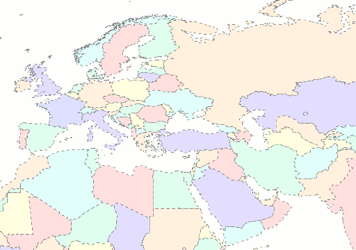
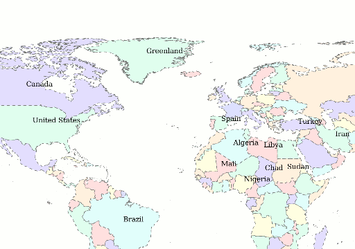

.. _cartography.ysld.tutorial.polygon:

Polygon Style
=============

In the layers tab of the Composer, click on the style option for the “ne_10m_admin_0_countries” layer to go to the styling page. A simple default style is already associated with this layer::

  name: Default Styler
  title: A yellow polygon style
  feature-styles:
  - name: name
    rules:
    - title: yellow polygon
      symbolizers:
      - polygon:
          stroke-color: 000000
          stroke-width: 0.5
          fill-color: ffff00

The countries layer is a polygon layer, and therefore we use a :ref:`polygon symbolizer <cartography.ysld.reference.symbolizers.polygon>` to display it. Observe that the default style draws a colored polygon with a black border for every country. 

.. figure:: img/poly_default.png
   
   Default polygon style

Polygon Styling
---------------

Polygon symbolizers provide options for styling both fill and stroke. Lets modify the default style to create a nicer display:

.. list-table::
   :class: non-responsive
   :widths: 40 60 

   * - ``fill-color: efefc3``
     - Change the fill color to a pale brown
   * - ``fill-opacity: 0.5``
     - Make the fill 50% transparent
   * - ``stroke-color: 777777``
     - Change the stroke color
   * - ``stroke-dasharray: '4 4'``
     - Use dashed lines of 4 px with 4 px gaps
   * - ``stroke-width: 0.5``
     - Use a line width of 0.5 px

The complete YSLD after these changes is::

  name: countries
  title: Simple country styler
  feature-styles:
  - name: name
    rules:
    - symbolizers:
      - polygon:
          stroke-color: 777777
          stroke-dasharray: '4 4'
          stroke-width: 0.5
          fill-color: efefc3
          fill-opacity: 0.5

The layer now looks like:

.. figure:: img/poly_basic.png

Using Filters
-------------

Suppose we wish to display different colors for each country. The countries layer contains an attribute called ``MAPCOLOR7``, which assigns each country a number from 1 to 7, such that no adjacent countries have the same number. We can use this attribute to control what color a country is using :ref:`filters <cartography.ysld.reference.filters>`. Filters apply a condition to a rule, so that the symbolizers in that rule are only drawn if the filter evaluates to true. After adding the filters, the YSLD looks like::

  name: countries
  title: Simple country styler
  feature-styles:
  - name: name
    rules:
    - filter: MAPCOLOR7 = 1.0
      symbolizers:
      - polygon:
          stroke-color: 777777
          stroke-dasharray: '4 4'
          stroke-width: 0.5
          fill-color: ffc3c3
          fill-opacity: 0.5
    - filter: MAPCOLOR7 = 2.0
      symbolizers:
      - polygon:
          stroke-color: 777777
          stroke-dasharray: '4 4'
          stroke-width: 0.5
          fill-color: ffe3c3
          fill-opacity: 0.5
    - filter: MAPCOLOR7 = 3.0
      symbolizers:
      - polygon:
          stroke-color: 777777
          stroke-dasharray: '4 4'
          stroke-width: 0.5
          fill-color: ffffc3
          fill-opacity: 0.5
    - filter: MAPCOLOR7 = 4.0
      symbolizers:
      - polygon:
          stroke-color: 777777
          stroke-dasharray: '4 4'
          stroke-width: 0.5
          fill-color: c3ffe3
          fill-opacity: 0.5
    - filter: MAPCOLOR7 = 5.0
      symbolizers:
      - polygon:
          stroke-color: 777777
          stroke-dasharray: '4 4'
          stroke-width: 0.5
          fill-color: c3ffff
          fill-opacity: 0.5
    - filter: MAPCOLOR7 = 6.0
      symbolizers:
      - polygon:
          stroke-color: 777777
          stroke-dasharray: '4 4'
          stroke-width: 0.5
          fill-color: c3c3ff
          fill-opacity: 0.5
    - filter: MAPCOLOR7 = 7.0
      symbolizers:
      - polygon:
          stroke-color: 777777
          stroke-dasharray: '4 4'
          stroke-width: 0.5
          fill-color: bfc3ff
          fill-opacity: 0.5

Here, we observe seven different filters, each with their own symbolizer. Each filter only applies for a certain value of ``MAPCOLOR7``, and each symbolizer has a different ``fill-color``, so the countries are drawn in different colors depending on their value of ``MAPCOLOR7``.

Transformation Functions
------------------------

While filters are very useful, the required YSLD is quite long. The exact same functionality can be accomplished much more concisely using the :ref:`recode function <cartography.ysld.reference.functions>`. Using the YSLD from before we added the filters, change the fill-color to::

  fill-color: ${recode(MAPCOLOR7, 1.0, '#ffc3c3', 2.0, '#ffe3c3', 3.0, '#ffffc3', 4.0, '#c3ffe3', 5.0, '#c3ffff', 6.0, '#c3c3ff', 7.0, '#bfc3ff')} 

This sets fill-color based on the value of ``MAPCOLOR7``, according to the key-value pairs in the recode function. If ``MAPCOLOR7 = 1.0``, fills with ``#ffc3c3``, if ``MAPCOLOR7 = 2.0`` fills with ``#ffe3c3``, etc.
The YSLD now looks like::

  name: countries
  title: Simple country styler
  feature-styles:
  - name: name
    rules:
    - title: countries
      symbolizers:
      - polygon:
          stroke-color: 777777
          stroke-dasharray: '4 4'
          stroke-width: 0.5
          fill-opacity: 0.5
          fill-color: ${recode(MAPCOLOR7, 1.0, '#ffc3c3', 2.0, '#ffe3c3', 3.0, '#ffffc3', 4.0, '#c3ffe3', 5.0, '#c3ffff', 6.0, '#c3c3ff', 7.0, '#bfc3ff')}

Labels
------

Labels can be applied to any layer using a :ref:`text symbolizer <cartography.ysld.reference.symbolizers.text>`. Most often, you will want to use some data attribute as the label text, usually a name.  If we add a text symbolizer with a basic label using the ``NAME`` attribute, our YSLD looks like::

  name: countries
  title: Simple country styler
  feature-styles:
  - name: name
    rules:
    - title: countries
      symbolizers:
      - polygon:
          stroke-color: 777777
          stroke-dasharray: '4 4'
          stroke-width: 0.5
          fill-opacity: 0.5
          fill-color: ${recode(MAPCOLOR7, 1.0, '#ffc3c3', 2.0, '#ffe3c3', 3.0, '#ffffc3', 4.0, '#c3ffe3', 5.0, '#c3ffff', 6.0, '#c3c3ff', 7.0, '#bfc3ff')}
      - text:
          label: ${NAME}

After this change, the map will look like:

The default labeling parameters are not ideal, but a number of styling options are available. Add the following attributes to the text symbolizer:

.. list-table::
   :class: non-responsive
   :widths: 40 60 

   * - ``label: ${strToUpperCase(NAME)}``
     - Change the label text to uppercase
   * - ``font-size: 14``
     - Change the font size to 14
   * - ``font-family: SansSerif``
     - Change the font to SansSerif
   * - ``font-weight: bold``
     - Make the font bold
   * - ``fill-color: 333333``
     - Change the font color to dark grey

This gives a much nicer font style, but the label placement is still poor. We can use some additional options to fix this:

.. list-table::
   :class: non-responsive
   :widths: 40 60 

   * - ``x-autoWrap: 100``
     - Wrap any names longer than 100 pixels
   * - ``x-maxDisplacement: 200``
     - Allow labels to shift up to 200 pixels to maintain best fit
   * - ``x-goodnessOfFit: 0.8``
     - Only show labels with 0.8 or better fit
   * - ``x-labelPriority: ${10-LABELRANK}``
     - Select labels based on priority (This uses the ``LABELRANK`` attribute of the country data).

The full YSLD is now::

  name: countries
  title: Simple country styler
  feature-styles:
  - name: name
    rules:
    - title: countries
      symbolizers:
      - polygon:
          stroke-color: 777777
          stroke-dasharray: '4 4'
          stroke-width: 0.5
          fill-opacity: 0.5
          fill-color: ${recode(MAPCOLOR7, 1.0, '#ffc3c3', 2.0, '#ffe3c3', 3.0, '#ffffc3', 4.0, '#c3ffe3', 5.0, '#c3ffff', 6.0, '#c3c3ff', 7.0, '#bfc3ff')}
      - text:
          label: ${strToUpperCase(NAME)}
          font-size: 14
          font-family: SansSerif
          font-weight: bold
          fill-color: 333333
          x-autoWrap: 100
          x-maxDisplacement: 200
          x-goodnessOfFit: 0.8
          x-labelPriority: ${10-LABELRANK}

With these additions, the labels now appear much clearer:

.. figure:: img/poly_label_options.png
