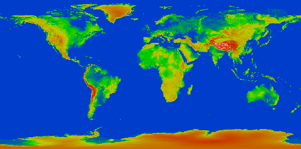

.. _cartography.ysld.tutorial.raster:

Raster Style
============

In the layers tab of the Composer, click on the style option for the “16_bit_dem_large” layer. A simple default style is already associated with this layer. This layer is a raster layer, so we use a :ref:`raster symbolizer <cartography.ysld.reference.symbolizers.raster>`

Raster layers are composed of a grid of values in one or more bands. A grayscale image will have a single band, with each grid element containing the intensity at that pixel. An RGB image will have 3 bands, corresponding to red, green, and blue values.

This raster layer has a single band. With the default raster symbolizer, it is drawn as a grayscale image.

.. figure:: img/raster_dem_gray.png

If we want the land to show up better, we can use the contrast-enhancement attribute::

          contrast-enhancement:
            mode: histogram
            gamma: 4.0

This adjusts the contrast so each brightness level contains an equal amount of content, and darkens the resulting image by a factor of ``4.0``.

The full YSLD is::

  name: raster
  feature-styles:
  - name: name
    rules:
    - symbolizers:
      - raster:
          opacity: 1.0
          contrast-enhancement:
            mode: histogram
            gamma: 4.0

The resulting image is:

.. figure:: img/raster_dem_contrast.png

Color Mapping
-------------

The color-map attribute can be used to convert any single band of data into a colored image based on the band values. It cannot be used with contrast-enhancement::

          color-map:
            type: intervals
            entries:
            - (0043c8 , 1.0, 8080, blue)
            - (00c819 , 1.0, 100000, green)

This paints intensity values below ``8080`` with the color ``0043c8``, and values between ``8080`` and ``100000`` with the color ``00c819``.

.. figure:: img/raster_dem_interval.png

The color map can also be used with ``type: ramp`` to blend colors between colormap entries. Here we create a basic rgb heightmap::

          color-map:
            type: ramp
            entries:
            - (0043c8 , 1.0, 8080, blue)
            - (00c819 , 1.0, 10000, green)
            - (bbc800 , 1.0, 15000, yellow)
            - (c81c00 , 1.0, 30000, red)
            - (ffffff , 1.0, 50000, white)

This gives:

The full YSLD for this is::

  name: raster
  feature-styles:
  - name: name
    rules:
    - symbolizers:
      - raster:
          opacity: 1.0
          color-map:
            type: ramp
            entries:
            - (0043c8 , 1.0, 8080, blue)
            - (00c819 , 1.0, 10000, green)
            - (bbc800 , 1.0, 15000, yellow)
            - (c81c00 , 1.0, 30000, red)
            - (ffffff , 1.0, 50000, white)

If we want to display this raster symbolizer alongside the other three layers while still providing some semblance of elevation data, a simpler, less colorful style would be useful::

  name: raster
  feature-styles:
  - name: name
    rules:
    - symbolizers:
      - raster:
          opacity: 1.0
          color-map:
            type: intervals
            entries:
            - (0043c8, 1.0, 8080, ocean)
            - (4b4422 , 1.0, 10000, low)
            - (857b54 , 1.0, 20000, mid)
            - (d9d1a8 , 1.0, 60000, high)

This style used a brown color palette and ``type: intervals`` to disable blending.

.. figure:: img/raster_dem_brownscale.png
