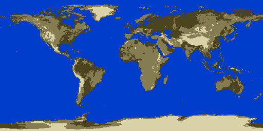

.. _cartography.ysld.tutorial.raster:

Styling a raster layer
======================

Raster layers are composed of a grid of values in one or more bands. A grayscale image will have a single band, with each grid element containing the intensity at that pixel. An RGB image will have 3 bands, corresponding to red, green, and blue values. A raster can have any number of bands.

This raster layer has a single band. With the default :ref:`raster symbolizer <cartography.ysld.reference.symbolizers.raster>`, it is drawn as a grayscale image.

Viewing the existing style
--------------------------

#. In the layers tab of Composer, click the style option for the ``dem`` layer to go to the style edit page. A simple default style is already associated with this layer:

   .. code-block:: yaml

      name: raster
      feature-styles:
      - name: name
        rules:
        - symbolizers:
          - raster:
              opacity: 1

   .. figure:: img/raster_dem_gray.png

      Default raster display

Adding contrast
---------------

#. If we want the land to show up better in the display, we can use the ``contrast-enhancement`` attribute:

   .. code-block:: yaml
      :emphasize-lines: 8-10

      name: raster
      feature-styles:
      - name: name
        rules:
        - symbolizers:
          - raster:
              opacity: 1
              contrast-enhancement:
                mode: histogram
                gamma: 4

   This adjusts the contrast so each brightness level contains an equal amount of content, and darkens the resulting image by a factor of ``4``.

   .. figure:: img/raster_dem_contrast.png

      Added contrast

Creating a color map
--------------------

The ``color-map`` attribute can be used to convert any single band of data into a colored image based on the band values.

#. Since ``contrast-enhancement`` cannot be used with ``color-map``, remove it from the style. Replace it with a color map with the following intervals:

   .. list-table::
      :class: non-responsive
      :widths: 40 60 
      :header-rows: 1

      * - Color
        - Values
      * - ``'#0043C8'``
        - Less than ``8080``
      * - ``'#00C819'``
        - Between ``8080`` and ``100000``

   .. code-block:: yaml

              color-map:
                type: intervals
                entries:
                - ['#0043C8', 1, 8080, blue]
                - ['#00C819', 1, 100000, green]

   .. figure:: img/raster_dem_interval.png

      Interval color map

#. The color map can also be used with ``type: ramp`` to create a gradient of colors between entries. Use this to create a basic colored elevation map with entries denoting ocean and four elevations:

   .. list-table::
      :class: non-responsive
      :widths: 40 60 
      :header-rows: 1

      * - Color
        - Value
      * - ``'#0043C8'`` (ocean)
        - Less than ``8080``
      * - ``'#3A3519'`` (shore)
        - Between ``8080`` and ``8100``
      * - ``'#4B4422'`` (low elevation)
        - Between ``8080`` and ``10000``
      * - ``'#857B54'`` (mid elevation)
        - Between ``10000`` and ``15000``
      * - ``'#D9D1A8'`` (red)
        - Between ``15000`` and ``30000``

   .. code-block:: yaml

              color-map:
                type: ramp
                entries:
                - ['#0043C8', 1, 8080, ocean]
                - ['#3A3519', 1, 8100, shore]
                - ['#4B4422', 1, 10000, low]
                - ['#857B54', 1, 20000, mid]
                - ['#D9D1A8', 1, 60000, high]

Final style
-----------

The final style looks like:

.. literalinclude:: files/ysldtut_raster.ysld
   :language: yaml

   Simplified color map

.. note:: :download:`Download the final raster style <files/ysldtut_raster.ysld>`

We have now styled all of our layers. Continue on to :ref:`cartography.ysld.tutorial.map` for the final step in the process.
