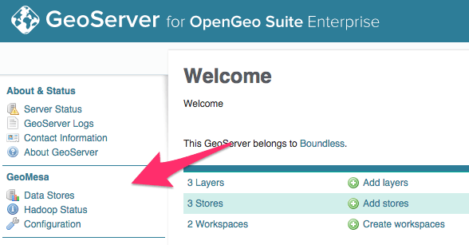

.. _dataadmin.geomesa.install:

Installation
============

Boundless has packaged and configured GeoMesa as an extension to OpenGeo Suite and as such it can be enabled through the standard :ref:`extension install <intro.extensions>` process.

* On Windows, the GeoServer Extension is called :guilabel:`GeoMesa`.
* On OS X, the folder that contains the files to copy is called :guilabel:`geomesa`.
* On all Linux versions, the package to install is called ``geoserver-geomesa``.
* For application servers, the extensions bundle will contain a directory called ``geomesa``.

After a successful installation you will see the below options appear on the left hand side of the GeoServer admin home page. 

   GeoMesa successfully installed