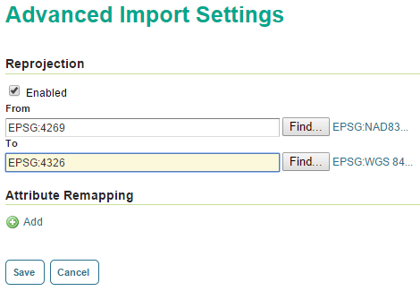

.. _dataadmin.mongodb.import:

Using the Layer Importer to load data into MongoDB
==================================================

It is possible to use the :ref:`Layer Importer <dataadmin.importer>` to load data into a MongoDB database from another format such as a shapefile.

.. note:: Please see the section on :ref:`dataadmin.importer.dbload` for more details.

Make sure to select the workspace and store that match the existing MongoDB store. All data imported into GeoServer will be first added to the MongoDB database first.

The only caveat to this process is that the data must be stored with a coordinate reference system of ``EPSG:4326``. So click the :guilabel:`Advanced` tab and in the "Reprojection" section verify the contents of the :guilabel:`From` field.  If the entry is not ``EPSG:4326``, click the :guilabel:`Enabled` checkbox and enter ``EPSG:4326`` in the :guilabel:`To` field. 

   Reprojecting to EPSG:4326

Usually the import process will be successful, but failures will occur most likely in two cases:

* **Multi-geometry support**. This is only available in MongoDB version 2.5 and newer.
* **Self-intersecting polygons**. These must be resolved with an external tool before import.

