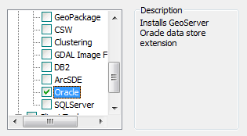

.. _dataadmin.oracle:

Working with Oracle data
========================

GeoServer can read and publish data from an Oracle Spatial database. Any table that has a valid geometry column can be published as a layer in GeoServer.

.. todo:: Caveats?

System requirements
-------------------

The following Oracle versions are supported:

.. todo:: What versions of Oracle?

Installing Oracle support
-------------------------

Installing Oracle support is the same with most :ref:`OpenGeo Suite Extensions <intro.extensions>`.

Windows
~~~~~~~

The Oracle extension can be added during the installation process. On the :guilabel:`Components` page, check the box for :guilabel:`Oracle`, in the section named :guilabel:`GeoServer Extensions`.

   Oracle in the components list

If OpenGeo Suite has already been installed, and you wish to install Oracle support at a later time, simply run the installer once more and uncheck all other items except for :guilabel:`Oracle`. This will add Oracle support to the existing OpenGeo Suite installation.

OS X
~~~~

The Oracle extension can be added to OpenGeo Suite by copying the contents of the :file:`oracle` extension folder (not the folder itself) to the GeoServer library folder. The GeoServer library folder can be found by selecting :guilabel:`Open Webapps Directory` from the GeoServer menu and then navigating to :file:`geoserver/WEB-INF/lib`.

   .. figure:: /intro/installation/mac/img/ext_webappsmenu.png

      Opening the webapps directory from the GeoServer menu

Once copied, GeoServer will need to be restarted to take effect.

Ubuntu Linux
~~~~~~~~~~~~

The Oracle extension can be added to OpenGeo Suite by installing the ``geoserver-oracle`` package:

.. code-block:: console

   apt-get install geoserver-oracle

.. note:: This command will need to be run as root or with :command:`sudo`.

Red Hat Linux
~~~~~~~~~~~~~

The Oracle extension can be added to OpenGeo Suite by installing the ``geoserver-oracle`` package:

.. code-block:: console

   yum install geoserver-oracle

.. note:: This command will need to be run as root or with :command:`sudo`.

Application servers
~~~~~~~~~~~~~~~~~~~

The Oracle extension can be added to OpenGeo Suite by copying the contents of the :file:`oracle` extension folder (not the folder itself) to the GeoServer library directory. If GeoServer is installed at :file:`/opt/tomcat/webapps/geoserver`, the GeoServer library directory will be found at :file:`/opt/tomcat/webapps/geoserver/WEB-INF/lib`.

After copying files, the application server or GeoServer will need to be restarted.

Verifying installation
----------------------

To verify that the extension has been installed properly:

#. Log in to the GeoServer web interface.

#. Click :guilabel:`Stores` then :guilabel:`Add new store`.

#. In the list of :guilabel:`Vector data stores`, you should see *three* entries:

   * Oracle
   * Oracle (JNDI)
   * Oracle (OCI)

   .. figure:: img/oracle_stores.png

      Three ways to connect to an Oracle database

If you don't see all of these entries, the extension did not install completely.

.. note:: If you see entries named :guilabel:`Oracle NG`, they are the correct entries. The ``NG`` part can be ignored.

.. todo:: Add info about the different types of connections.

.. todo:: Add info about publishing a layer.

Caveats
-------

Oracle data will be assumed to be point geometries, so new layers will be styled accordingly. Data can be rendered as intended by changing the styling of the layer to use the correct geometry.
