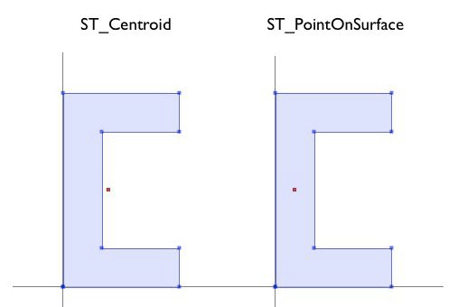
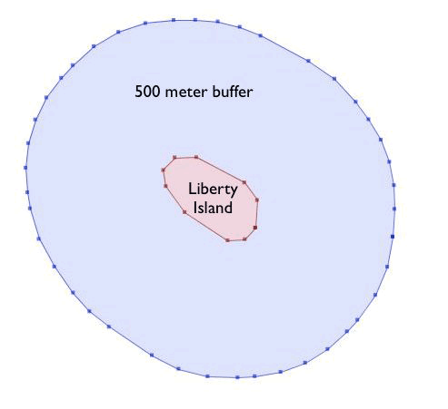
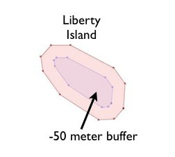
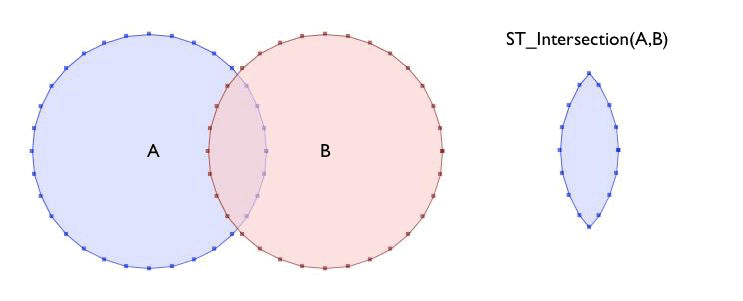

.. _dataadmin.postgis.generation:

Geometry Generation
===================

Many function work with geometries "as they are" and return
 
* analyses of the objects (``ST_Length``, ``ST_Area``), 
* serializations of the objects (``ST_AsText``, ``ST_AsGML``), 
* parts of the object (``ST_RingN``) or 
* true/false tests (``ST_Contains``, ``ST_Intersects``).

In addition, there are "Geometry constructing functions" that take geometries as inputs and output new geometries.

Centroid and PointOnSurface
---------------------------

A common need when composing a spatial query is to replace a polygon feature with a point representation of the feature. This is useful for spatial joins because using ``ST_Intersects`` on two polygon layers often results in double-counting: a polygon on a boundary will intersect an object on both sides; replacing it with a point forces it to be on one side or the other, not both.

 * ``ST_Centroid(geometry)`` returns a point that is approximately on the center of mass of the input argument. This simple calculation is very fast, but sometimes not desirable, because the returned point is not necessarily in the feature itself. If the input feature has a convexity (imagine the letter 'C') the returned centroid might not be in the interior of the feature.
 * ``ST_PointOnSurface(geometry)`` returns a point that is guaranteed to be inside the input argument. It is substantially more computationally expensive than the centroid operation.
 

   *ST_Centroid and ST_PointOnSurface*

Buffer
------

The buffering operation is common in GIS workflows. ``ST_Buffer(geometry,distance)`` takes in a buffer distance and geometry type and outputs a polygon with a boundary the buffer distance away from the input geometry. 

.. figure:: img/st_buffer.png
   :align: center

   *ST_Buffer*

For example, if the US Park Service wanted to enforce a marine traffic zone around Liberty Island, they might build a 500 meter buffer polygon around the island.

.. code-block:: sql

  CREATE TABLE liberty_island_zone AS
  SELECT ST_Buffer(the_geom,500) AS the_geom 
  FROM nyc_census_blocks 
  WHERE blkid = '360610001009000';

  SELECT Populate_Geometry_Columns(); 
  

   *Positive buffer*

The ``ST_Buffer`` function also accepts negative distances and builds inscribed polygons within polygonal inputs. For lines and points you will just get an empty return.

   *Negative buffer*

Intersection and Union
----------------------

Intersection is another classic GIS operation, which creates a new coverage by calculating the intersection of two superimposed polygons. The result has the property that any polygon in either of the parents can be built by merging polygons in the resultant.

The ``ST_Intersection(geometry A, geometry B)`` function returns the spatial area (or line, or point) that both arguments have in common. If the arguments are disjoint, the function returns an empty geometry.

.. code-block:: sql

  SELECT ST_AsText(ST_Intersection(
    ST_Buffer('POINT(0 0)', 2),
    ST_Buffer('POINT(3 0)', 2)
  ));

   *ST_Intersection*

The ``ST_Union`` does the reverse; it takes inputs and removes common lines. There are two forms of the ``ST_Union`` function: 

 * ``ST_Union(geometry, geometry)``: A two-argument version that takes in two geometries and returns the merged union.  For example, our two-circle example from the previous section looks like this when you replace the intersection with a union.
 
   .. code-block:: sql

     SELECT ST_AsText(ST_Union(
       ST_Buffer('POINT(0 0)', 2),
       ST_Buffer('POINT(3 0)', 2)
     ));
  
   .. figure:: img/st_union.png
      :align: center

      *ST_Union*

 * ``ST_Union([geometry])`: An aggregate version that takes in a set of geometries and returns the merged geometry for the entire group. The aggregate ``ST_Union`` can be used with the ``GROUP BY`` SQL statement to create carefully merged subsets of basic geometries.
 
As an example of ``ST_Union`` aggregation, consider our ``nyc_census_blocks`` table. Census geography is carefully constructed so that larger geographies can be built up from smaller ones. So, we can create a census tracts map by merging the blocks that form each tract. Or, we can create a county map by merging blocks that fall within each county.

To carry out the merge, note that the unique key ``blkid`` actually embeds information about the higher level geographies. Here are the parts of the key for Liberty Island we used earlier:

::

  360610001009000 = 36 061 00100 9000
  
  36     = State of New York
  061    = New York County (Manhattan)
  000100 = Census Tract
  9      = Census Block Group
  000    = Census Block
  
So, we can create a county map by merging all geometries that share the same first 5 digits of their ``blkid``.

.. code-block:: sql

  CREATE TABLE nyc_census_counties AS
  SELECT 
    ST_Union(the_geom) AS the_geom, 
    SubStr(blkid,1,5) AS countyid
  FROM nyc_census_blocks
  GROUP BY countyid;

  SELECT Populate_Geometry_Columns();
  
.. figure:: img/generation_union_counties.png
   :align: center

   *Union applied to census blocks to create country polygons*

An area test can confirm that our union operation did not lose any geometry. First, we calculate the area of each individual census block, and sum those areas grouping by census county id.

.. code-block:: sql

  SELECT SubStr(blkid,1,5) AS countyid, Sum(ST_Area(the_geom)) AS area
  FROM nyc_census_blocks 
  GROUP BY countyid;

::

  countyid |       area       
 ----------+------------------
  36005    | 109807439.720947
  36047    | 184906575.839355
  36061    | 58973521.6225586
  36081    | 283764734.207275
  36085    | 149806077.958252

Then we calculate the area of each of our new county polygons from the county table:

.. code-block:: sql

  SELECT countyid, ST_Area(the_geom) AS area
  FROM nyc_census_counties;

::

  countyid |       area       
 ----------+------------------
  36005    | 109807439.720947
  36047    | 184906575.839355
  36061    | 58973521.6225586
  36081    | 283764734.207275
  36085    | 149806077.958252

The same answer!

For more information about geometry functions in PostGIS, please see the `PostGIS Reference <../../../postgis/postgis/html/reference.html>`_