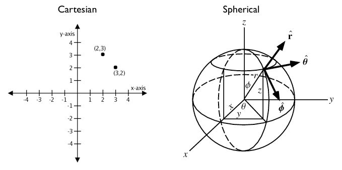
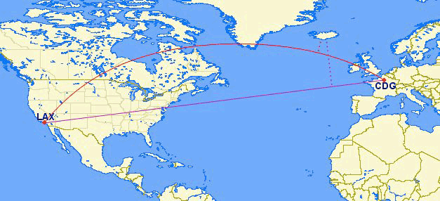

.. _dataadmin.pgBasics.geography:

.. warning:: Document Status: **Draft**

Geography Data Type
===================

Many spatial datasets are available in a geographic, or "latitude/longitude", coordinate system.

Unlike coordinates in Mercator, UTM, or State Plane, **geographic coordinates are not Cartesian**. Geographic coordinates do not represent a linear distance from an origin as plotted on a plane. Rather, these **spherical coordinates** describe the angular distance between the equator and the poles. In spherical coordinates a point is specified by the distance from the origin (the radius), the angle of rotation from the initial meridian plane, and the angle from the polar axis (analogous to a vector from the origin through the North Pole).

   *Cartesian versus Spherical coordinates*

You can treat geographic coordinates as approximate Cartesian coordinates and continue to do spatial calculations. However, measurements of distance, length and area will be nonsensical. Since spherical coordinates measure **angular** distance, the units are in "degrees." Further, the approximate results from indexes and true/false tests like intersects and contains can become terribly wrong. The distance between points get larger as problem areas like the poles or the international dateline are approached.

For example, here are the coordinates of Los Angeles and Paris.

 * Los Angeles: ``POINT(-118.4079 33.9434)``
 * Paris: ``POINT(2.3490 48.8533)``
 
The following calculates the distance between Los Angeles and Paris using the standard PostGIS Cartesian ``ST_Distance(geometry, geometry)``.  Note that the SRID of 4326 declares a geographic spatial reference system.

.. code-block:: sql

  SELECT ST_Distance(
    ST_GeometryFromText('POINT(-118.4079 33.9434)', 4326), -- Los Angeles (LAX)
    ST_GeometryFromText('POINT(2.5559 49.0083)', 4326)     -- Paris (CDG)
    );

::

  121.898285970107

The units for spatial reference 4326 are degrees. So our answer is 121 degrees. But, on a sphere, the size of one "degree square" is quite variable, becoming smaller as you move away from the equator. Think of the meridians (vertical lines) on the globe getting closer to each other as you go toward the poles. So, a distance of 121 degrees doesn't *mean* anything. It is a nonsense number.

In order to calculate a meaningful distance, we must treat geographic coordinates not as approximate Cartesian coordinates but rather as true spherical coordinates.  We must measure the distances between points as true paths over a sphere -- a portion of a great circle. 

PostGIS provides this functionality through the ``geography`` type.

.. note::

  Different spatial databases have different approaches for "handling geographics" 
  
  * Oracle attempts to paper over the differences by transparently doing geographic calculations when the SRID is geographic. 
  * SQL Server uses two spatial types, "STGeometry" for Cartesian data and "STGeography" for geographics. 
  * Informix Spatial is a pure Cartesian extension to Informix, while Informix Geodetic is a pure geographic extension. 
  * Similar to SQL Server, PostGIS uses two types, "geometry" and "geography".
  
Using the ``geography`` instead of ``geometry`` type, let's try again to measure the distance between Los Angeles and Paris. Instead of ``ST_GeometryFromText(text)``, we will use ``ST_GeographyFromText(text)``.

.. code-block:: sql

  SELECT ST_Distance(
    ST_GeographyFromText('POINT(-118.4079 33.9434)'), -- Los Angeles (LAX)
    ST_GeographyFromText('POINT(2.5559 49.0083)')     -- Paris (CDG)
    );

::

  9124665.26917268

**All return values from ``geography`` calculations are in meters**, so our answer is 9124km. 

The need to support non-point geometries becomes very clear when posing a question like "How close will a flight from Los Angeles to Paris come to Iceland?" 

   *Los Angeles (LAX) to Paris (CDG)*

Working with geographic coordinates on a Cartesian plane (the purple line) yields a *very* wrong answer indeed! Using great circle routes (the red lines) gives the right answer. If we convert our LAX-CDG flight into a line string and calculate the distance to a point in Iceland using ``geography`` we'll get the correct answer in meters.

.. code-block:: sql

  SELECT ST_Distance(
    ST_GeographyFromText('LINESTRING(-118.4079 33.9434, 2.5559 49.0083)'), -- LAX-CDG
    ST_GeographyFromText('POINT(-21.8628 64.1286)')                        -- Iceland  
  );

::

  531773.757079116
  
So the closest approach to Iceland on the LAX-CDG route is a relatively small 532 km.
  
The Cartesian approach to handling geographic coordinates breaks down entirely for features that cross the international dateline. The shortest great-circle route from Los Angeles to Tokyo crosses the Pacific Ocean. The shortest Cartesian route crosses the Atlantic and Indian Oceans.

.. figure:: img/geography_lax_nrt.png

   *Los Angeles (LAX) to Tokyo (NRT)*

.. code-block:: sql

   SELECT ST_Distance(
     ST_GeometryFromText('Point(-118.4079 33.9434)'),  -- LAX
     ST_GeometryFromText('Point(139.733 35.567)'))     -- NRT (Tokyo/Narita)
       AS geometry_distance, 
   ST_Distance(
     ST_GeographyFromText('Point(-118.4079 33.9434)'), -- LAX
     ST_GeographyFromText('Point(139.733 35.567)'))    -- NRT (Tokyo/Narita) 
       AS geography_distance; 
    
::

   geometry_distance | geography_distance 
  -------------------+--------------------
    258.146005837336 |   8833954.76996256

Utilizing the Geography data type
---------------------------------

In order to load geometry data into a geography table, the geometry first needs to be projected into EPSG:4326 (longitude/latitude), and then changed into geography.  The ``ST_Transform(geometry,srid)`` function converts coordinates to geographics and the ``Geography(geometry)`` function "casts" them from geometry to geography.

.. code-block:: sql

  CREATE TABLE nyc_subway_stations_geog AS
  SELECT 
    Geography(ST_Transform(the_geom,4326)) AS geog, 
    name, 
    routes
  FROM nyc_subway_stations;
   
Building a spatial index on a geography table is exactly the same as for geometry:

.. code-block:: sql

   CREATE INDEX nyc_subway_stations_geog_gix 
     ON nyc_subway_stations_geog USING GIST (geog);

The difference is under the covers: the geography index will correctly handle queries that cover the poles or the international date-line, while the geometry one will not.

There are only a small number of native functions for the geography type:
 
* ``ST_AsText(geography)`` returns ``text``
* ``ST_GeographyFromText(text)`` returns ``geography``
* ``ST_AsBinary(geography)`` returns ``bytea``
* ``ST_GeogFromWKB(bytea)`` returns ``geography``
* ``ST_AsSVG(geography)`` returns ``text``
* ``ST_AsGML(geography)`` returns ``text``
* ``ST_AsKML(geography)`` returns ``text``
* ``ST_AsGeoJson(geography)`` returns ``text``
* ``ST_Distance(geography, geography)`` returns ``double``
* ``ST_DWithin(geography, geography, float8)`` returns ``boolean``
* ``ST_Area(geography)`` returns ``double``
* ``ST_Length(geography)`` returns ``double``
* ``ST_Covers(geography, geography)`` returns ``boolean``
* ``ST_CoveredBy(geography, geography)`` returns ``boolean``
* ``ST_Intersects(geography, geography)`` returns ``boolean``
* ``ST_Buffer(geography, float8)`` returns ``geography``
* ``ST_Intersection(geography, geography)`` returns ``geography``

.. note::

   The buffer and intersection functions are actually wrappers on top of a cast to geometry, and are not carried out natively in spherical coordinates. As a result, they may fail to return correct results for objects with very large extents that cannot be cleanly converted to a planar representation.

   For example, the ``ST_Buffer(geography,distance)`` function transforms the geography object into a "best" projection, buffers it, and then transforms it back to geographics. If there is no "best" projection (the object is too large), the operation can fail or return a malformed buffer.

Creating a Geography Table
--------------------------
 
The SQL for creating a new table with a geography column is similar to creating a geometry table. However, geography includes the ability to specify the data type when the table is created. The following example will create a new geography table for point data:

.. code-block:: sql

  CREATE TABLE airports (
    code VARCHAR(3),
    geog GEOGRAPHY(Point)
  );
  
  INSERT INTO airports VALUES ('LAX', 'POINT(-118.4079 33.9434)');
  INSERT INTO airports VALUES ('CDG', 'POINT(2.5559 49.0083)');
  INSERT INTO airports VALUES ('REK', 'POINT(-21.8628 64.1286)');

On creation, all geography fields are automatically registered in the ``geography_columns`` view.

.. code-block:: sql

  SELECT * FROM geography_columns;
  
::

           f_table_name         | f_geography_column | srid |   type   
 -------------------------------+--------------------+------+----------
  nyc_subway_stations_geography | geog               |    0 | Geometry
  airports                      | geog               | 4326 | Point

Casting to Geometry
-------------------

While the basic functions for geography types can handle many use cases, there are times when you might need access to other functions only supported by the geometry type. Fortunately, you can convert objects back and forth from geography to geometry.

The PostgreSQL syntax convention for casting is to append ``::typename`` to the end of the value you wish to cast. So, ``2::text`` with convert a numeric two to a text string '2'. And ``'POINT(0 0)'::geometry`` will convert the text representation of point into a geometry point.

The ``ST_X(point)`` function only supports the geometry type, so we can read the X coordinate from our geographies by appending ``::geometry`` to our geography values.

.. code-block:: sql

  SELECT code, ST_X(geog::geometry) AS longitude FROM airports;

::

  code | longitude 
 ------+-----------
  LAX  | -118.4079 
  CDG  |    2.5559
  REK  |  -21.8628

By appending ``::geometry`` to the geography value, we convert the object to a geometry with an SRID of 4326. From there we can use as many geometry functions as strike our fancy. But, remember -- now that our object is a geometry, the coordinates will be interpreted as Cartesian coordinates, not spherical ones.
 
 
When Not To Use Geography
-------------------------

Although geographic coordinates (latitude/longitude) are universally accepted, it may not always be appropriate to use them for a number of reasons, including:

* There are far fewer functions available that directly support the geography type.
* The calculations on a sphere are computationally far more expensive than Cartesian calculations. For example, the Cartesian formula for distance (Pythagoras) involves one call to sqrt(). The spherical formula for distance (Haversine) involves two sqrt() calls, an arctan() call, four sin() calls and two cos() calls. Trigonometric functions are very costly, and spherical calculations involve a lot of them.
 
If your data are geographically compact (contained within a state, county or city), use the ``geometry`` type with a Cartesian projection that makes sense with your data.  

If you need to measure distance with a dataset that is geographically dispersed (covering much of the world), use the ``geography`` type. The advantages of the ``geography`` data type will offset some of the performance issues. On the other hand, casting to ``geometry`` can offset most functionality limitations.

For more information about geometry functions in PostGIS, please see the `PostGIS Reference <../../../postgis/postgis/html/reference.html>`_