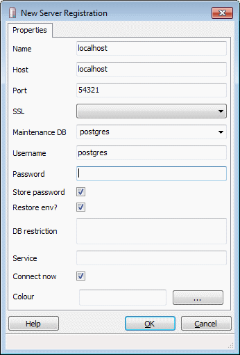
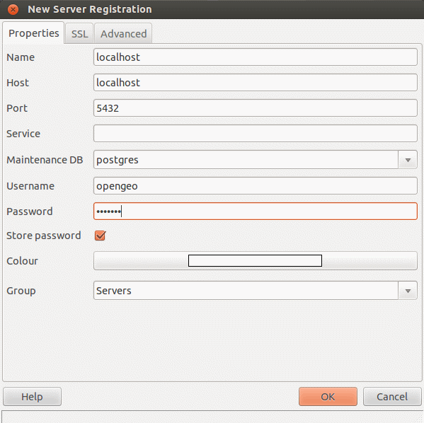
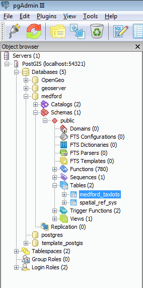

.. _dataadmin.postgis.pgadmin:

Connecting to pgAdmin
=====================

.. note:: 

   PostgreSQL has a number of administrative front-ends.  The primary is `psql <http://www.postgresql.org/docs/9.1/static/app-psql.html>`_ a command-line tool for entering SQL queries.  Another popular PostgreSQL front-end is the free and open source graphical tool `pgAdmin <http://www.pgadmin.org/>`_. All queries done in pgAdmin can also be done on the command line with psql.  pgAdmin is linked from the :ref:`Dashboard` and so it will be discussed in these sections.

Creating a spatial database can be done both via the command line tool ``psql`` or via the graphical tool **pgAdmin**.  We wil use pgAdmin throughout.

If this is the first time you have run pgAdmin, you should have a server entry for **PostGIS (localhost:54321)** (port 5432 on Linux) already configured in pgAdmin. Double click the entry to open, and enter your password.

If you don't have an entry for PostGIS, you may need create a new connection.  Go to :menuselection:`File --> Add Server`, and register a new server  at **localhost** and port **54321** (port 5432 on Linux) in order to connect to the PostGIS bundled with the OpenGeo Suite.

   *Connection parameters on Windows / Mac*

   *Connection parameters on Linux*

Once this is done, double click on the entry to connect to the local PostGIS.  You should see an expandable tree of information on the left.  To see the databases in this instance, expand the :menuselection:`Databases` folder.  To see the tables in a database, expand :menuselection:`Databases --> <DBNAME> --> schemas --> public --> Tables`

   *Traversing the tree to find a database table*

When performaing SQL queries, make sure that the proper database is selected in the tree.  The SQL Query window will show the current selected database.

.. figure:: img/pgadmin_querydb.png
   :align: center

   *Querying against the medford database*
