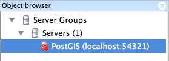
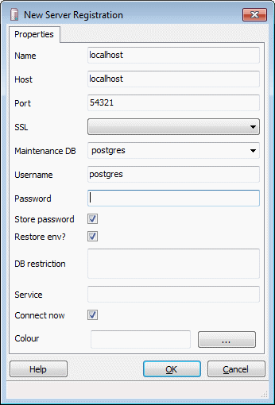
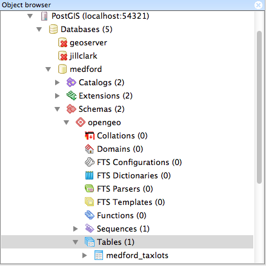
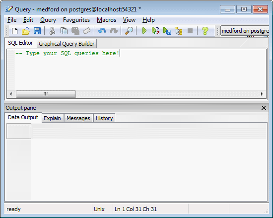

.. _dataadmin.pgGettingStarted.pgadmin:

Connecting to the PostgreSQL database with pgAdmin
==================================================

There are a number of front-end tools available for connecting to, and working with, the PostgreSQL database. Among the most popular are `psql <http://www.postgresql.org/docs/9.3/static/app-psql.html>`_, a command-line tool for querying the database, and the free and open source graphical tool `pgAdmin <http://www.pgadmin.org/>`_. 

Any data querying and manipulation you can do with :command:`pgAdmin` can also be done at the command line with ``psql``.

.. note:: This section uses the client tool :command:`pgAdmin`, a graphical utility provided as part of Boundless Desktop.

Working with pgAdmin
--------------------

Depending on how you installed Boundless Suite, you may already have one pre-configured PostGIS server, ``localhost:5432``, listed in the pgAdmin :guilabel:`Object browser`.

   PostGIS server in pgAdmin

If you don't have an entry for PostGIS listed, add a new server connection manually. Click :menuselection:`File --> Add Server` and complete the :guilabel:`New Server Registation` dialog box to register a new server. Ensure the Host is set to **localhost** and Port is **5432** (unless you have configured PostgreSQL for a different port). 

   Connection parameters on Windows / OS X

.. figure:: img/pgadmin_connectlinux.png

   Connection parameters on Linux

To connect to the PostGIS server, double-click the PostGIS server item and provide the password when prompted.

To view the databases in this instance, expand the :menuselection:`Databases` item. Double-click one of the listed databases to reveal the contents in the :guilabel:`Object browser`.  

   Navigating the database

When executing SQL queries, make sure you have the intended target database selected.  The SQL :guilabel:`Query` dialog box will confirm the current database selection.

   Querying a database

.. note:: If you are just installing Boundless Suite for the first time, there will only be a generic "postgres" database installed, with no tables, and you will need to :ref:`create a new spatial database <dataadmin.pgGettingStarted.createdb>`.
