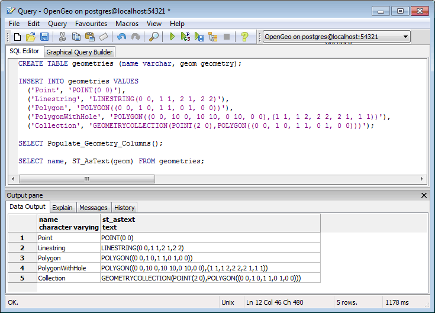

.. _dataadmin.postgis.geometries:

Geometries and Representation
=============================

This section discusses basic fuctions for querying and manipulating geometries.

Sample table
------------

Given a basic dataset of geospatial features, we can perform some basic operations on them.

We can create a table and populate it based on the following SQL commands (using the SQL editor of pgAdmin):

.. code-block:: sql

  CREATE TABLE geometries (name varchar, geom geometry);
  
  INSERT INTO geometries VALUES 
    ('Point', 'POINT(0 0)'),
    ('Linestring', 'LINESTRING(0 0, 1 1, 2 1, 2 2)'),
    ('Polygon', 'POLYGON((0 0, 1 0, 1 1, 0 1, 0 0))'),
    ('PolygonWithHole', 'POLYGON((0 0, 10 0, 10 10, 0 10, 0 0),(1 1, 1 2, 2 2, 2 1, 1 1))'),
    ('Collection', 'GEOMETRYCOLLECTION(POINT(2 0),POLYGON((0 0, 1 0, 1 1, 0 1, 0 0)))');
    
  SELECT Populate_Geometry_Columns();
  
  SELECT name, ST_AsText(geom) FROM geometries;

   *Sample geometries*

The above example CREATEs a table (**geometries**) then INSERTs five geometries: a point, a line, a polygon, a polygon with a hole, and a collection. Finally, the inserted rows are SELECTed and displayed in the Output pane.

The command ``Populate_Geometry_Columns()`` function finds all the columns in the database that contain geometry and updates the ``geometry_columns`` table to include references to them.  

Representing Real World Objects
-------------------------------

The Simple Features for SQL (``SFSQL``) specification, the original guiding standard for PostGIS development, defines how a real world object is represented.  By taking a continuous shape and digitizing it at a fixed resolution we achieve a passable representation of the object.  SFSQL only handled 2-dimensional representations.  PostGIS has extended that to include 3- and 4-dimensional representations; more recently the SQL-Multimedia Part 3 (``SQL/MM``) specification has officially defined their own representation.  

Our example table contains a mixture of different geometry types. We can collect general information about each object using functions that read the geometry metadata.

 * ``ST_GeometryType(geometry)`` returns the type of the geometry
 * ``ST_NDims(geometry)`` returns the number of dimensions of the geometry
 * ``ST_SRID(geometry)`` returns the spatial reference identifier number of the geometry

.. code-block:: sql

  SELECT name, ST_GeometryType(geom), ST_NDims(geom), ST_SRID(geom)
    FROM geometries;

returns the following::

       name       |    st_geometrytype    | st_ndims | st_srid 
 -----------------+-----------------------+----------+---------
  Point           | ST_Point              |        2 |      -1
  Polygon         | ST_Polygon            |        2 |      -1
  PolygonWithHole | ST_Polygon            |        2 |      -1
  Collection      | ST_GeometryCollection |        2 |      -1
  Linestring      | ST_LineString         |        2 |      -1

Points
~~~~~~

.. figure:: img/geometries_points.png
   :align: center

   *Different kinds of points*

A spatial **point** represents a single location.  This point is represented by a single coordinate (including either 2-, 3- or 4-dimensions).  Points are used to represent objects when the exact details, such as shape and size, are not important at the target scale.  For example, cities on a map of the world can be described as points, while a map of a single state might represent cities as polygons.  

.. code-block:: sql

  SELECT ST_AsText(geom) 
    FROM geometries
    WHERE name = 'Point';

returns::

  POINT(0 0)

Some of the specific spatial functions for working with points are:

 * ``ST_X(geometry)`` returns the X ordinate
 * ``ST_Y(geometry)`` returns the Y ordinate

So, we can read the ordinates from a point like this:

.. code-block:: sql

  SELECT ST_X(geom), ST_Y(geom)
    FROM geometries
    WHERE name = 'Point';

The following SQL query would return the geometry associated with one point (in the ``ST_AsText`` column).

.. code-block:: sql

  SELECT name, ST_AsText(the_geom)
    FROM some_table
    LIMIT 1;

Linestrings
~~~~~~~~~~~

.. figure:: img/geometries_lines.png
   :align: center

   *Different kinds of lines*

A **linestring** is a path between locations.  It takes the form of an ordered series of two or more points.  Roads and rivers are typically represented as linestrings.  A linestring is said to be **closed** if it starts and ends on the same point.  It is said to be **simple** if it does not cross or touch itself (except at its endpoints if it is closed).  A linestring can be both **closed** and **simple**.  A single real world street may consist of many linestrings, each representing a segment of road with different attributes.

The following SQL query will return the geometry associated with one linestring (in the ``ST_AsText`` column).

.. code-block:: sql

  SELECT ST_AsText(geom) 
    FROM geometries
    WHERE name = 'Linestring';
  
::

  LINESTRING(0 0, 1 1, 2 1, 2 2)

Some of the specific spatial functions for working with linestrings are:

 * ``ST_Length(geometry)`` returns the length of the linestring
 * ``ST_StartPoint(geometry)`` returns the first coordinate as a point
 * ``ST_EndPoint(geometry)`` returns the last coordinate as a point
 * ``ST_NPoints(geometry)`` returns the number of coordinates in the linestring

So, the length of our linestring is:

.. code-block:: sql

  SELECT ST_Length(geom) 
    FROM geometries
    WHERE name = 'Linestring';

::

  3.41421356237309

Polygons
~~~~~~~~

.. figure:: img/geometries_polygons.png
   :align: center

   *Different kinds of polygons*

A polygon is a representation of an area.  The outer boundary of the polygon is represented by a ring.  This ring is a linestring that is both closed and simple as defined above.  Holes within the polygon are also represented by rings.

Polygons are used to represent objects whose size and shape are important.  City limits, parks, building footprints or bodies of water are all commonly represented as polygons when the scale is sufficiently high to see their area.  Roads and rivers can sometimes be represented as polygons.

The following SQL query will return the geometry associated with one linestring (in the ``ST_AsText`` column).

.. code-block:: sql

  SELECT ST_AsText(geom) 
    FROM geometries
    WHERE name LIKE 'Polygon%';

.. note::

  Rather than using an ``=`` sign in our ``WHERE`` clause, we are using the ``LIKE`` operator to carry out a string matching operation. You may be used to the ``*`` symbol as a wildcard for pattern matching, but in SQL the ``%`` symbol is used, along with the ``LIKE`` operator.

::

 POLYGON((0 0, 1 0, 1 1, 0 1, 0 0))
 POLYGON((0 0, 10 0, 10 10, 0 10, 0 0),(1 1, 1 2, 2 2, 2 1, 1 1))

The first polygon has only one ring. The second one has an interior "hole". Most graphics systems include the concept of a "polygon", but GIS systems are relatively unique in allowing polygons to explicitly have holes.

.. figure:: img/geometries_polygonhole.png
   :align: center

   *Polygons, one with a hole*

Some of the specific spatial functions for working with polygons are:

 * ``ST_Area(geometry)`` returns the area of the polygons
 * ``ST_NRings(geometry)`` returns the number of rings (usually 1, more of there are holes)
 * ``ST_ExteriorRing(geometry)`` returns the outer ring as a linestring
 * ``ST_InteriorRingN(geometry,n)`` returns a specified interior ring as a linestring
 * ``ST_Perimeter(geometry)`` returns the length of all the rings

We can calculate the area of our polygons using the area function:

.. code-block:: sql

  SELECT name, ST_Area(geom) 
    FROM geometries
    WHERE name LIKE 'Polygon%';

::

  Polygon            1
  PolygonWithHole    99

Note that the polygon with a hole has an area that is the area of the outer shell (a 10x10 square) minus the area of the hole (a 1x1 square).

Collections
~~~~~~~~~~~

There are four collection types, which group multiple simple geometries into sets. 

 * **MultiPoint**, a collection of points
 * **MultiLineString**, a collection of linestrings
 * **MultiPolygon**, a collection of polygons
 * **GeometryCollection**, a heterogeneous collection of any geometry (including other collections)

Collections are another concept that shows up in GIS software more than in generic graphics software. They are useful for directly modeling real world objects as spatial objects. For example, how to model a lot that is split by a right-of-way? As a **MultiPolygon**, with a part on either side of the right-of-way.

.. figure:: img/geometries_polygoncollection.png
   :align: center

   *Polygon collection*

Our example collection contains a polygon and a point:

.. code-block:: sql

  SELECT name, ST_AsText(geom) 
    FROM geometries
    WHERE name = 'Collection';

::

  GEOMETRYCOLLECTION(POINT(2 0),POLYGON((0 0, 1 0, 1 1, 0 1, 0 0)))

.. figure:: img/geometries_geometrycollection.png
   :align: center

   *Geometry collection*

Some of the specific spatial functions for working with collections are:

 * ``ST_NumGeometries(geometry)`` returns the number of parts in the collection
 * ``ST_GeometryN(geometry,n)`` returns the specified part
 * ``ST_Area(geometry)`` returns the total area of all polygonal parts
 * ``ST_Length(geometry)`` returns the total length of all linear parts

Geometry Input and Output
-------------------------

Within the database, geometries are stored on disk in a format only used by the PostGIS program. In order for external programs to insert and retrieve useful geometries, they need to be converted into a format that other applications can understand. Fortunately, PostGIS supports emitting and consuming geometries in a large number of formats:

 * Well-known text (``WKT``)
 
   * ``ST_GeomFromText(text)`` returns ``geometry``
   * ``ST_AsText(geometry)`` returns ``text``
   * ``ST_AsEWKT(geometry)`` returns ``text``
   
 * Well-known binary (``WKB``)
 
   * ``ST_GeomFromWKB(bytea)`` returns ``geometry``
   * ``ST_AsBinary(geometry)`` returns ``bytea``
   * ``ST_AsEWKB(geometry)`` returns ``bytea``
   
 * Geographic Mark-up Language (``GML``)
 
   * ``ST_GeomFromGML(text)`` returns ``geometry``
   * ``ST_AsGML(geometry)`` returns ``text``
   
 * Keyhole Mark-up Language (``KML``)
 
   * ``ST_GeomFromKML(text)`` returns ``geometry``
   * ``ST_AsKML(geometry)`` returns ``text``
   
 * ``GeoJSON``
 
   * ``ST_AsGeoJSON(geometry)`` returns ``text``
   
 * Scalable Vector Graphics (``SVG``)
 
   * ``ST_AsSVG(geometry)`` returns ``text``
 
The most common use of a constructor is to turn a text representation of a geometry into an internal representation:

.. code-block:: sql

   SELECT ST_GeomFromText('POINT(583571 4506714)',26918);
 
Note that in addition to a text parameter with a geometry representation, we also have a numeric parameter providing the ``SRID`` of the geometry.
 
The following SQL query shows an example of ``WKB`` representation (the call to ``encode()`` is required to convert the binary output into an ASCII form for printing).  

.. note:: You can type any of the following commands into the pgAdmin **Query Tool** and then execute them by pressing **F5** or clicking on **Execute**.

.. code-block:: sql

  SELECT encode(
    ST_AsBinary(ST_GeometryFromText('LINESTRING(0 0 0,1 0 0,1 1 2)')), 
    'hex');

Output is (quite unwieldy):

.. code-block:: sql

   01020000000300000000000000000000000000000000000000000000000000f03f0000000000000000000000000000f03f000000000000f03f

While WKT is useful for human readability, WKB should be used for most actual processes, such as viewing data in a GIS application, transferring data to a web service, or processing data remotely.  

Since WKT and WKB were defined in the ``SFSQL`` specification, they do not handle 3- or 4-dimensional geometries.  For these cases PostGIS has defined the Extended Well Known Text (EWKT) and Extended Well Known Binary (EWKB) formats.  These provide the same formatting capabilities of WKT and WKB with the added dimensionality.

Here is an example of a 3D linestring in WKT:

.. code-block:: sql

   SELECT ST_AsEWKT(ST_GeometryFromText('LINESTRING(0 0 0,1 0 0,1 1 2)'));

Output is:

.. code-block:: sql

   LINESTRING(0 0 0,1 0 0,1 1 2)

In addition to emitters for the various forms (WKT, WKB, GML, KML, JSON, SVG), PostGIS also has consumers for four (WKT, WKB, GML, KML). Most applications use the WKT or WKB geometry creation functions, but the others work too. Here's an example that consumes GML and output JSON:

.. code-block:: sql

  SELECT ST_AsGeoJSON(ST_GeomFromGML('<gml:Point><gml:coordinates>1,1</gml:coordinates></gml:Point>'));

And the output::

  "{"type":"Point","coordinates":[1,1]}"

For more information about geometry functions in PostGIS, please see the `PostGIS Reference <../../../postgis/postgis/html/reference.html>`_
