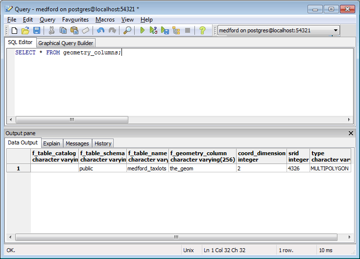

.. _dataadmin.postgis.metatables:

Metadata Tables
===============

In conformance with the Simple Features for SQL (SFSQL) specification, PostGIS provides two tables to track and report on the geometry types available in a given database.  These tables are created inside every spatial database.

* The first table, ``spatial_ref_sys``, defines all the spatial reference systems known to the database.  
* The second table, ``geometry_columns``, provides a listing of all "features" (defined as an object with geometric attributes), and the basic details of those features.  

.. figure:: img/metatables_relationships.png
   :align: center

   *Table relationships for spatial metadata tables*

The ``geometry_columns`` table in the database won't contain any data until you've create tables in the database.  One tables have been created, running the following command will display information about each of those spatial tables:

.. code-block:: sql

   SELECT * FROM geometry_columns;

The ``geometry_columns`` table has the following attribute fields:

* ``f_table_catalog``, ``f_table_schema``, and ``f_table_name`` provide the fully qualified name of the feature table containing a given geometry.  Because PostgreSQL doesn't make use of catalogs, ``f_table_catalog`` will tend to be empty.  
* ``f_geometry_column`` is the name of the column that geometry containing column -- for feature tables with multiple geometry columns, there will be one record for each.  
* ``coord_dimension`` and ``srid`` define the the dimension of the geometry (2-, 3- or 4-dimensional) and the Spatial Reference system identifier that refers to the ``spatial_ref_sys`` table respectively.  
* The ``type`` column defines the type of geometry as described below; we've seen Point and Linestring types so far.  

By querying this table, GIS clients and libraries can determine what to expect when retrieving data and can perform any necessary projection, processing or rendering without needing to inspect each geometry.

