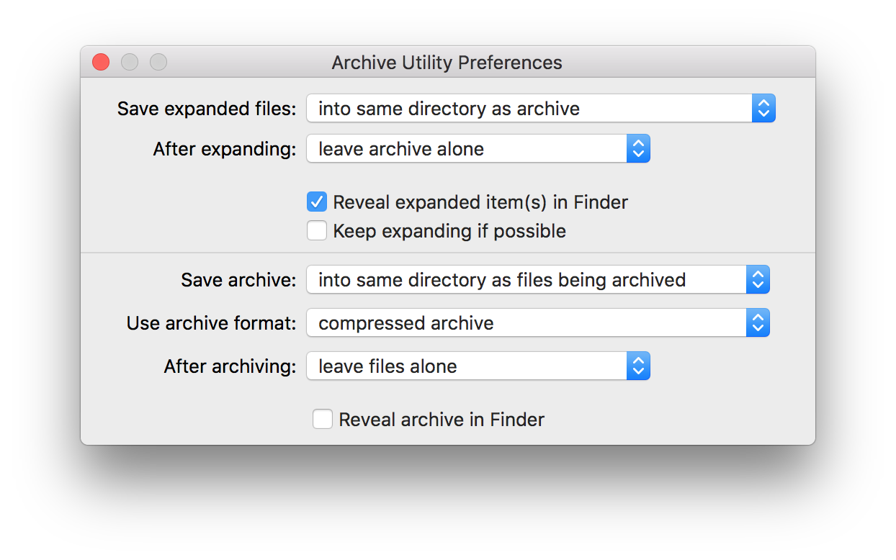

.. _install.mac.vm:

Virtual machine install on Mac OS X
===================================

This section will install the Boundless Server virtual machine on a Mac OS X host.

Before expanding the Boundless Server virtual machine zip file ie. ``BoundlessServer_VirtualBox_1.1.0.ova.zip`` be sure to change the settings for the default ``Archive Utility`` so that "Keep Expanding if Possible" is unchecked to prevent the necessary ``.ova`` file from expanding after the zip file is unpacked.

   Uncheck "Keep Expanding if Possible"

You can now double click or use the Archive Utility to unzip ``BoundlessServer_VirtualBox_1.1.0.ova.zip``.

Alternatively the Boundless Server virtual machine ``.zip`` file can be unzipped using the command line when using Mac OS X.

Navigate to the directory where the zip was downloaded to and run:

   .. code-block:: bash

    unzip BoundlessServer_VirtualBox_1.1.0.ova.zip

Where ``1.1.0`` is the Boundless Server version. The result should be a single ``BoundlessServer_VirtualBox_1.1.0.ova`` file, with intended version, which you can import with VirtualBox.

Installation
------------

.. include:: ../include/vbox/setup_intro.txt

#. Install `VirtualBox <https://www.virtualbox.org/wiki/Downloads>`__. You may keep all defaults during the install.

   .. figure:: img/vbox_welcome_mac.png

      Installing VirtualBox

#. After installation, run VirtualBox. Navigate to :menuselection:`File --> Import Appliance`.

   .. figure:: img/vbox_importlink_mac.png

      Import Appliance link

#. Select the Boundless Server virtual machine file.

#. Details about the virtual machine will be displayed. Click :guilabel:`Import`.

   .. figure:: img/vbox_importmenu_mac.png

      Import Appliance menu

#. The Boundless Server license agreement will display. Click :guilabel:`Agree` to accept.

   .. figure:: img/vbox_license_mac.png

      Boundless Server license

#. You will now see the :guilabel:`Boundless Server` entry in the list of virtual machines in VirtualBox.

   .. figure:: /install/include/vbox/img/vbox_manager.png

      VirtualBox Manager showing Boundless Server virtual machine

#. Click to select the virtual machine and then click :guilabel:`Shared Folders`.

   .. figure:: /install/include/vbox/img/vbox_sharedfolderlink.png

      Accessing the shared folder menu

#. In order to facilitate copying files from your host system to the virtual machine, we recommend creating a shared folder such that any files copied to that folder  will be accessible inside the virtual machine. Right-click the blank area of the dialog and select :guilabel:`Add shared folder` (or press :kbd:`Insert`).

   .. figure:: img/vbox_sharedfoldermenu_mac.png

      Link to add a new shared folder

#. Fill out the form:

   * For :guilabel:`Folder Path`, select a directory on the host machine that will serve as the shared folder. One good option for this directory would be the Desktop.
   * For :guilabel:`Folder Name`, enter :kbd:`share`.
   * Check :guilabel:`Auto-mount`.

   .. figure:: img/vbox_sharedfolder_mac.png

      Setting a shared folder

#. When finished, click :guilabel:`OK`, then click :guilabel:`OK` again to close the :guilabel:`Settings` page.

Post-installation
-----------------

A few more steps are required before you are ready to proceed.

Start the virtual machine
^^^^^^^^^^^^^^^^^^^^^^^^^

.. include:: ../include/vbox/check_start_mac.txt

Terminal setup
^^^^^^^^^^^^^^

.. include:: ../include/vbox/check_terminal.txt

Using the shared folder
^^^^^^^^^^^^^^^^^^^^^^^

.. include:: ../include/vbox/copy_shared_file.txt

Create a snapshot
^^^^^^^^^^^^^^^^^

.. include:: ../include/vbox/check_snapshot.txt

Extensions
^^^^^^^^^^

.. include:: ../include/vbox/extensions.txt

Virtual Machine reference
^^^^^^^^^^^^^^^^^^^^^^^^^

.. include:: ../include/vbox/check_reference.txt
