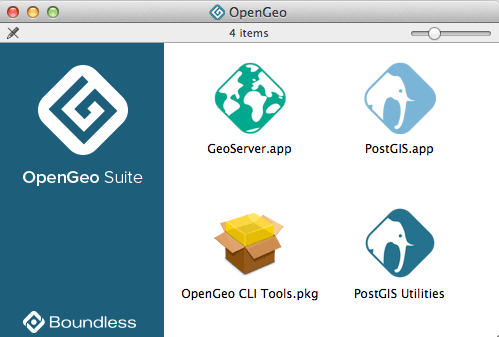
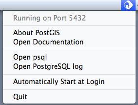
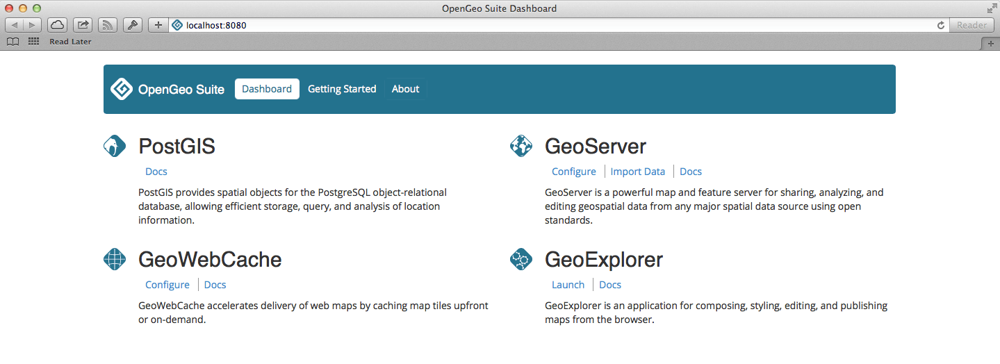
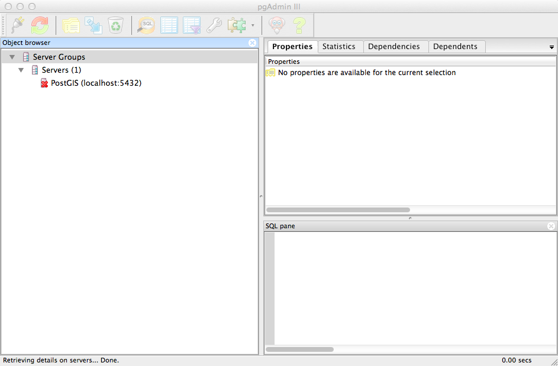
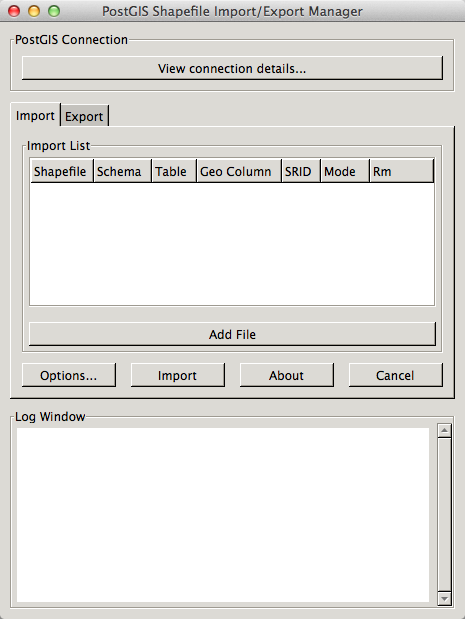

.. _installation.mac.install:

New installation
================

.. note:: 

   If upgrading from a previous **major** version see the :ref:`Upgrade <installation.mac.upgrade>` section. If upgrading from a previous **minor** version, please continue below.

Prerequisites
-------------

OpenGeo Suite has the following system requirements:

* **Operating System**: 10.7 or newer
* **Memory**: 1GB minimum (2GB recommended)
* **Disk space**: 600MB minimum (plus extra space for any loaded data)
* **Browser**: Any modern web browser is supported
* **Permissions**: Administrative rights

Installation
------------

The Mac installer for OpenGeo Suite is as an image made up several components that are installed separately. 

   OpenGeo Suite for Mac OS X

PostGIS.app
^^^^^^^^^^^

PostGIS ships as a self-contained application. Start by double-clicking :guilabel:`PostGIS.app``. You will see a "Welcome" window the first time the application is launched.

.. figure:: img/pgwelcome.png

   PostGIS Welcome dialog

You can check the PostgreSQL server status and perform other tasks from the PostGIS icon in the OS X menu bar.

   PostGIS menu

.. note:: While it is possible to run the PostGIS application directly from the installer disk image it is recommended you copy it to :file:`/Applications` and run from there.

GeoServer.app
^^^^^^^^^^^^^

GeoServer also ships as a self-contained application. Start by double-clicking :guilabel:`GeoServer.app`. You will see a "Welcome" window the first time the application is launched.

.. figure:: img/gsstarting.png

   GeoServer Welcome dialog

.. note:: The GeoServer application runs a Jetty web server that also contains GeoWebCache, GeoExplorer, and the OpenGeo Dashboard.

You can check the server status and perform other tasks from the GeoServer icon in the OSX menu bar.

.. figure:: img/gsmenu.png

   GeoServer menu

Once the server has fully started up a web browser will open and display the OpenGeo dashboard. 

   OpenGeo Suite Dashboard

.. note:: While it is possible to run the GeoServer application directly from the installer disk image it is recommended you copy it to :file:`/Applications` and run from there. 

CLI tools
^^^^^^^^^

The CLI tools package contains all the command line tools for OpenGeo Suite:

* The PostGIS data conversion utilities such as ``shp2pgsql``
* The `GDAL/OGR <http://www.gdal.org/>`_ format translation utilities
* The `PDAL <http://www.pointcloud.org/>`_ tools for working with LIDAR point cloud data

To install the CLI Tools:

#. Double-click the :guilabel:`OpenGeo CLI Tools.pkg` file. 

   .. figure:: img/clitools.png

      OpenGeo Suite Command Line Tools Installer

#. Work through the installer dialogs accepting the defaults. 

#. The CLI Tools package installs everything into :file:`/usr/local/opengeo`. This directory must be added to the ``PATH``. Add the following line to your ``.profile``::

     export PATH=/usr/local/opengeo/bin:$PATH

   .. note:: Alternatively you can run the :file:`/usr/local/opengeo/bin/opengeo-clitools-doctor` utility which will create symlinks for all the tools into :file:`/usr/local/bin`. Use this method with caution as it may conflict with different versions of the same tools already installed on the system.

PostGIS Utilities
^^^^^^^^^^^^^^^^^

The PostGIS Utilities package contains utility applications for working with 
PostGIS and PostgreSQL:

* **pgAdmin** - A database manager for PostgreSQL
* **pgShapeLoader** - A graphical Shapefile loader/dumper

Double-click to run the applications. 

   pgAdmin PostgreSQL Manager

   PostGIS Shapefile Loader

.. note:: As with the other applications of OpenGeo Suite, it is recommended that you copy them to :file:`/Applications` for subsequent usage.

After installation
------------------

Installation is now complete. After installation, please see the section on :ref:`installation.mac.misc`.
