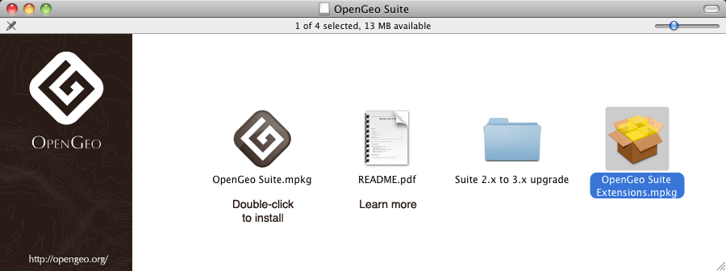

.. _installation.mrsid:

Enabling MrSID image support
============================

The OpenGeo Suite comes with support for publishing data from many formats supported by the `Geospatial Data Abstraction Library <http://gdal.org>`_ (GDAL). These formats include DTED, EHdr, AIG, ENVIHdr, and much more.

`MrSID <http://www.gdal.org/frmt_mrsid.html>`_ is available as an optional extension as well, but due to licensing issues, it is not enabled by default. The steps to enable support will differ depending on how the OpenGeo Suite is installed, and on what platform.

Find the method of installation below and continue there.

.. _installation.mrsid.ubuntu:

Ubuntu
------

.. note:: By default, the Production WARs install will not show **any** of the GDAL image formats at all. To enable GDAL image formats in the Production WAR file, please see the section on :ref:`installation.gdal`. This section assumes that the GDAL image formats are already enabled.

MrSID support is provided by a separate package called **gdal-mrsid**.

#. Install the following package from the OpenGeo repository. (See :ref:`installation.linux.ubuntu` for instructions on how to add the OpenGeo repository)::

      # apt-get install gdal-mrsid

   .. note::  You must run these commands as root or use :command:`sudo`.

#. Restart Tomcat.

Continue at the :ref:`installation.mrsid.verify` section.

.. _installation.mrsid.centos:

CentOS / Red Hat
----------------

.. note:: By default, the Production WARs install will not show **any** of the GDAL image formats at all. To enable GDAL image formats in the Production WAR file, please see the section on :ref:`installation.gdal`. This section assumes that the GDAL image formats are already enabled.

MrSID support is provided by a separate package called **gdal-mrsid**.

#. Install the following package from the OpenGeo repository. (See :ref:`installation.linux.redhat` for instructions on how to add the OpenGeo repository)::

      # yum install gdal-mrsid

   .. note::  You must run this command as root or use :command:`sudo`.

#. Copy :file:`/usr/lib/gdal.jar` (:file:`/usr/lib64/gdal.jar` on 64-bit installs) to :file:`/usr/share/tomcat6/webapps/geoserver/WEB-INF/lib/gdal-1.8.1.jar`.

   .. note:: You may need to replace ``tomcat6`` with ``tomcat5`` in the above path depending on the server configuration.

#. Restart Tomcat.

Continue reading at the :ref:`installation.gdal.verify` section.

.. _installation.mrsid.windows:

Windows
-------

Windows Installer
~~~~~~~~~~~~~~~~~

MrSID support must be enabled during the installation process.

#. Navigate through the installer until you reach the :guilabel:`Choose Components` page.

   .. figure:: img/mrsid_win_components.png
      :align: center
      
      *The Components page of the Windows installer*

#. Scroll down to the :guilabel:`Extensions` option, and expand the tree. Check the box for :guilabel:`MrSID`.

   .. figure:: img/mrsid_win_checked.png
      :align: center
      
      *Enabling the MrSID extension*

#. Click :guilabel:`Next` and continue the installation process. 

Continue reading at the :ref:`installation.mrsid.verify` section.

Windows Production WARs
~~~~~~~~~~~~~~~~~~~~~~~

#. Navigate to:  http://data.opengeo.org/gdal_support/ .

#. Download the file that matches the version of the OpenGeo Suite (e.g. :file:`mrsid_win_30.zip` for version 3.0).

   .. note:: This file requires 32-bit Java/Tomcat.

#. Extract the contents of this archive to the location where the GDAL libraries were extracted (see :ref:`installation.gdal`).

#. Restart Tomcat.

Continue reading at the :ref:`installation.gdal.verify` section.

.. _installation.mrsid.mac:

Mac OS X
--------

Mac OS X Installer
~~~~~~~~~~~~~~~~~~

MrSID support is enabled via a separate installation package, available in the OpenGeo Suite bundle. In addition to the standard :file:`OpenGeo Suite Installer.pkg` file, there is also an :file:`OpenGeo Suite Extensions.mpkg` file.

      
   *OpenGeo Suite Extensions contain MrSID support*

#. Double click on this file to install MrSID after the OpenGeo Suite installation process has completed. Click :guilabel:`Next` to continue.

   .. figure:: img/mrsid_mac_welcome.png
      
      *OpenGeo Suite Extensions contain the MrSID extension*

#. Select the target disk, which should be the same as where the OpenGeo Suite was installed. Click  :guilabel:`Next` again.

#. On the following page, check the box that says :guilabel:`MrSID Support for OpenGeo Suite`, then click :guilabel:`Next`.

   .. figure:: img/mrsid_mac_components.png
      
      *Check this box to install MrSID support*

#. Please wait while the installation proceeds.

   .. figure:: img/mrsid_mac_progress.png
      
      *Installation*

#. You will receive confirmation that the installation was successful. 

    .. figure:: img/mrsid_mac_success.png
       :align: center

       *MrSID support successfully installed*

Continue reading at the :ref:`installation.mrsid.verify` section.

Mac OS X Production WARs
~~~~~~~~~~~~~~~~~~~~~~~~

#. Navigate to:  http://data.opengeo.org/gdal_support/

#. Download the file that matches the version of the OpenGeo Suite (e.g. :file:`mrsid_osx_30.zip` for version 3.0).

#. Extract the contents of the archive into :file:`/usr/local/lib/`.

#. Restart Tomcat.

Continue reading at the :ref:`installation.gdal.verify` section.

.. _installation.mrsid.verify:

Verifying installation
----------------------

#. To verify that the MrSID extension was installed properly, navigate to the GeoServer web admin interface and log in with administrator credentials.

   .. note:: Please see the GeoServer reference documentation for more information about the GeoServer web admin interface.
   
#. Click on :guilabel:`Stores` and then :guilabel:`Add new Store`. There should be a :guilabel:`MrSID` option under :guilabel:`Raster Data Formats`.

   .. figure:: img/mrsid_verify.png
      :align: center
      
      *Verifying that MrSID is an option in the Raster Data Sources*

