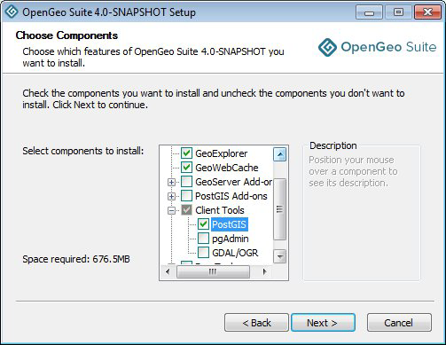

.. _installation.windows.upgrade:

Upgrading
=========

This section describes how to upgrade from a previous **major** version of OpenGeo Suite.

If performing a **minor** upgrade, you may proceed with a typical :ref:`install <installation.windows.install>`. 

.. note:: A "major" version upgrade is from version 3.x to 4.y. A "minor" version upgrade is from 4.x to 4.y.

.. warning:: This upgrade is **not-backward compatible**. Irreversible changes are made to the data so that they can't be used with versions 3.x and below of OpenGeo Suite.

Back up PostGIS databases
~~~~~~~~~~~~~~~~~~~~~~~~~

The first step of the upgrade process is to back up your existing PostGIS data. 

#. Ensure the old (3.x) version of OpenGeo Suite is running.
 
#. Make sure that the PostgreSQL ``bin`` directory is on your path. By default, this is :file:`C:\\Program Files\\OpenGeo\\OpenGeo Suite\\pgsql\\9.1\\bin` though your installation may vary. To test that this is set up correctly, open a Command Prompt and type:

   .. code-block:: console
 
      psql --version 

   If you receive an error, type the following to temporarily add the above directory to your path:

   .. code-block:: console

      set PATH=%PATH%;C:\Program Files\OpenGeo\OpenGeo Suite\pgsql\9.1\bin

#. To backup, a specialized PostGIS upgrade utility is used. `Download this utility <http://repo.opengeo.org/suite/releases/pgupgrade/postgis_upgrade-4.0.zip>`_, and extract the archive to a temporary directory. To avoid permissions issues, it is best to put this directory on your desktop or in your home directory. By default, the backup files created from using this script will be saved into this directory.

#. Run the backup command:

   .. code-block:: console

      postgis_upgrade.exe backup --port 5432

   .. note:: For more information about supported options run ``postgis_upgrade.exe --help``. 

#. The script will run and create a number of files:

   * Compressed dump files for every database backed up (:file:`<database>.dmp`)
   * SQL output of server roles

#. The PostGIS data backup process is complete. You may now shut down OpenGeo Suite 3.x.

Back up GeoServer data directory
~~~~~~~~~~~~~~~~~~~~~~~~~~~~~~~~

Uninstalling OpenGeo Suite 3.x will not remove any of the GeoServer 
configuration so there is no need to make a back up. It can be copied into the
correct location during restore.

For OpenGeo Suite 3.x and earlier the default the data directory is located at 
:file:`<user_home_directory>\\.opengeo\\data_dir`.

For OpenGeo Suite 4.x and above the default data directory is located at 
:file:`C:\\ProgramData\\Boundless\\OpenGeo\\geoserver`. 

Uninstall old Suite
~~~~~~~~~~~~~~~~~~~

The next step of the process is to uninstall OpenGeo Suite 3.x. The uninstaller
can be run directly from the Windows Start Menu.

Install new Suite
~~~~~~~~~~~~~~~~~

You are now ready to install the new version of OpenGeo Suite. To do so follow
the instructions in the :ref:`installation.windows` section.

In order to run the PostGIS restore script you must select the PostGIS client 
tools as part of the new install. 

   Installing PostGIS client tools

Restore PostGIS databases
~~~~~~~~~~~~~~~~~~~~~~~~~

#. Ensure the OpenGeo PostgreSQL service is running.

#. Ensure the PostGIS/PostgreSQL commands are on the path. From a command prompt, type the command: 

    .. code-block:: console
 
       psql --version 

   If you receive an error re-run the installer and install the PostGIS client tools, as described in the previous section.

#. Restore your PostGIS data by running the upgrade utility again with the "restore" argument:

   .. code-block:: console

      postgis_upgrade.exe restore 

#. Your databases and roles will be restored. You can verify that the databases were created and data restored by running ``psql -l`` on the command line.

Restore GeoServer data directory
~~~~~~~~~~~~~~~~~~~~~~~~~~~~~~~~

#. Stop the OpenGeo Jetty service if it is running.

#. Restore the GeoServer data directory:

   #. Delete or rename the new default data directory, located at  
      :file:`C:\\ProgramData\\Boundless\\OpenGeo\\geoserver`.

   #. Copy the existing contents of :file:`<user_home_directory>\\.opengeo\\data_dir` to :file:`C:\\ProgramData\\Boundless\\OpenGeo\\geoserver`. 

#. Restart the OpenGeo Jetty service. 

