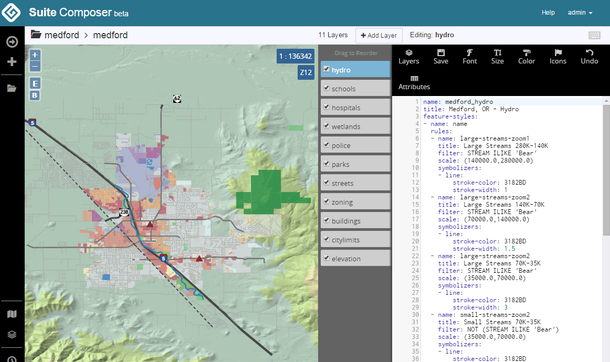

.. _intro.composer:

Composer
========

Boundless Suite Composer is a tool for creating, styling and publishing maps. It requires geoserver, but runs as a standalone web application. Composer can be accessed at ``http://localhost:8080/composer/`` in a typical Suite install.

   Boundless Suite Composer

For more information about Composer please see the section on :ref:`webmaps.composer`.