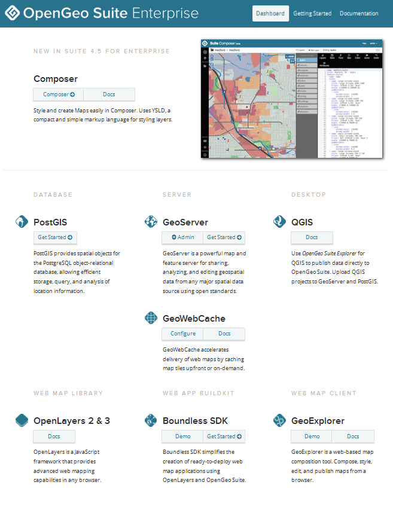

.. _intro.dashboard:

Dashboard
=========

The Dashboard is a single interface that allows you to access all components of OpenGeo Suite, including links to common tasks, configuration, and management. It runs as web application in the same container as GeoServer, accessible at ``http://localhost:8080/dashboard/``.

.. figure:: img/dashboard.png

   OpenGeo Suite Dashboard

   OpenGeo Suite Enterprise Dashboard

Contained in the dashboard are brief introductions to each of the components of OpenGeo Suite, including links to documentation and common tools.

The Dashboard contains a Getting Started page, which is designed to show options for common tasks performed with OpenGeo Suite.

.. figure:: img/dashboard_gettingstarted.png

   A sample workflow
