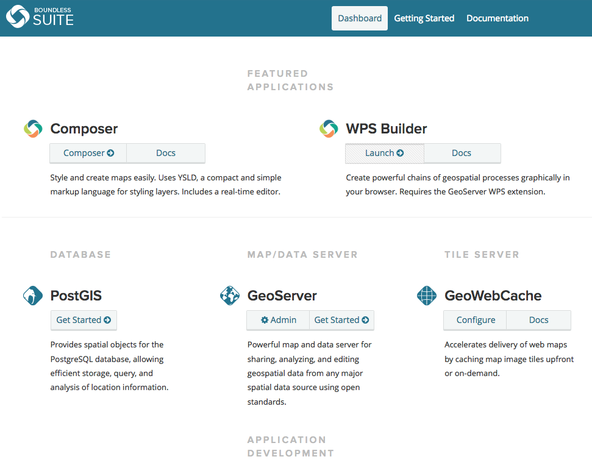
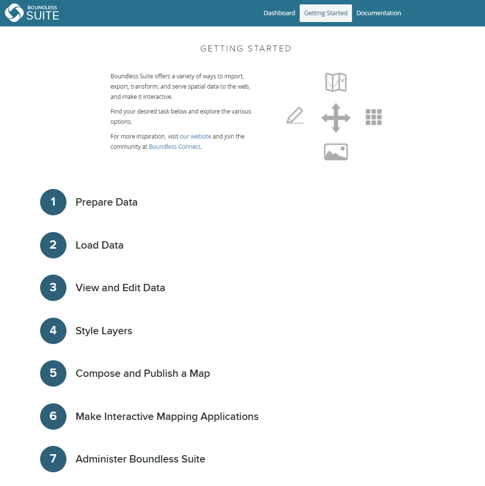

.. _intro.dashboard:

Dashboard
=========

The Dashboard is a single interface that allows you to access all components of Boundless Suite, including links to common tasks, configuration, and management. It runs as a web application in the same container as GeoServer, accessible at ``http://localhost:8080/dashboard/``.

   Boundless Suite Dashboard

Contained in the dashboard are brief introductions to each of the components of Boundless Suite, including links to documentation and common tools.

The Dashboard contains a Getting Started page, which is designed to show options for common tasks performed with Boundless Suite.

   A sample workflow
