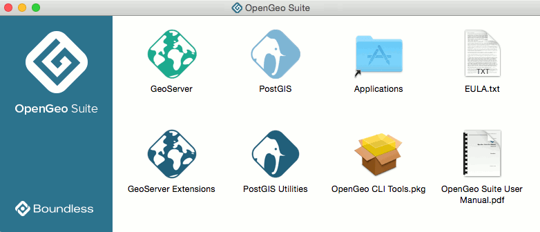

.. _intro.installation.mac.components:

Components
==========

The following is a list of components available for OpenGeo Suite on Mac OS X. These are accessible from the OpenGeo Suite disk image.

Adding or removing components to OpenGeo Suite can be accomplished by :ref:`installing <intro.installation.mac.install>` or :ref:`uninstalling <intro.installation.mac.uninstall>` the appropriate component. Extensions can only be uninstalled by deleting the files for that extension from your :file:`geoserver/WEB-INF/lib` directory.

      OpenGeo Suite components

GeoServer
---------

.. list-table::
   :stub-columns: 1
   :header-rows: 1
   :class: non-responsive

   * - Component
     - Description
     - Availability
   * - GeoServer
     - Server implementing OGC compliant map and feature services
     - All versions
   * - Composer
     - Map styling and composition application
     - OpenGeo Suite Enterprise only
   * - GeoExplorer
     - Map viewing and editing application
     - All versions
   * - GeoWebCache
     - Tile caching server
     - All versions
   * - WPS Builder
     - :ref:`Graphical utility <processing.wpsbuilder>` for executing WPS processes
     - OpenGeo Suite Enterprise only

PostGIS
-------

.. list-table::
   :stub-columns: 1
   :header-rows: 1
   :class: non-responsive

   * - Component
     - Description
     - Availability
   * - PostGIS
     - PostgreSQL/PostGIS spatial database
     - All versions

GeoServer Extensions
--------------------
 
.. list-table::
   :stub-columns: 1
   :header-rows: 1
   :class: non-responsive

   * - Component
     - Description
     - Availability
   * - App Schema
     - Application Schema support.
     - OpenGeo Suite Enterprise only
   * - ArcSDE
     - ArcSDE database support.
     - OpenGeo Suite Enterprise only
   * - CloudWatch
     - Connection to :ref:`Amazon CloudWatch <sysadmin.cloudwatch>` monitoring.
     - OpenGeo Suite Enterprise only
   * - Clustering
     - :ref:`Clustering <sysadmin.clustering>` plug-ins.
     - OpenGeo Suite Enterprise only
   * - CSW
     - Catalogue Service for Web (CSW) support.
     - All versions
   * - DB2
     - DB2 database support.
     - OpenGeo Suite Enterprise only
   * - GDAL Image Formats
     - Additional raster formats support as part of GDAL integration.
     - OpenGeo Suite Enterprise only
   * - GeoMesa
     - :ref:`GeoMesa <dataadmin.geomesa>` data source support.
     - OpenGeo Suite Enterprise only
   * - GeoPackage
     - GeoPackage data source support.
     - All versions
   * - GeoScript
     - Scripting extension for GeoServer.
     - OpenGeo Suite Enterprise only
   * - INSPIRE
     - Additional WMS and WFS metadata configuration for INSPIRE compliance
     - OpenGeo Suite Enterprise only
   * - MongoDB
     - :ref:`MongoDB <dataadmin.mongodb>` database support.
     - OpenGeo Suite Enterprise only
   * - Oracle
     - :ref:`Oracle <dataadmin.oracle>` database support.
     - OpenGeo Suite Enterprise only
   * - SQL Server
     - SQL Server database support.
     - OpenGeo Suite Enterprise only
   * - WPS
     - :ref:`Web Processing Service (WPS) <processing>` support.
     - All versions

PostGIS Utilities
-----------------

.. list-table::
   :stub-columns: 1
   :header-rows: 1
   :class: non-responsive

   * - Component
     - Description
     - Availability
   * - pgAdmin3
     - Graphical PostGIS/PostgreSQL database manager.
     - All versions
   * - pgShapeLoader
     - Graphical utility for loading data into PostGIS.
     - All versions

CLI Tools
---------

.. list-table::
   :stub-columns: 1
   :header-rows: 1
   :class: non-responsive

   * - Component
     - Description
     - Availability
   * - Boundless SDK
     - Toolkit for building web map applications.
     - All versions
   * - PostGIS Client Tools
     - PostGIS command line data loading utilities such as ``shp2pgsql``. 
     - All versions
   * - PostgreSQL Client Tools
     - PostgreSQL command line data loading utilities such as ``psql``. 
     - All versions
   * - GDAL (and Python modules)
     - Spatial data manipulation utilities such as ``gdal_translate`` and ``ogr2ogr``.
     - All versions
   * - PROJ.4
     - Cartographic Projections Library.
     - All versions
   * - GEOS
     - Geometry Engine, Open Source.
     - All versions
   * - LIBTIFF
     - TIFF Library and Utilities.
     - All versions
   * - GEOTIFF
     - LIBTIFF extension for reading and writing GeoTIFF information tags.
     - All versions
   * - LASZIP
     - Free and lossless LiDAR compression library.
     - All versions
   * - PDAL
     - Point Data Abstraction Library.
     - All versions
   * - ANT
     - Apache Ant build tool, used by Boundless SDK.
     - All versions
