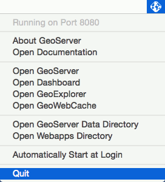

.. _intro.installation.mac.postinstall:

After installation: Working with OpenGeo Suite for Mac OS X
===========================================================

This document contains information about various tasks specific to OpenGeo Suite for Mac OS X. 

Starting and stopping OpenGeo services
--------------------------------------

To stop the Jetty (GeoServer) or PostgreSQL (PostGIS) services, just quit the application from the appropriate icon in the OS X menu bar.

   Stopping GeoServer

Service port configuration
--------------------------

The Jetty and PostgreSQL services run on ports **8080** and **5432** respectively. These ports can often conflict with existing services on the system, in which case the ports must be changed.

Changing the Jetty port
^^^^^^^^^^^^^^^^^^^^^^^

To change the Jetty port:

#. Edit the following file::

     ~/Library/Application\ Support/GeoServer/jetty/start.ini

#. Search for the Java system property named ``jetty.port`` and change its value to a number that does not conflict with any existing services on the machine. 

   .. note:: It is a common convention for Java services like Jetty to use port values greater than 8000. 

#. Optionally change the ``STOP.PORT`` property in the same manner.

Changing the PostgreSQL port
^^^^^^^^^^^^^^^^^^^^^^^^^^^^

To change the PostgreSQL port:

#. Edit the following file::

     ~/Library/Application\ Support/PostGIS/var/postgresql.conf

#. Search or the ``port`` property (around line 63), uncomment it and change its value from 5432 to a number that does not conflict with any existing services on the machine.

GeoServer Data Directory
------------------------

The **GeoServer Data Directory** is the location on the file system where GeoServer stores all of its configuration, and (optionally) file-based data. By default, this directory is located at :file:`~/Library/Application Support/GeoServer`. You can also find your data directory by running GeoServer and selecting :guilabel:`Open GeoServer Data Directory` from the GeoServer icon in the OS X menu bar.

To point GeoServer to an alternate location:

#. Edit the following file::

     ~/Library/Application\ Support/GeoServer/jetty/start.ini

#. Uncomment the ``GEOSERVER_DATA_DIR`` system property and sets its value to the desired location. For example::

     # geoserver data directory, uncomment and change to specify an alternative
     -DGEOSERVER_DATA_DIR=/Users/opengeo/geoserver_data

#. Close and relaunch ``GeoServer.app``.

.. _intro.installation.mac.postinstall.pgconfig:

PostgreSQL Configuration
------------------------

PostgreSQL configuration is controlled within the ``postgresql.conf`` file. This file is located here::

  ~/Library/Application\ Support/PostGIS/var/postgresql.conf

