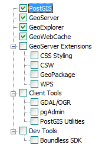
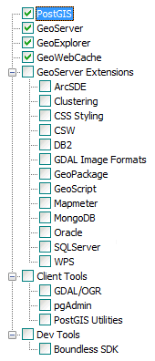

.. _intro.installation.windows.components:

Components
==========

The following is a list of components available for OpenGeo Suite on Windows. These are accessible from the **Components** page of the installer.

Adding components to OpenGeo Suite can be accomplished by running the installer again and selecting the appropriate component.

.. note:: The list of available components differs between OpenGeo Suite and OpenGeo Suite Enterprise. For more information on OpenGeo Suite Enterprise, please `contact us <http://boundlessgeo.com/about/contact-us/sales/>`_.

   Full list of available components (OpenGeo Suite)

   Full list of available components (OpenGeo Suite Enterprise)

Top level
---------

.. list-table::
   :stub-columns: 1
   :header-rows: 1
   :class: non-responsive

   * - Component
     - Description
     - Availability
   * - PostGIS
     - The PostgreSQL/PostGIS spatial database.
     - All versions
   * - GeoServer
     - Server implementing OGC compliant map and feature services.
     - All versions
   * - GeoExplorer
     - Map viewing and editing application.
     - All versions
   * - GeoWebCache
     - Tile caching server.
     - All versions
   * - WPS Builder
     - :ref:`Graphical utility <processing.wpsbuilder>` for executing WPS processes
     - OpenGeo Suite Enterprise only

GeoServer Extensions
--------------------

.. list-table::
   :stub-columns: 1
   :header-rows: 1
   :class: non-responsive

   * - Component
     - Description
     - Availability
   * - App Schema
     - Application Schema support.
     - OpenGeo Suite Enterprise only
   * - ArcSDE
     - ArcSDE database support.
     - OpenGeo Suite Enterprise only
   * - CloudWatch
     - Connection to :ref:`Amazon CloudWatch <sysadmin.cloudwatch>` monitoring.
     - OpenGeo Suite Enterprise only
   * - Clustering
     - :ref:`Clustering <sysadmin.clustering>` plug-ins.
     - OpenGeo Suite Enterprise only
   * - CSW
     - Catalogue Service for Web (CSW) support.
     - All versions
   * - DB2
     - DB2 database support.
     - OpenGeo Suite Enterprise only
   * - GDAL Image Formats
     - Additional raster formats support as part of GDAL integration.
     - OpenGeo Suite Enterprise only
   * - GeoMesa
     - :ref:`GeoMesa <dataadmin.geomesa>` data source support.
     - OpenGeo Suite Enterprise only
   * - GeoPackage
     - GeoPackage data source support.
     - All versions
   * - GeoScript
     - Scripting extension for GeoServer.
     - OpenGeo Suite Enterprise only
   * - INSPIRE
     - Additional WMS and WFS metadata configuration for INSPIRE compliance
     - OpenGeo Suite Enterprise only
   * - MongoDB
     - :ref:`MongoDB <dataadmin.mongodb>` database support.
     - OpenGeo Suite Enterprise only
   * - Oracle
     - :ref:`Oracle <dataadmin.oracle>` database support.
     - OpenGeo Suite Enterprise only
   * - SQL Server
     - SQL Server database support.
     - OpenGeo Suite Enterprise only
   * - WPS
     - :ref:`Web Processing Service (WPS) <processing>` support.
     - All versions

Client Tools
------------

.. list-table::
   :stub-columns: 1
   :header-rows: 1
   :class: non-responsive

   * - Component
     - Description
     - Availability
   * - GDAL/OGR
     - Spatial data manipulation utilities such as ``gdal_translate`` and ``ogr2ogr``.
     - All versions
   * - pgAdmin
     - Graphical PostGIS/PostgreSQL database manager. Also includes **pgShapeloader** a graphical utility for loading data into PostGIS
     - All versions
   * - PostGIS Utilities
     - PostGIS command line data loading utilities such as ``psql`` and ``shp2pgsql``. 
     - All versions

Dev Tools
---------

.. list-table::
   :stub-columns: 1
   :header-rows: 1
   :class: non-responsive

   * - Component
     - Description
     - Availability	   
   * - Boundless SDK
     - Tool kit for building web map applications.
     - All versions