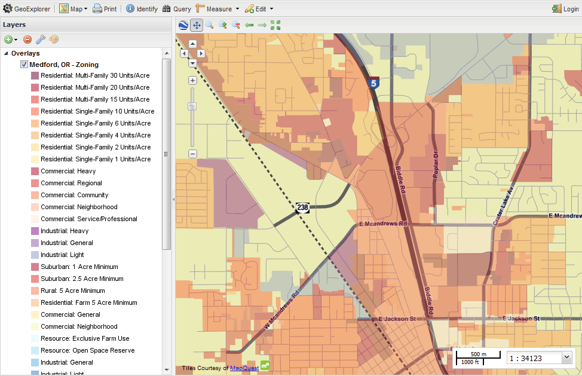

.. _builtindemos:

.. warning:: Document Status: **Ready for copyedit review**

Sample layers
=============

The OpenGeo Suite comes with some preloaded sample layers that may be viewed and restyled as required.
 
Medford
-------

The city of Medford, in the US state of Oregon, has generously shared some of their municipal data. The following layers are available with the OpenGeo Suite.

.. list-table::
   :widths: 10 20 10 10
   :header-rows: 1
   
   * - Layer Name
     - Abstract
     - Last Update
     - Type
   * - :guilabel:`medford:bikelanes`
     - Bike lanes in Jackson County
     - Dec 2008
     - MultiLineString
   * - :guilabel:`medford:buildings`
     - Building outlines for Medford
     - Mar 2009
     - MultiPolygon
   * - :guilabel:`medford:citylimits`
     - Local jurisdiction of Medford
     - Jul 2009
     - MultiPolygon
   * - :guilabel:`medford:firestations`       
     - Location of fire stations in Jackson County
     - Apr 2009 
     - Point
   * - :guilabel:`medford:hospitals`     
     - Location of hospitals in Jackson County
     - Oct 2006 
     - Point
   * - :guilabel:`medford:hydro`   
     - US Fish & Wildlife National Wetlands Inventory of wetland linear features
     - Oct 2000
     - MultiLineString
   * - :guilabel:`medford:libraries`     
     - Location of libraries in Jackson County
     - Aug 2006  
     - Point
   * - :guilabel:`medford:parks`         
     - Open parks within Medford
     - Unknown
     - MultiPolygon
   * - :guilabel:`medford:police`       
     - Location of police stations in Jackson County
     - Apr 2009
     - Point
   * - :guilabel:`medford:schools`       
     - Location of Jackson County schools
     - Mar 2009
     - Point
   * - :guilabel:`medford:stormdrains`        
     - Storm drains within Medford
     - Unknown
     - MultiLineString 
   * - :guilabel:`medford:streets`  
     - All public streets within Jackson County  
     - Sept 2009 
     - MultiLineString 
   * - :guilabel:`medford:wetlands`             
     - US Fish & Wildlife National Wetlands Inventory of Jackson County
     - Oct 2009 
     - MultiPolygon
   * - :guilabel:`medford:zoning`             
     - City Zones from the Jackson County City Planning    
     - Apr 2008
     - MultiPolygon 
   * - :guilabel:`medford:taxlots`             
     -    
     - 
     - MultiPolygon
   * - :guilabel:`medford:elevation`             
     - 50 Meters USGS 30 Meter Digital Elevation Model color shaded relief of Medford                
     - Jan 2001 
     - GeoTIFF

   
The Medford layers have a declared :term:`SRS` (the projection GeoServer publishes the layer with) of EPSG:4326 and bounding boxes within the range ``-122.904, 42.231, -123.042, 42.438``. The Medford data is available in the public domain.

   *Medford zoning data viewed in GeoExplorer*

World
-----

The OpenGeo Suite also includes a number of world layers including: 

.. list-table::
   :widths: 10 10 7
   :header-rows: 1

   * - Layer Name
     - Abstract
     - Type  
   * - :guilabel:`world:volcanoes`             
     - Major volcaones              
     - Point
   * - :guilabel:`world:globaldata_temp`             
     - World temperatures              
     - Point   
   * - :guilabel:`world:urbanareas1_1`             
     - Urban population              
     - Point
   * - :guilabel:`world:cities`             
     - Major cities               
     - Point
   * - :guilabel:`world:borders`             
     - Continental outlines             
     - MultiPolygon

The world layers have a declared :term:`SRS` (the projection GeoServer publishes the layer with) of EPSG:4326 and bounding boxes within the range ``-179.97, -77.53, 179.58, 71.08``.

Base Maps
---------

When the GeoExplorer application is opened, it will automatically link to the MapQuest OpenStreetMap web service, providing a general map of the world as a base map. 

.. figure:: ../../_images/load_geoexplorer.png

   *OSM world map in GeoExplorer*

Layer preview
-------------

You can use GeoExplorer to view any of the sample layers. To open GeoExplorer, click :guilabel:`Launch` next to :guilabel:`GeoExplorer` on the OpenGeo Suite :ref:`Dashboard`. For more information on viewing and adding layers to GeoExplorer, see the :ref:`webmaps.basic` tutorial or the GeoExplorer `reference documentation <../geoexplorer/>`_.

