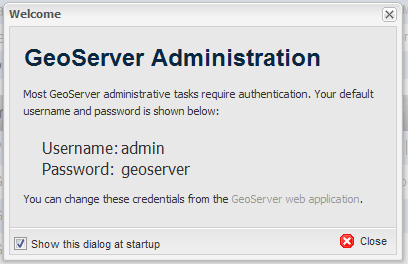
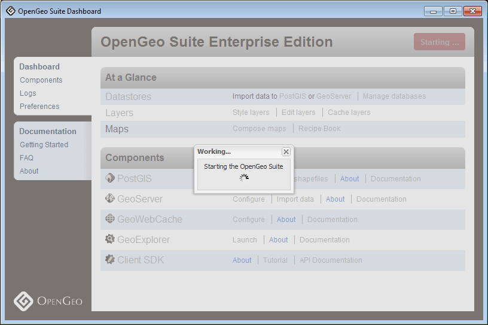
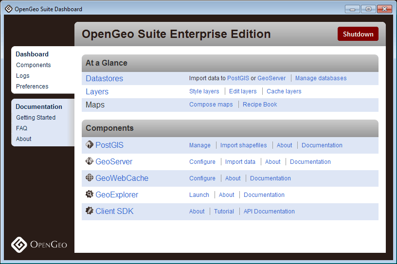
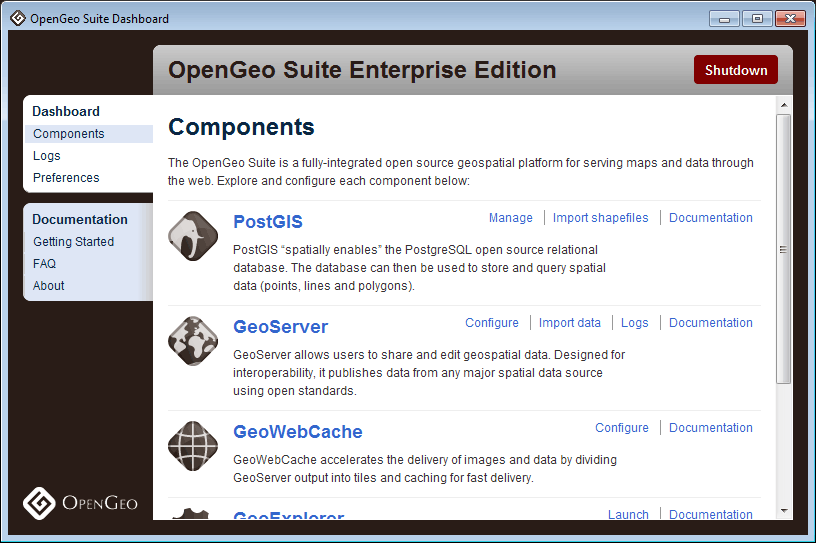
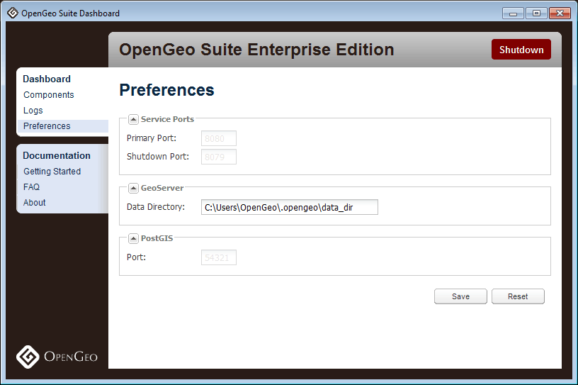
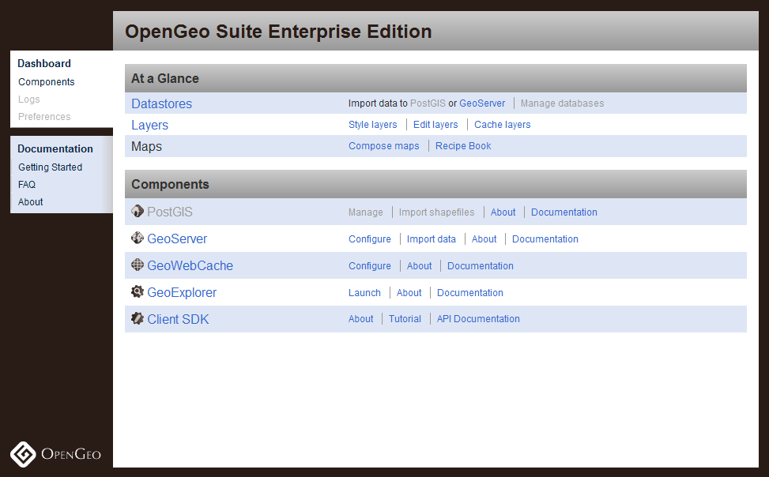

.. _dashboard:

Dashboard
=========

The OpenGeo Suite Dashboard is a single interface that allows you to access all components of the OpenGeo Suite, including links to common tasks, configuration, and management. It runs on the host machine as an application, though there is also a :ref:`dashboard.web` with similar functionality.

.. note:: The "desktop" Dashboard is available for Windows and OS X only.

.. figure:: img/dashboard.png
   :align: center

   *OpenGeo Suite Dashboard*

.. note:: When you first launch the OpenGeo Suite Dashboard, you will be presented with the GeoServer user name and password. These credentials are used to administer GeoServer.

   *Dashboard first launch*

Starting and Stopping
---------------------

The Dashboard can start and stop the OpenGeo Suite. Simply click on the :guilabel:`Start` or :guilabel:`Shutdown` button at the top right of the Dashboard. Many links in the Dashboard will be disabled unless the OpenGeo Suite is started.

.. note:: The first time the OpenGeo Suite is started might take a few minutes to initialize the software. Subsequent starting times will be greatly reduced.

   *OpenGeo Suite starting*

   *OpenGeo Suite started*

You can also start and stop the OpenGeo Suite from the command prompt. First, navigate to the root of your installation directory.

To start::

   opengeo-suite start  

To stop::

   opengeo-suite stop

Getting Started
---------------

The Dashboard contains a Getting Started page, which is designed to show a sample workflow for publishing your data and creating your maps. A more detailed discussion is available here in the :ref:`webmaps.basic` tutorial.

.. figure:: img/dashboard_gettingstarted.png
   :align: center

   *A sample workflow*

Components
----------

Contained in the dashboard are brief introductions to each of the components of the OpenGeo Suite, including links to documentation and common tools.

   *Components*

.. _dashboard.prefs:

Preferences
-----------

You can configure the OpenGeo Suite through the Preferences page.

.. warning:: You must stop and start the OpenGeo Suite for any changes to take effect.

   *Preferences*

Service Ports
~~~~~~~~~~~~~

The OpenGeo Suite runs a web server on your host machine that responds on a specific port (the default is **8080**). You can change this by changing the :guilabel:`Port` value. Click :guilabel:`Save` when done. Restart the OpenGeo Suite for the change to take effect.

Similarly, the port that PostGIS responds on can be changed here as well.

GeoServer Data Directory
~~~~~~~~~~~~~~~~~~~~~~~~

GeoServer's data and configuration is stored in what is known as the data directory. You can point the OpenGeo Suite to a different GeoServer data directory if you'd like (or move the existing data directory to another location) by changing the value of :guilabel:`Data Directory`. Click :guilabel:`Save` when done. Restart the OpenGeo Suite for the change to take effect.

.. _dashboard.web:

Web Dashboard
-------------

Much of the functionality in the Dashboard is available through a web-based interface as well. Navigate to ``http://localhost:8080/dashboard/`` or wherever the OpenGeo Suite was installed, to see the Web Dashboard.

.. note:: Starting and stopping the OpenGeo Suite, viewing the logs, and changing preferences are not available through the Web Dashboard.