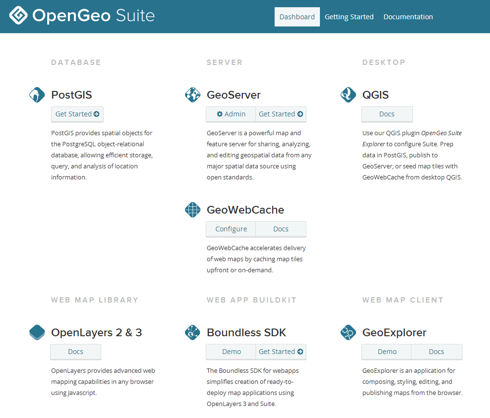
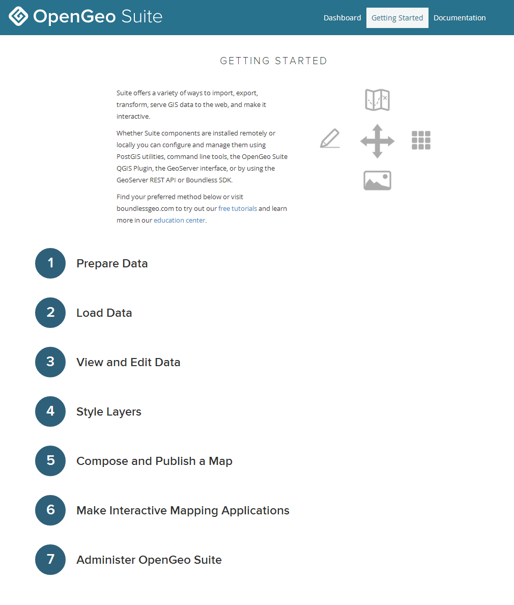

.. _dashboard:

Dashboard
=========

The Dashboard is a single interface that allows you to access all components of OpenGeo Suite, including links to common tasks, configuration, and management. It runs as web application in the same container as GeoServer, accessible at ``http://localhost:8080/dashboard/``.

   *OpenGeo Suite Dashboard*

Contained in the dashboard are brief introductions to each of the components of 
OpenGeo Suite, including links to documentation and common tools.

Getting Started
---------------

The Dashboard contains a Getting Started page, which is designed to show a sample workflow for publishing your data and creating your maps. A more detailed discussion is available here in the :ref:`webmaps.basic` tutorial.

   *A sample workflow*
