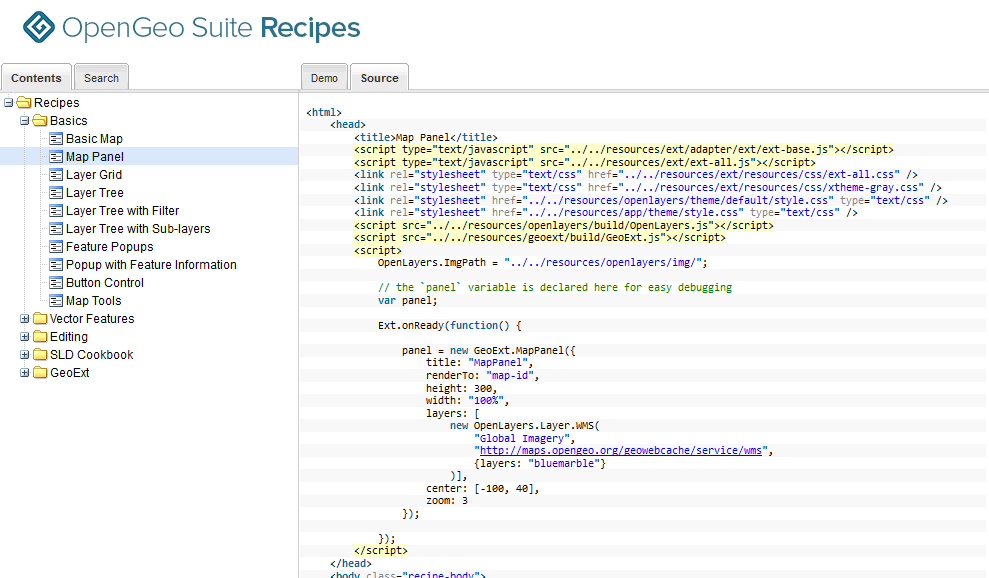

.. _intro.recipes:

Recipes
=======

OpenGeo Suite includes an application called **OpenGeo Suite Recipes**, which contains code examples (or "recipes") for building applications using the OpenGeo Suite. This can be launched from the :ref:`intro.dashboard` or by navigating to http://localhost:8080/recipes.

.. figure:: img/recipes.png

   OpenGeo Suite Recipes

Each recipe contains a map, the code required to build the map, and links to relevant API documentation.

.. figure:: img/recipedemo.png

   A demo from a recipe

   The source code required to generate the demo

.. note:: You can also build complete web applications using the :ref:`Boundless SDK <webapps>`.