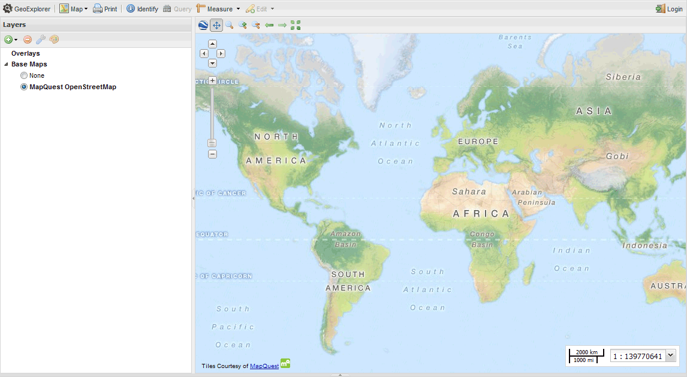

.. _sampledata:

Sample Data
===========

OpenGeo Suite comes with some preloaded sample layers that may be viewed and restyled as required.

.. note:: The sample layers are provided for demonstration purposes only. No assurances are provided with respect to the currency or accuracy of the data.

States
------

A population distribution layer for the United States of America taken from the 
the 2010 Census. See the `U.S. Census Bureau <http://census.gov>`_ for more details.

The :guilabel:`usa:states` layer is in a geographic projection (EPSG:4326) with an approximate spatial extent of ``-179.2, 17.8, -65.2, 71.4`` (west, south, east, north). 

Countries
---------

A world wide country layer taken from the Natural Earth `1:50m cultural <http://www.naturalearthdata.com/downloads/50m-cultural-vectors/>`_ vector dataset. 

The :guilabel:`opengeo:countries` layer is in a geographic projection (EPSG:4326) with a spatial extent of +-180 (longitude) and +-90 (latitude). 

.. _sampledata.medford:

Medford
-------

The city of Medford, in the USA state of Oregon, has generously shared some of their public domain municipal data. 

.. note:: This data does not ship with OpenGeo Suite by default. To install the data download `medford.zip <http://data.opengeo.org/medford.zip>`_ and unpack it into the root of the GeoServer data directory.

The following layers are available in the Medford dataset:

.. list-table::
   :widths: 10 20 10 10
   :header-rows: 1
   
   * - Layer Name
     - Abstract
     - Last Update
     - Type
   * - :guilabel:`medford:bikelanes`
     - Bike lanes in Jackson County
     - Dec 2008
     - MultiLineString
   * - :guilabel:`medford:buildings`
     - Building outlines for Medford
     - Mar 2009
     - MultiPolygon
   * - :guilabel:`medford:citylimits`
     - Local jurisdiction of Medford
     - Jul 2009
     - MultiPolygon
   * - :guilabel:`medford:firestations`       
     - Location of fire stations in Jackson County
     - Apr 2009 
     - Point
   * - :guilabel:`medford:hospitals`     
     - Location of hospitals in Jackson County
     - Oct 2006 
     - Point
   * - :guilabel:`medford:hydro`   
     - US Fish & Wildlife National Wetlands Inventory of wetland linear features
     - Oct 2000
     - MultiLineString
   * - :guilabel:`medford:libraries`     
     - Location of libraries in Jackson County
     - Aug 2006  
     - Point
   * - :guilabel:`medford:parks`         
     - Open parks within Medford
     - Unknown
     - MultiPolygon
   * - :guilabel:`medford:police`       
     - Location of police stations in Jackson County
     - Apr 2009
     - Point
   * - :guilabel:`medford:schools`       
     - Location of Jackson County schools
     - Mar 2009
     - Point
   * - :guilabel:`medford:stormdrains`        
     - Storm drains within Medford
     - Unknown
     - MultiLineString 
   * - :guilabel:`medford:streets`  
     - All public streets within Jackson County  
     - Sept 2009 
     - MultiLineString 
   * - :guilabel:`medford:wetlands`             
     - US Fish & Wildlife National Wetlands Inventory of Jackson County
     - Oct 2009 
     - MultiPolygon
   * - :guilabel:`medford:zoning`             
     - City Zones from the Jackson County City Planning    
     - Apr 2008
     - MultiPolygon 
   * - :guilabel:`medford:taxlots`             
     - Property tax land parcels    
     - 2009
     - MultiPolygon
   * - :guilabel:`medford:elevation`             
     - 50 Meters USGS 30 Meter Digital Elevation Model color shaded relief of Medford                
     - Jan 2001 
     - GeoTIFF

.. figure:: img/medford.png

   *Medford zoning data viewed in GeoExplorer*
   
The Medford layers are in a geographic projection (EPSG:4326) with an approximate spatial extent of ``-122.904, 42.231, -123.042, 42.438`` (west, south, east, north). 

.. _sampledata.world:

World
-----

A variety of world wide datasets compiled from a number of sources. 

.. note::  This data does not ship with OpenGeo Suite by default. To install the data download `world.zip <http://data.opengeo.org/world.zip>`_ and unpack it into the root of the GeoServer data directory.

.. note:: The world data bundle contains styles that require the GeoServer WPS extensions. 

The world layers include:

.. list-table::
   :widths: 10 10 7
   :header-rows: 1

   * - Layer Name
     - Abstract
     - Type  
   * - :guilabel:`world:volcanoes`             
     - Major volcanoes             
     - Point
   * - :guilabel:`world:globaldata_temp`             
     - Maximum daily temperatures             
     - Point   
   * - :guilabel:`world:urbanareas1_1`             
     - Urban population              
     - Point
   * - :guilabel:`world:cities`             
     - Major cities               
     - Point
   * - :guilabel:`world:borders`             
     - Continental outlines             
     - MultiPolygon

The world layers are in a geographic projection (EPSG:4326). 

The :guilabel:`world:volcanoes` layer is derived from the freely available volcano data compiled by the Smithsonian Institute, Global Volcanism Program. The :guilabel:`world:globaldata_temp` layer is derived from the `NASA GLOBE Program <http://www.globe.gov/>`_ and again is freely available. (GLOBE data is only available for locations in countries that have joined the GLOBE Program.) 

The :guilabel:`world:urbanareas1_1` layer was obtained from the `Nordpil world database of large urban areas <http://nordpil.com/go/resources/world-database-of-large-cities/>`_, derived from the World Urbanization Prospects: The 2007 Revision Population Database (UN Population Division). The urban areas data is made available under a Creative Commons public domain license.

The :guilabel:`world:cities` layer was derived from public domain data obtained from the `Natural Earth <http://www.naturalearthdata.com/>`_ website. The :guilabel:`world:borders` layer was downloaded from the `Mapping Hacks <http://www.mappinghacks.com/data>`_ website. The original data was derived from public domain sources. 

For further information, please refer to the Readme.txt file included with the data bundle. 

Base Maps
---------

GeoExplorer provides a link to the MapQuest OpenStreetMap (OSM) web service, providing a general map of the world as a base map. 

   *OSM world map in GeoExplorer*

Layer preview
-------------

You can use GeoExplorer to view any of the sample layers. To open GeoExplorer, click :guilabel:`Launch` next to :guilabel:`GeoExplorer` on the OpenGeo Suite :ref:`Dashboard`. For more information on viewing and adding layers to GeoExplorer, see the :ref:`webmaps.basic` tutorial or the GeoExplorer `reference documentation <../geoexplorer/>`_.

