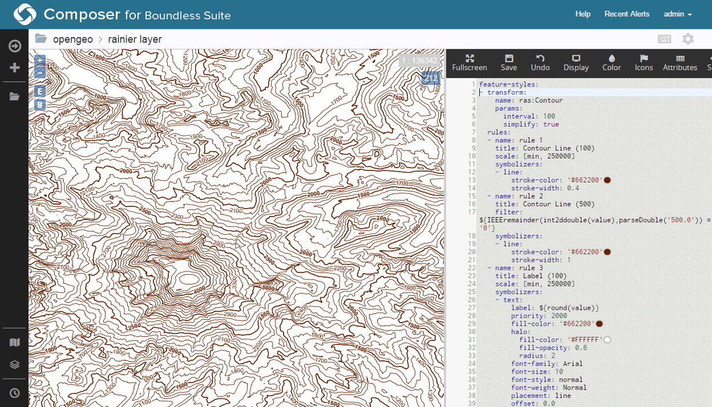

.. _processing.contour.dynamic:

Creating a dynamic contour map
==============================

The same contour map can be created dynamically with SLD and :ref:`rendering transformations <cartography.rt>`. The goal is to apply a style to the raster layer such that the contour lines are *generated directly, without the need to create a separate vector layer*.

Design
------

The data has already been loaded, so all that needs to be done is to craft a style for the raster layer that employs a rendering transformation. We'll use the style created in the :ref:`previous section <processing.contour.static>` here.

YSLD
~~~~

Adding a rendering transformation is done with the :ref:`transform <cartography.ysld.reference.transforms>` mapping. The transformation name is ``ras:Contour``, the name of the WPS process. From there, the other arguments to the process are supplied as parameters as before, except that no output format is required, and the band is implied as there is only one to choose from:

.. literalinclude:: files/contour_rt.ysld
   :language: yaml
   :lines: 2-6

:download:`Download the full YSLD for this example <files/contour_rt.ysld>`, including the rendering transformation.

Add this to the YSLD created in the previous section, and then apply the style directly to the raster layer.

SLD
~~~

Adding a rendering transformation is done with the ``<Transformation>`` tag. The transformation name is ``ras:Contour``, the name of the WPS process. From there, the other arguments to the process are supplied as parameters as before, except that no output format is required, and the band is implied as there is only one to choose from:

.. literalinclude:: files/contour_rt.sld
   :language: xml
   :lines: 14-28

Add this to the SLD created in the previous section, and then apply the style directly to the raster layer.

:download:`Download the full SLD for this example <files/contour_rt.sld>`, including the rendering transformation.

Viewing
-------

Using Composer, load this style into the layer on the :ref:`style/view <webmaps.composer.styleview>` page for that layer (the *original raster layer*, not the contour layer), and click :guilabel:`Save`.

   Dynamic contour map in Composer

.. note::

   If not using Composer, load the SLD into GeoServer and associate it to the raster layer in the same way as done in the previous section.

This map looks identical to the statically generated one. The advantage here is that a secondary vector layer was never created. This map is generated dynamically based on the source raster data, the built-in contour process, and styling.
