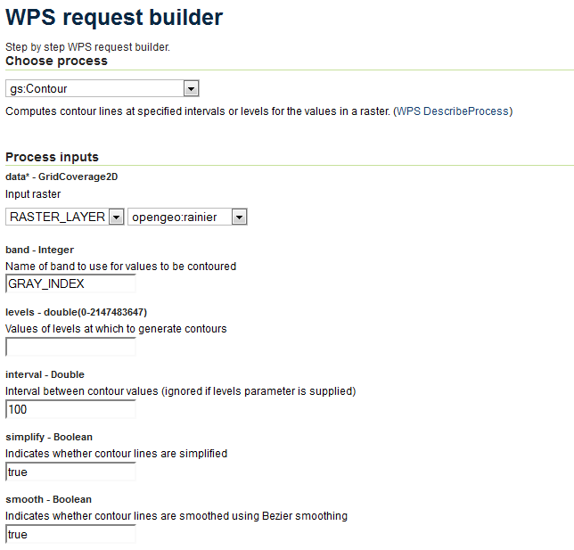
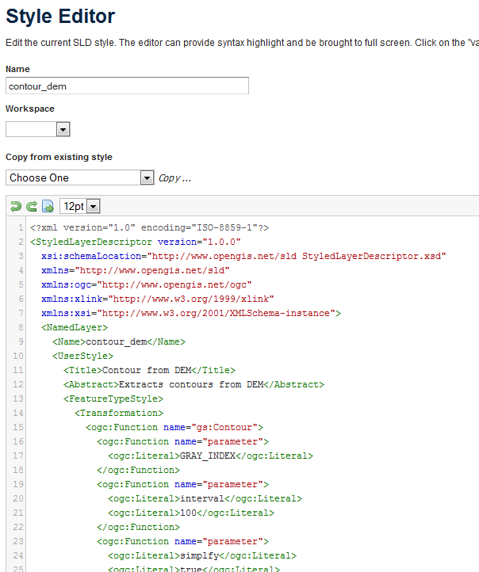
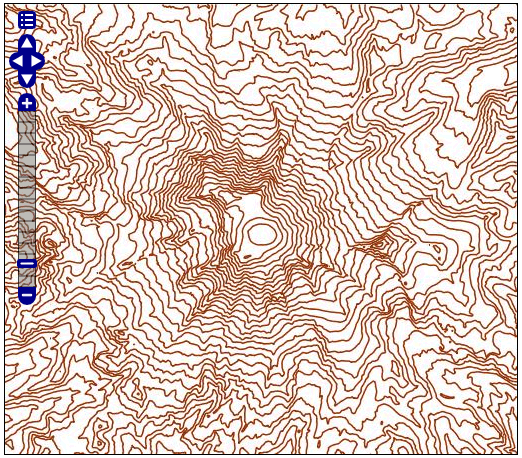
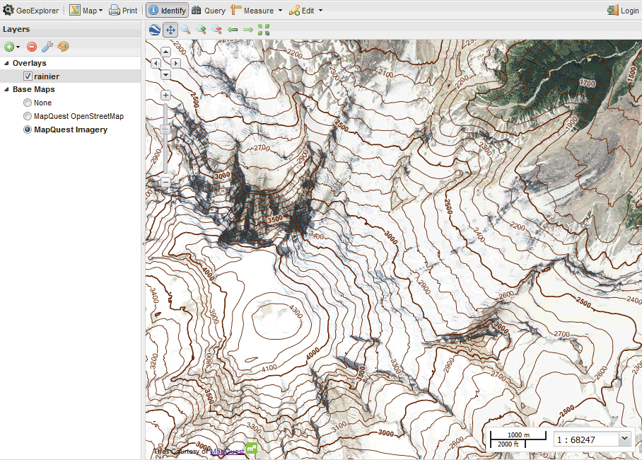

.. _processing.contour:

Creating a contour map with a WPS process
=========================================

This tutorial will show how to create a contour map from a raster data layer. 

Background
----------

A contour map is a vector map format which contains linestrings denoting areas of an equal value. It is most commonly generated from raster topographic or digital elevation model data (to show height) but can also be used on weather maps  or other datasets where bands of common value are desired.

There are two ways of creating a contour map from raster data with the OpenGeo Suite.

* Statically, using the WPS Request Builder
* Dynamically, using SLD and :ref:`cartography.rt`

Both ways hinge on the WPS process called **gs:Contour**.

To create a static map, import data into GeoServer, execute the process using the WPS Request Builder, and output the result. Load the output back into GeoServer to view the results alongside the original content.

To create a dynamic map, import data into GeoServer, and create a custom SLD that executes the same WPS process via a rendering transformation. With this style created, the result will be a dynamic vector-based contour view of the raster layer.

Both situations will be covered in this tutorial.

Data
----

.. note:: The example data used in this section is a digital elevation model of Mt. Rainier National Forest and was acquired via the `USGS National Viewer Map <http://viewer.nationalmap.gov/viewer/>`_.

Start with an appropriate dataset. Any raster data set that contains a band where contouring is possible will suffice.

Load this dataset into GeoServer. The simplest way is to use `GeoExplorer <../../geoexplorer>`_ and its Upload Layers functionality, but you can also use the GeoServer :ref:`dataadmin.importer`. 

.. figure:: img/dem_geoexplorer.png

   *Viewing raster layer in GeoExplorer*

This is the default style of the layer in GeoServer, a grayscale output mapped from lightest at highest values to darkest at lowest values. In this case, the attribute values range from approximately **518 to 4392**. The units of this data are in meters.

.. note:: To find the minimum and maximum values for a raster, use the **gs:RasterZonalStatistics** process or, alternately, chain the output of the **gs:RasterAsPointCollection** into the input of **gs:Aggregate** with the :guilabel:`Min` or :guilabel:`Max` function.

.. todo:: Make the above process easier.

.. figure:: img/dem_geoexplorer_gfi.png

   *GeoExplorer Identify dialog showing attributes*

Design
------

Contour bands need to be frequent enough to be meaningful, but not so frequent as to clutter the map. While context and usage will determine the optimal intervals,  **100 meters** will be used here. And as precision is not important in this exercise, the ``smooth`` and ``simplify`` functions will be employed to reduce the size of the output data.

Creating a static contour map
-----------------------------

Using the WPS Request Builder in the GeoServer UI, one can generate a vector contour layer of a given raster layer. Access the WPS Request Builder by going to :guilabel:`Demos` and selecting :guilabel:`WPS Request Builder`.

Once there, select :guilabel:`gs:Contour` in the box marked :guilabel:`Choose process`. Enter the following information:

.. list-table::
   :header-rows: 1

   * - Field
     - Value
     - Example
   * - data
     - Name of the raster layer or the source of the data
     - ``opengeo:rainier``
   * - band
     - Name of the band used for the contour values
     - ``GRAY_INDEX``
   * - interval
     - Interval between contour lines
     - ``100``
   * - simplify
     - Whether to reduce the vertices in the output
     - ``true``
   * - smooth
     - Whether to smooth the vectors
     - ``true``
   * - output
     - Output format
     - ``application/zip`` (for Shapefile)
 
All other fields can be left blank.

   *WPS Request Builder for creating a contour layer*

Run this process, and save the resulting archive. Import this data back into GeoServer, using either the :ref:`dataadmin.importer` or `GeoExplorer <../../geoexplorer>`_.

To view this layer, load GeoExplorer and add both layers to a map using the :guilabel:`Add Layers` button. Place the contour layer on top of the source raster layer for proper context.

.. figure:: img/static_geoexplorer.png

   *Generated static contour map in GeoExplorer*

Creating a dynamic contour map
------------------------------

This same type of contour map can be created dynamically with SLD and rendering transformations. The goal will be to view the raster layer but with a special style such that the view is of the dynamically-generated contour lines.

In our SLD, we will be using a ``<Transformation>``. The transformation name is ``gs:Contour``, which is the name of our process. From there, the other arguments to the process are supplied exactly as above.

.. literalinclude:: contour.sld
   :language: xml
   :lines: 14-32

Aside from the <Transformation> the SLD doesn't have very much content. There is a single ``<Rule>`` containing a single ``<LineSymbolizer>`` which will style all lines as dark brown and with a single pixel of thickness.

.. literalinclude:: contour.sld
   :language: xml
   :lines: 33-42

.. todo:: Wish we could add varying thickness lines based on contour value and labels showing the value of each line. See SUITE-1151. Once resolved, a more meaningful SLD can be created here.

Putting it all together, we have the following:

.. literalinclude:: contour.sld
   :language: xml

Load this SLD into GeoServer via the :guilabel:`Styles` menu and selecting :guilabel:`Add new style`. 

   *Creating a new style with rendering transformation* 

Once that is done, associate this style with the original layer. This is done by going to the :guilabel:`Layers` menu, clicking on the layer name, clicking on the Publishing tab, and selecting the style from the drop-down menu called :guilabel:`Default style`. Click :guilabel:`Save` when done.

.. figure:: img/geoserver_layer_style.png

   *Associating the style with the layer* 

Once these changes are saved, go to the :guilabel:`Layer Preview` and view the layer. You can also view the layer in GeoExplorer.

   *Dynamic contour map displayed in OpenLayers*

   *Dynamic contour map displayed in GeoExplorer*

