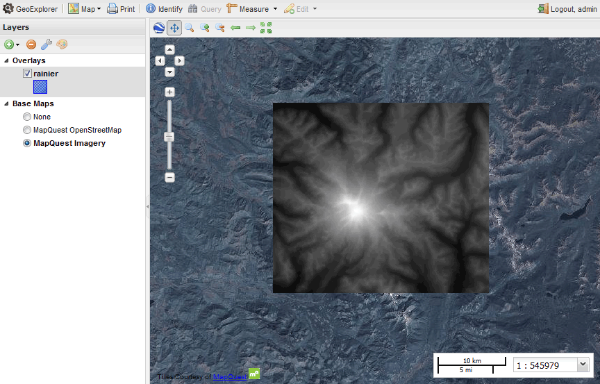
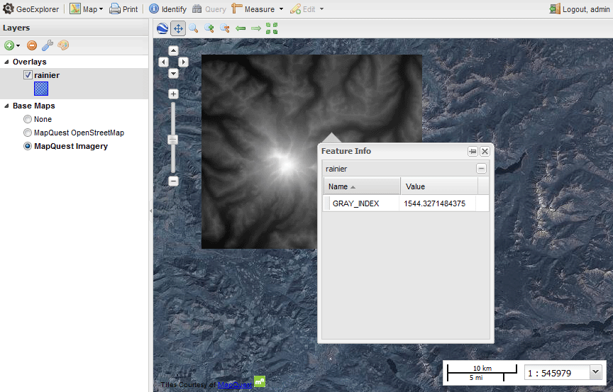

.. _processing.contour.setup:

Contour map setup
=================

A contour map is a vector map formed by linestrings which delineate areas of similar or equal value. It is most commonly generated from raster topographic or digital elevation model data (to show height) but can also be used on weather maps  or other datasets where bands of common value are desired.

There are two methods of creating a contour map from raster data with the OpenGeo Suite.

* **Statically**, using the Web Processing Service (WPS)
* **Dynamically**, using SLD and :ref:`cartography.rt`

Both methods hinge on the WPS process **gs:Contour**.

To create a static map, import data into GeoServer, execute the process using the WPS Request Builder, and output the result. Load the output back into GeoServer to view the results alongside the original content.

To create a dynamic map, import data into GeoServer, and create a custom SLD that executes the same WPS process via a rendering transformation. With this style created, the result will be a dynamic vector-based contour view of the raster layer.

Example data
------------

.. note:: The example data used in this section is a digital elevation model of the area around Mt. Rainier National Park and was acquired via the `USGS National Viewer Map <http://viewer.nationalmap.gov/viewer/>`_.

Start with an appropriate dataset. Any raster data set that contains a band where contouring is possible will suffice.

Load this dataset into GeoServer. The simplest way is to use `GeoExplorer <../../geoexplorer>`_ and its Upload Layers functionality, but you can also use the :ref:`dataadmin.importer`. 

   *Viewing raster layer in GeoExplorer*

This is the default style of the layer in GeoServer, a grayscale output mapped from lightest at highest values to darkest at lowest values. In this case, the attribute values range from approximately **500 to 4400**. The units of this data are in meters.

.. note:: To find the minimum and maximum values for a raster using WPS processed, use the **gs:RasterZonalStatistics** process or, alternately, chain the output of the **gs:RasterAsPointCollection** into the input of **gs:Aggregate** with the :guilabel:`Min` or :guilabel:`Max` function.

.. todo:: Make the above process easier.

   *GeoExplorer Identify dialog showing attribute values*

.. _processing.contour.setup.design:

Design considerations
---------------------

Contour bands need to be frequent enough to be meaningful, but not so frequent as to clutter the map. While context and usage will determine the optimal intervals,  **100 meters** will be used here as the minimum interval, while every **500 meters**, a thicker band will be employed. Labels showing the band value will be placed on the bands, with a bold label corresponding to a thicker line. At higher zoom levels (zoomed out), the 100 meter bands and labels will be hidden, leaving only the 500 meter bands.

As precision is not important in this exercise, the ``simplify`` function will be employed to reduce the density of vertices in the output.