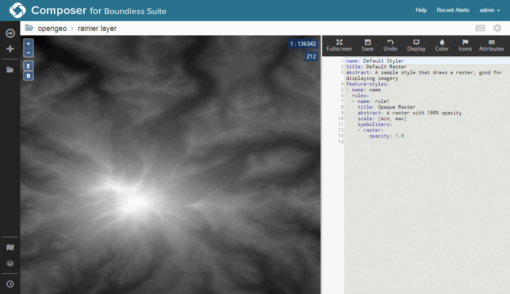
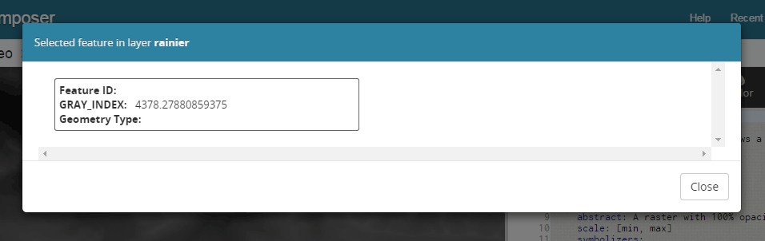

.. _processing.contour.setup:

Contour map setup
=================

A contour map is a vector map formed by linestring features which describe areas of similar or equal value. The contour map is most commonly generated from raster topographic or digital elevation model data (to show height), but can also be used on weather maps or other datasets where bands of common value are desired.

There are two methods of creating a contour map from raster data using Boundless Suite.

* **Statically**, using the Web Processing Service (WPS)
* **Dynamically**, using map styles and :ref:`rendering transformations <cartography.rt>`

Example data
------------

.. note:: The example data used in this section is a digital elevation model of the area around Mt. Rainier National Park and was acquired via the `USGS National Viewer Map <http://viewer.nationalmap.gov/viewer/>`_. The specific layer acquired was the Topo layer.

You should start with an appropriate dataset. Any raster data set that contains a band where contouring is possible will work.

Load this dataset into GeoServer. The simplest way is to use :ref:`Composer <webmaps.composer>`, but you can also use the :ref:`GeoServer Layer Importer <dataadmin.importer>`.

   Viewing raster layer in Composer

The default style of the layer in GeoServer is a grayscale output mapped from lightest at highest values to darkest at lowest values. In the above case, the attribute values range from approximately **500 to 4400**; the units of this data are in meters.

   Composer Identify dialog showing band value

.. _processing.contour.setup.design:

Design considerations
---------------------

Contour bands need to be frequent enough to be meaningful, but not so frequent as to clutter the map. While context and usage will determine the optimal design, the following decisions will be implemented:

* The minimum interval for a contour band will be **100 meters**
* Every **500 meters**, a thicker band will be employed.
* **Labels showing the band value** will be placed on the bands, with a bold label corresponding to a thicker line.
* At higher zoom levels (zoomed out), the 100 meter bands and labels will be hidden, leaving only the 500 meter bands.
* As precision is not important in this exercise, the output will be simplified to reduce the density of vertices in the output. This will improve the responsiveness of the map.
