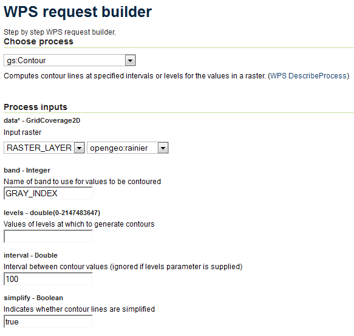
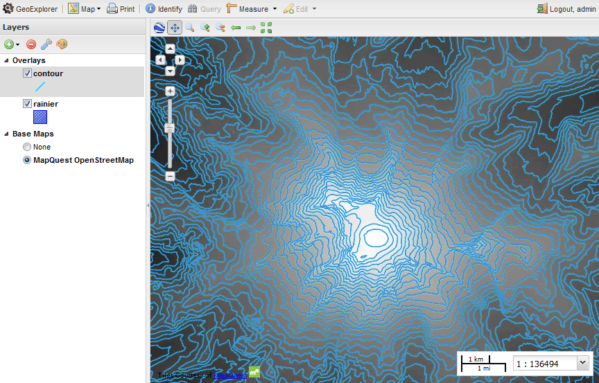
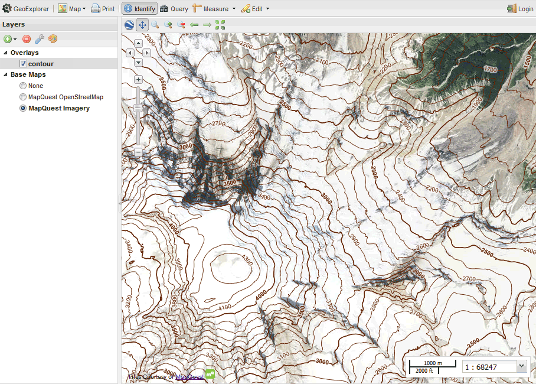

.. _processing.contour.static:

Creating a static contour map
=============================

Using the GeoServer WPS process **gs:Contour** it is possible to generate a vector contour layer of a given raster layer. You can access this process through the **WPS Request Builder** by going to :guilabel:`Demos` and selecting :guilabel:`WPS Request Builder`. Once there, select :guilabel:`gs:Contour` in the box marked :guilabel:`Choose process`. Enter the following information for your specific data:

.. list-table::
   :header-rows: 1

   * - Field
     - Value
     - Example
   * - data
     - Name of the raster layer or the source of the data
     - ``opengeo:rainier``
   * - band
     - Name of the band used for the contour values
     - ``GRAY_INDEX``
   * - interval
     - Interval between contour lines
     - ``100``
   * - simplify
     - Whether to reduce the vertices in the output
     - ``true``
   * - output
     - Output format
     - ``application/zip`` (for Shapefile)
 
All other fields can be left blank.

   *WPS Request Builder for creating a contour layer*

Run this process, and save the resulting archive. Import this data back into GeoServer, using either the :ref:`dataadmin.importer` or `GeoExplorer <../../geoexplorer>`_.

.. note:: It is also possible to chain the output of this process to the input of the **gs:Import** process. This way, the GeoServer layer will be published in one step without the need for a shapefile to be created.

.. todo:: Link to page on the gs:Import process. 

To view this layer, load GeoExplorer and add both layers to a map using the :guilabel:`Add Layers` button. Place the contour layer on top of the source raster layer for proper context.

   *Simple generated contour map viewed in GeoExplorer*

Styling
-------

The default style created by GeoServer can be improved based on the :ref:`processing.contour.setup.design` of a topographic map.

First, the default display can be improved by setting up a rule with a thinner line. The SLD will look like this:

.. literalinclude:: contour.sld
   :language: xml
   :lines: 1-10,13,29-31,33-39,151-154

.. figure:: img/style_onerule.png

   *Map with a single style*

Too many lines of equal width can make them hard to distinguish, so the next step is to add a rule that will display every fifth band (500 meters) as thicker (1px instead of 0.4px). You can determine if the value of the band is a multiple of 500 by using the ``IEEERemainder`` filter function.

.. note:: Read more about `filtering in GeoServer <../../geoserver/filter/>`_.

.. literalinclude:: contour.sld
   :language: xml
   :lines: 40-62

.. figure:: img/style_tworules.png

   *Map style with two different band thicknesses*

This is an improvement, but when zoomed out there still will be too many thin lines rendered. Add a ``<MaxScaleDenominator>`` to the first rule to prevent the thin lines from showing up when the map is zoomed out too far.

.. literalinclude:: contour.sld
   :language: xml
   :lines: 32

.. figure:: img/style_zoomout.png

   *Map style hiding thin bands when zoomed out*

A good topographic map should have labels for the bands. Since there are two rules for bands, two similar rules for labels will be created as well: one for the thin lines and one for the thick lines. The primary difference between the two rules will be the font weight: bold to match the thicker lines, normal weight to match the thinner lines. The bold labels will also be prioritized higher.

Label rule for the thinner lines:

.. literalinclude:: contour.sld
   :language: xml
   :lines: 63-100

Label rule for the thicker lines:

.. literalinclude:: contour.sld
   :language: xml
   :lines: 101-150

Putting it all together looks like this:

.. figure:: img/style_complete.png

   *Finished map style*

Here is the full SLD for this example:

.. literalinclude:: contour.sld
   :language: xml
   :lines: 1-10,13,29-154

Viewing
-------

Load this SLD into GeoServer via the :guilabel:`Styles` menu and select :guilabel:`Add new style`. 

.. figure:: img/geoserver_addstyle.png

   *Creating a new style*

Once that is done, associate this style with the original layer. You can do this by going to the :guilabel:`Layers` menu, clicking on the layer name, clicking on the :guilabel:`Publishing` tab, and selecting the style from the drop-down menu called :guilabel:`Default style`. Click :guilabel:`Save` when done.

.. figure:: img/geoserver_layer_style.png

   *Associating the style with the layer* 

Once these changes are saved, go to the :guilabel:`Layer Preview` and view the layer. You can also view the layer in GeoExplorer.

   *Static contour map in GeoExplorer*

In the next section, the contour map will be generated dynamically from the source raster.
