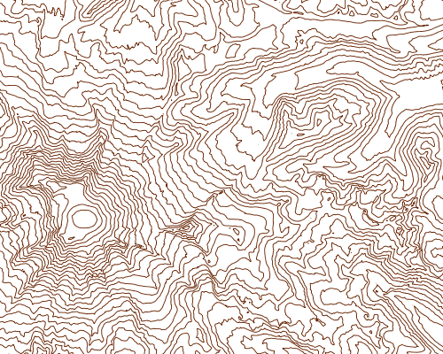
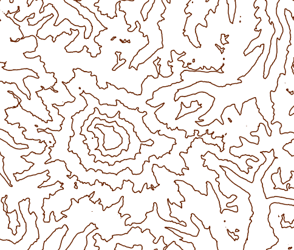
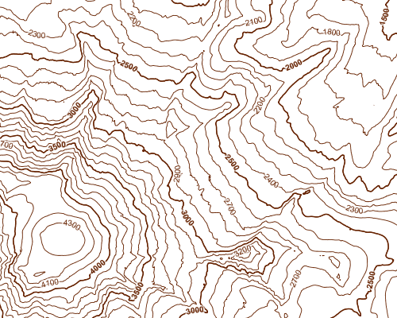
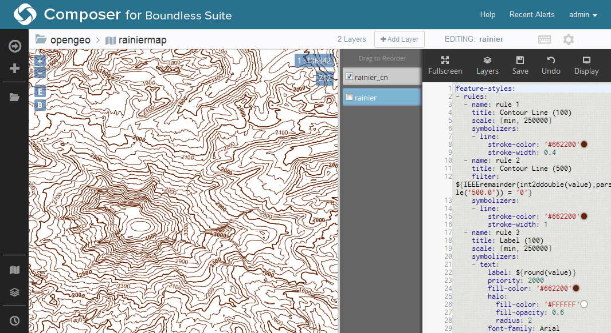

.. _processing.contour.static:

Creating a static contour map
=============================

Using the GeoServer WPS process **ras:Contour**, it is possible to generate a vector contour layer of a given raster layer.

Running the process
-------------------

There are two ways to execute a process:

* Through :ref:`WPS Builder <processing.wpsbuilder>`
* Through the **WPS Request Builder** demo in GeoServer

The two sections below result in the same output.

Using WPS Builder
~~~~~~~~~~~~~~~~~

#. Open WPS Builder.

   .. note:: If GeoServer is at ``http://localhost:8080/geoserver``, then WPS Builder will be at ``http://localhost:8080/wpsbuilder``.

#. Drag the :guilabel:`Contour` process (under :guilabel:`Raster`) onto the Canvas.

   .. todo:: Figure

#. Click each parameter to set the input values. Use the following:

   .. list-table::
      :stub-columns: 1
      :header-rows: 1
      :class: non-responsive

      * - Field
        - Value
        - Example
      * - data
        - Name of the raster layer or the source of the data
        - Name of the layer (such as ``opengeo:rainier``)
      * - interval
        - Interval between contour lines
        - ``100``
      * - simplify
        - Whether to reduce the vertices in the output
        - ``True``

   .. figure:: img/wpsbuilder_contour.png

      Contour process in WPS Builder 

#. Click :guilabel:`Run Process`.

#. Click :guilabel:`Download` to save the output.

Using the WPS Request Builder
~~~~~~~~~~~~~~~~~~~~~~~~~~~~~

#. Open the WPS Request Builder by going to :guilabel:`Demos` in GeoServer and selecting :guilabel:`WPS Request Builder`.

#. Once there, select :guilabel:`ras:Contour` in the box marked :guilabel:`Choose process`.

#. Enter the following information for your specific data:

   .. list-table::
      :stub-columns: 1
      :header-rows: 1
      :class: non-responsive

      * - Field
        - Value
        - Example
      * - data
        - Name of the raster layer or the source of the data
        - Name of the layer (such as ``opengeo:rainier``)
      * - band
        - Name of the band used for the contour values
        - ``GRAY_INDEX``
      * - interval
        - Interval between contour lines
        - ``100``
      * - simplify
        - Whether to reduce the vertices in the output
        - ``true``
      * - result
        - Output format
        - ``application/zip`` (for Shapefile)
    
   All other fields can be left blank.

   .. figure:: img/contour_requestbuilder.png

      WPS Request Builder for creating a contour layer

#. Run this process, and save the resulting archive.

Loading output
--------------

One the output of the process has been downloaded, it needs to be added back to GeoServer.

#. Import the output back into GeoServer, using either :ref:`Composer <webmaps.composer>` or the :ref:`Layer Importer <dataadmin.importer>`.

   .. note:: It is also possible to chain the output of this process to the input of the **gs:Import** process. This way, the GeoServer layer will be published in one step without the need for a shapefile to be created.

#. View this layer using :ref:`Composer <webmaps.composer>`. When making the map, place the contour layer on top of the source raster layer for proper context.

   .. note:: See the :ref:`Composer tutorial <webmaps.composer.tutorial>` for how to create a map with multiple layers.

   .. figure:: img/composer_static_simple.png

      Simple generated contour map viewed in Composer

Styling
-------

Initial improvement
~~~~~~~~~~~~~~~~~~~

The default style created by GeoServer can be improved based on the :ref:`processing.contour.setup.design` of a topographic map.

First, the default display can be improved by setting up a rule with a thinner line.

   Map with a single style

Using Composer, the YSLD will look like this:

.. literalinclude:: files/contour.ysld
   :language: yaml
   :lines: 1-4,6-9

The equivalent SLD will look like this:

.. literalinclude:: files/contour.sld
   :language: xml
   :lines: 1-16,18-24,136-139

Differing widths
~~~~~~~~~~~~~~~~

Too many lines of equal width can make them hard to distinguish, so the next step is to add a rule that will display every fifth band (500 meters) as thicker (1px instead of 0.4px). You can determine if the value of the band is a multiple of 500 by using the ``IEEERemainder`` filter function.

.. note:: Read more about `filtering in GeoServer <../../geoserver/filter/>`_.

.. figure:: img/style_tworules.png

   Map style with two different band thicknesses

YSLD:

.. literalinclude:: files/contour.ysld
   :language: yaml
   :lines: 10-16

SLD:

.. literalinclude:: files/contour.sld
   :language: xml
   :lines: 25-47

Scale-based style
~~~~~~~~~~~~~~~~~

The differing thicknesses is an improvement, but when zoomed out there still will be too many thin lines rendered. So we will add a scale rule to the first rule to prevent the thin lines from showing up when the map is zoomed out too far.

   Map style hiding thin bands when zoomed out

YSLD:

.. literalinclude:: files/contour.ysld
   :language: yaml
   :lines: 3-9
   :emphasize-lines: 3

SLD:

.. literalinclude:: files/contour.sld
   :language: xml
   :lines: 14-24
   :emphasize-lines: 4

Labels
~~~~~~

A good topographic map should have labels for the bands. Since there are two rules for bands, two similar rules for labels will be created as well: one for the thin lines and one for the thick lines. The primary difference between the two rules will be the font weight: bold to match the thicker lines, normal weight to match the thinner lines. The bold labels will also be prioritized higher.

Add these rules to the bottom of the existing style created above:

For the thinner lines:

YSLD:

.. literalinclude:: files/contour.ysld
   :language: yaml
   :lines: 17-39

SLD:

.. literalinclude:: files/contour.sld
   :language: xml
   :lines: 48-85

Label rule for the thicker lines:

YSLD:

.. literalinclude:: files/contour.ysld
   :language: yaml
   :lines: 40-63

.. literalinclude:: files/contour.sld
   :language: xml
   :lines: 86-135

Putting it all together looks like this:

   Finished map style

:download:`Download the full YSLD for this example <files/contour.ysld>` (and the :download:`SLD <files/contour.sld>`)

Viewing
-------

Using Composer, load this style into the layer on the :ref:`style/view <webmaps.composer.styleview>` page for that layer, and click :guilabel:`Save`.

   Static contour map in Composer

.. note::

   If not using Composer, load the SLD into GeoServer via the :guilabel:`Styles` menu and select :guilabel:`Add new style`.

   .. figure:: img/geoserver_addstyle.png

      Creating a new style

   Once that is done, associate this style with the original layer. You can do this by going to the :guilabel:`Layers` menu, clicking on the layer name, clicking on the :guilabel:`Publishing` tab, and selecting the style from the drop-down menu called :guilabel:`Default style`. Click :guilabel:`Save` when done.

   .. figure:: img/geoserver_layer_style.png

      Associating the style with the layer

   Once these changes are saved, go to the :guilabel:`Layer Preview` and view the layer.

   .. figure:: img/static_styled.png

      Static contour map

In the next section, the contour map will be generated dynamically from the source raster.
