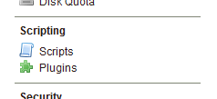

.. _processing.geoscript.gsui:

Managing scripts with GeoServer
===============================

The GeoServer web interface contains a rudimentary interface for managing scripts.  Through this interface you can create (upload) new scripts or edit existing ones.  Changes take effect immediately, without the need for a server restart.

Accessing scripts
-----------------

To view the scripts interface, navigate to the GeoServer web interface.  Make sure you are logged in.

On the menu on the left side of the screen will be a :guilabel:`Scripting` section.  Click on the entry for :guilabel:`Scripts`.

   *Scripting link in the GeoServer menu*

This will bring up the Scripts page.

.. figure:: img/gsui_scriptspage.png

   *Scripts page*

This page has an editor for copying/editing script information, as well as a folder tree for managing files.

Saving a new script
-------------------

Uploading and activating a script that has been created locally can be accomplished in a few steps.  From the Scripts page:

#. Select the folder you would like to save the script in by clicking on it.  The ``app`` folder is used for creating applications.  The ``wps`` folder is used for creating WPS processes. (See :ref:`processing.geoscript.processcreate` for more information about creating a process script.)

   .. todo:: Is the ``app`` description correct?

   .. figure:: img/gsui_newscriptfolder.png

      *Selecting the folder for the type of script*

#. Click the :guilabel:`New` button to create a new script file in that folder:

   .. figure:: img/gsui_newscript.png

      *Creating a new script file*

#. Double-click on the filename to rename it.

   .. figure:: img/gsui_rename.png

      *Renaming the script file*

#. Now paste in the content from your local text editor.

   .. figure:: img/gsui_code.png

      *Script code*

#. Click the :guilabel:`Save` icon.

   .. todo:: Which one is Save?

   .. figure:: img/gsui_save.png

      *Saving changes*

The script will now be immediately available to GeoServer.

   .. figure:: img/gsui_activescript.png

      *Script showing as an active WPS process*

Deleting a script
-----------------

To delete an existing script, click on the name of the script, and click the :guilabel:`Delete` button (red circle).  Your script will be immediately removed.

.. warning:: This operation is not undoable and no confirmation will be asked. 

.. figure:: img/gsui_delete.png

   *Saving changes*