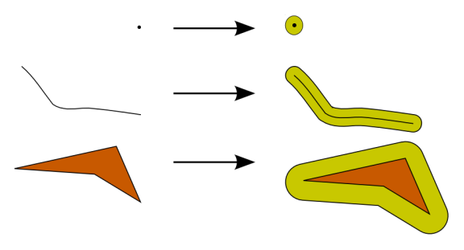
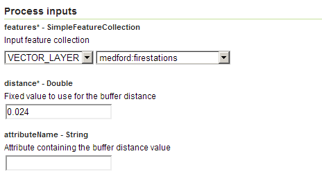
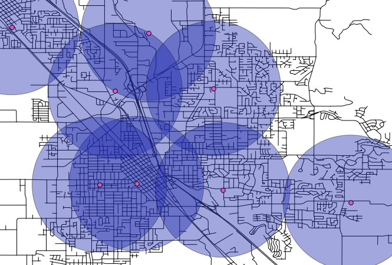

.. _processing.processes.vector.bufferfc:

.. warning:: Document status: **Requires copyedit review (MP)**

BufferFeatureCollection
=======================

Description
-----------

The ``gs:BufferFeatureCollection`` process takes a feature collection and applies a buffer to each feature. The buffer distance can be a fixed value for all features or can be variable, with the values taken from an attribute in the feature collection, or a combination of the two.

The resulting feature collection will always contain polygons regardless of the input.

   *gs:BufferFeatureCollection*

The attribute names and values of the output feature collection will match those of the input.

Inputs and outputs
------------------

This process accepts :ref:`processing.processes.formats.fcin` and returns :ref:`processing.processes.formats.fcout`.

Inputs
~~~~~~

.. list-table::
   :header-rows: 1

   * - Name
     - Description
     - Type
     - Usage
   * - ``features``
     - Input feature collection
     - :ref:`SimpleFeatureCollection <processing.processes.formats.fcin>`
     - Required
   * - ``distance``
     - Fixed value to use for the buffer distance
     - Double
     - Required
   * - ``attributeName``
     - Attribute containing a variable buffer distance value
     - String
     - Required

Outputs
~~~~~~~

.. list-table::
   :header-rows: 1

   * - Name
     - Description
     - Type
   * - ``result``
     - Buffered feature collection
     - :ref:`SimpleFeatureCollection <processing.processes.formats.fcout>`

Usage notes
-----------

* The buffer distance is assumed to be in the units of the input feature collection.
* The buffer distance is also assumed to be a Cartesian distance, so unexpected output may occur with data in geographic coordinates.
* The fixed ``distance`` parameter is required, so if using the ``attributeName`` parameter to specify a buffer distance, set the ``distance`` parameter to ``0``.
* Negative values of buffer distance can be used in the case of polygons, which will result in output features being shrunk by the buffer distance instead of expanded.

Examples
--------

Fire station coverage
~~~~~~~~~~~~~~~~~~~~~

Assuming that a fire station has a good response radius of about 3 km, buffering the ``medford:firestations`` layer will determine the areas able to be properly served by existing fire stations.

As the input feature collection uses geographic coordinates (EPSG:4326), the distance must be `converted to degrees <http://en.wikipedia.org/wiki/Longitude#Length_of_a_degree_of_longitude>`_. The location of these features is approximately at 42 degrees N, 3 km can be approximated as 0.024 degrees.

Input parameters:

* ``features``: ``medford:firestations``
* ``distance``: 0.024 
* ``attributeName``: [blank]

:download:`Download complete XML request <xml/bufferfcexample.xml>`

   *gs:BufferFeatureCollection example parameters*

The resulting feature collection looks like this:

   *gs:BufferFeatureCollection example output*

.. todo:: It would be much better to work with a feature collection in another CRS...

Related processes
-----------------

* Buffer calculation is also available through the :ref:`gs:Transform <processing.processes.vector.transform>` process using the ``buffer(geom, dist)`` function.
* Buffer calculation for geometries is available through the ``JTS:buffer`` process.
* The ``gs:PointBuffers`` process can be used to create multiple buffers around a single point.

.. - Polygons resulting from this process (if the buffer distance is positive) contain the area of the polygons being buffered. To get a polygon representing just the buffer area, without the area of the original polygon, use the ``gs:Overlay`` method to erase that inner area.

.. image: bufferanderase.png

.. todo:: this process is yet to be developed.

.. - Polygons resulting from buffering near features might overlap. Use the ``gs:Dissolve`` process to merge overlapping polygons if needed

.. todo:: this process is yet to be developed.

