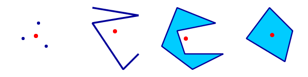

.. _processing.processes.vector.centroid:

.. warning:: Document Status: **Requires copyedit review (MD)**

Centroid
========

.. todo:: Graphic needed.

Description
-----------

The ``gs:Centroid`` process takes a feature collection and returns a point feature collection 
containing the centroids of the geometries of the input features. 
Feature attributes names and values are preserved unchanged.

The `centroid <http://en.wikipedia.org/wiki/Centroid>`_ of a geometry is defined for all geometry types (Point, Line and Polygon). 
It is equal to the geometric center of all points contained in the geometry.
Note that the centroid point does not necessarily lie within the geometry
(for instance, the centroid of a C-shaped polygon lies outside the polygon).

   *Centroids of a MultiPoint, LineString, and two Polygons*

Centroids can be used to provide a representative point for features.  
Geospatial use cases include distance analysis and label placement.

Inputs and outputs
------------------

This process accepts :ref:`processing.processes.formats.fcin` and returns :ref:`processing.processes.formats.fcout`.

Inputs
^^^^^^

.. list-table::
   :header-rows: 1
   :widths: 25 35 20 20
   
   * - Name
     - Description
     - Type
     - Usage
   * - ``features``
     - Input features
     - FeatureCollection
     - Required

Outputs
^^^^^^^

.. list-table::
   :header-rows: 1

   * - Name
     - Description
     - Type
   * - ``result``
     - Centroids of input features
     - FeatureCollection

Usage notes
---------------

* If a feature collection consisting of point geometries is supplied, the output is identical to the input.

Examples
--------
 
The following example illustrates how to use the ``gs:Centroid`` process.

* Find the centroids of the polygons in the ``medford:zoning`` layer.

  - ``features``: *medford:zoning*

  .. figure:: img/centroid-med.png
  
   *Centroids of zoning polygons*

Relationship to other processes
-------------------------------

* Centroid calculation is also available from the ``gt:Transform`` process, using the ``centroid(geom)`` function.
 
* If it is desired to compute a point which is guaranteed to lie within the input geometry,
  the ``interiorPoint(geom)`` function may be used in the ``gt:Transform`` process

